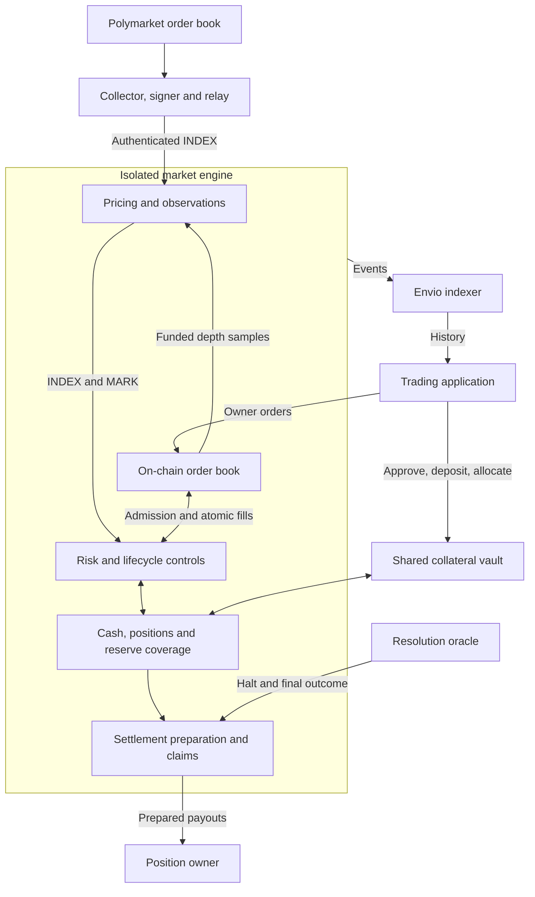

<p align="center">
  <picture>
    <source media="(prefers-color-scheme: dark)" srcset="frontend/public/brand/eros-markets-mark-on-dark.svg">
    
  </picture>
</p>

<h1 align="center">Eros Markets</h1>

<p align="center">On-chain order books and isolated risk for binary event derivatives on Monad.</p>

<p align="center">
  <a href="#architecture">Architecture</a> &middot;
  <a href="#pricing-and-market-readiness">Pricing</a> &middot;
  <a href="#local-development">Local development</a> &middot;
  <a href="#documentation">Documentation</a>
</p>

Eros Markets lets traders take long or short exposure to real-world event outcomes through an on-chain central limit order book. Each market combines collateral accounting, margin checks, reserve coverage and cash settlement. The integrated application uses **Polymarket as an external price reference**, while execution, positions and collateral remain on Eros.

This is the active integration branch, **`feat/pricefeed`**. It contains the contracts, price publisher, resolution services, indexer, SDKs, trading application and local lifecycle tooling. The [`main` README](https://github.com/akronim26/eros-markets/blob/main/README.md) provides the general project overview.

## Implementation status

The project is a development/testnet implementation. It supports reserve-backed leverage up to a listing ceiling of **5×**, subject to the active calibration, current prices, account collateral, reserve coverage and market stage. A configured ceiling is not a promise of executable leverage.

The latest source includes a Monad-testnet-only fast-start pricing path. Its [implementation record](docs/integration/FAST_MARK_STARTUP.md) documents local validation and a pending replacement deployment. The October 9 deployed engines retain their previous pricing behavior. Deployment manifests identify particular bytecode and configuration; they do not automatically follow branch updates.

Recorded testnet integrations use test collateral and synthetic risk calibration. Oracle sandbox and simulated external-provider components are identified in their evidence. Test results and deployment receipts establish their stated scope, not production readiness or an independent security audit.

## Architecture



Price publication and event resolution serve separate purposes. The publisher maintains the reference used during trading. The resolution oracle supplies the final outcome used for settlement. Polymarket prices do not supply Eros liquidity: funded makers must place orders in the Eros book.

| Component | Responsibility |
| --- | --- |
| [`contracts/`](contracts/) | Price-time FIFO matching, limit/IOC/post-only orders, reduce-only execution, risk admission, accounting, liquidation and settlement |
| [`oracle/`](oracle/) | Market registry and factory, resolution and adjudication contracts, operator services and Envio indexer |
| [`packages/pricefeed/`](packages/pricefeed/README.md) | Polymarket collection, source/rules validation, signed observations and durable publication journals |
| [`scripts/ops/`](scripts/ops/README.md) | Persistent market workers, restart policies, gas-runway checks and operator status |
| [`oracle/packages/oracle-sdk/`](oracle/packages/oracle-sdk/README.md) | Concrete ABIs, verified deployment manifests, read adapters and owner transaction builders |
| [`packages/risk-sdk/`](packages/risk-sdk/README.md) | Risk/settlement read models and accounting event replay |
| [`frontend/`](frontend/README.md) | Next.js/React terminal, Privy wallet connection, viem/wagmi transactions and account views |

The market factory reconstructs approved engine creation code from **two immutable code stores** and registers each engine with the shared collateral vault. Each engine has its own market ledger and reserve. Book and risk hooks execute within the same contract transaction, so accepted fills and their accounting updates are atomic.

New engine bytecode requires a replacement deployment. Existing engines, positions and vault allocations retain their original bindings; balances do not migrate automatically.

## Pricing and market readiness

The engine separates four price concepts:

- **INDEX:** the authenticated external reference, averaged over a complete observation window.
- **PERP:** the price derived from eligible funded depth in the Eros order book.
- **BASIS:** the difference between the book observation and external reference.
- **MARK:** the risk price assembled from those inputs using median and band constraints.

| Configuration | INDEX | PERP | BASIS | Maximum carry | Initial MARK activation |
| --- | ---: | ---: | ---: | ---: | --- |
| Current source, Monad testnet `10143` | 60 s | 60 s | 60 s | 30 s | Permissionless `activatePricing()` when all readiness checks pass |
| October 9 deployed engines | 60 s | 60 s | 180 s | 30 s | Successful accounting epoch opening |
| Current source, other chains including local `31337` | 300 s | 60 s | 900 s | 30 s | Successful accounting epoch opening |

Use the deployed engine's `pricingWindows()` and verified runtime identity to determine its behavior. Legacy ABI names such as `indexTwap300()` and `basisTwap900()` are compatibility selectors, not configuration guarantees.

On the new testnet path, exactly backed, non-crossing **post-only warm-up quotes** may rest around a fresh authenticated INDEX point. This lets book history develop alongside INDEX history. These quotes cannot produce matched trades before the INDEX window is valid. Complete coverage, source authentication, depth, spread and freshness checks still apply.

`activatePricing()` enables initial normal pricing only when the market is active, accounting is READY and every price candidate is valid. It does not open an epoch, activate staged calibration or authorize funding. An uncalibrated market remains at 1× after pricing activation.

The latest startup record includes an unresolved MARK-availability gap around hourly rollover. Its timing measurements are local simulations, not public-chain latency guarantees. See [fast MARK startup](docs/integration/FAST_MARK_STARTUP.md) for the implementation, evidence and remaining work.

### Operating a market

A usable market requires continuous operation of the publisher, sampling/epoch keeper and funded makers. A running frontend or a successful Polymarket fetch alone does not establish executable prices.

Operators must maintain source publication, eligible two-sided depth, accounting progress, collateral and gas budgets. The supervisor preserves durable journals and checks gas runway before launch; unknown identity, nonce, funding and receipt failures require reconciliation. Use the [operating runbook](docs/integration/TESTNET_OPERATIONS.md) for deployment-specific enrollment and recovery.

## Risk, collateral and settlement

**Margin and reserve coverage are separate constraints.** Margin limits individual exposure. Prefunded market reserves cover admitted potential trader deficits under both terminal outcomes. Maintenance margin does not guarantee that a liquidation can execute before a discontinuous event-price jump.

The selected integration uses reserve capital to preserve full winning entitlements. Periodic funding payments, payout recovery/haircuts and token conversion remain disabled. An exceptional custody or accounting shortfall blocks claim readiness instead of silently changing the payout policy. Reserves also do not replace maker collateral or executable liquidity.

Scheduled markets require full backing for new commitments from **T−12h30m**, enter the backing-floor stage at **T−12h**, and become reduce-only at **T−1h**. Trading halts at the scheduled time or an authenticated earlier halt. Select demonstration markets with enough remaining trading time for the intended lifecycle.

During the backing-floor sweep, a legacy account with a terminal-outcome deficit may have its cash and position transferred to the reserve even if its current MARK equity is positive. This lifecycle rule is separate from ordinary margin liquidation.

The owner flow is:

1. Approve collateral and deposit it into the vault.
2. Allocate free vault collateral to the selected market.
3. Place, cancel or batch orders against the on-chain book.
4. Close or reduce exposure, then release eligible market collateral.
5. Withdraw free vault collateral, or use the prepared claim path after resolution.

Closing a position, releasing collateral and withdrawing to a wallet are separate transactions. Snapshot preparation can begin after halt; payout preparation requires finality and an available settlement price. Both preparation passes and completion must finish before claims are available. YES, NO and INVALID follow explicit settlement rules.

### Units and read interfaces

| Quantity | Representation |
| --- | --- |
| Collateral | Six decimal places; deposits and withdrawals use integer atoms |
| Order size | One lot = 0.001 claim |
| Order price | Integer tick 1–999; price = tick / 1,000 |
| Probability | WAD, scaled by `10^18` |
| Internal cash | `cashQ`; one collateral atom = `10^18` Q units |
| Time | Unix seconds |

At tick `t`, `n` lots transfer `n × t × 10^18` Q units. Use integer arithmetic and explicit rounding. Contract previews and finalized receipts determine executable actions and balances; SDK projections are estimates. Missing prices remain unavailable rather than becoming zero.

The [versioned frontend interface](oracle/packages/oracle-sdk/FRONTEND_HANDOFF.md) documents manifests, states, pagination, errors, units and transaction sequences. The SDK's browser entry exposes credential-free manifests, concrete engine/factory/vault ABIs and transaction builders. Optional [delegated trading and protection](services/automation/README.md) use separate authorization and are not required for normal wallet signing.

## Local development

Clone this branch with its pinned submodules:

```bash
git clone --branch feat/pricefeed --recurse-submodules https://github.com/akronim26/eros-markets.git
cd eros-markets
```

| Tool | Version / scope |
| --- | --- |
| Foundry | 1.8.3 for the integrated backend |
| Solidity | 0.8.30; legacy UMA tests also compile 0.8.16 |
| Bun | 1.3.13 for the oracle workspace |
| Node.js | 22.x for frontend/oracle tooling; pricefeed pins its own 24.21.0 runtime |
| Python | 3.12+ for integration runners |

The commands below use Bash. Use a Linux-native workspace, including one inside WSL on Windows, for the complete backend/service suites. See [the integration setup](docs/integration/LEVERAGE_INTEGRATION.md) for tool overrides and PowerShell commands.

### Run the application locally

The normal frontend configuration reads the verified **Monad testnet deployment** selected in `frontend/src/config/public-manifest.json`.

```bash
npm ci --prefix frontend

# Preserve any existing local configuration.
if [ ! -f frontend/.env.local ]; then
  cp frontend/.env.example frontend/.env.local
fi

npm run dev --prefix frontend
```

Open the URL printed by Next.js, normally `http://localhost:3000`. Set `NEXT_PUBLIC_PRIVY_APP_ID` in `frontend/.env.local` and configure the allowed origin in Privy to enable wallet login. A blank app ID keeps public reads available and disables wallet actions.

Keep credential-bearing RPC URLs in server-only `MONAD_RPC_URL`; the browser can use `/api/rpc` through `NEXT_PUBLIC_READ_RPC_URL`. Configure the indexer endpoint and its chain/registry binding for event history. Every `NEXT_PUBLIC_` value is browser-visible. Restart or rebuild after configuration changes.

This command starts the application server. Market publication, makers, keepers and indexing are separate services; their health determines the available data and trading actions.

### Exercise the integrated backend locally

Install and build the backend dependencies before running the lifecycle. The initial online build populates the compiler cache used by the runner's offline compilation.

```bash
git submodule update --init --recursive

cd oracle
bun install --frozen-lockfile
FOUNDRY_PROFILE=integration forge build --skip UmaImports --skip test/uma

cd ../packages/pricefeed
npm ci
npm run build
cd ../..

python3 scripts/integration/local-stack.py run \
  --scenario leveraged --settle-leveraged \
  --rpc-port 18556 --read-port 8797
```

This creates a disposable deployment on chain `31337`, uses test collateral and synthetic pricing/calibration, and exercises the leveraged lifecycle through settlement and payout auditing. It needs no public RPC credentials or public-chain funds. Keep ports `18556`, `18557` and `8797` free and run only one deployment orchestrator at a time.

For an open development fixture, replace `--settle-leveraged` with `--keep-running`. While that run is active:

```bash
python3 scripts/integration/local-stack.py status --scenario leveraged
python3 scripts/integration/probe-local-api.py --scenario leveraged
python3 scripts/integration/local-stack.py stop --scenario leveraged
```

Run evidence and the verified local manifest are written under `tmp/`. Starting this backend does **not** repoint the ordinary frontend from testnet. The explicit local manifest and browser fixture wiring are documented in [E2E testing](docs/integration/E2E_TESTING.md). The separate real-Polymarket mode and its authentic-timestamp requirements are described in [integration readiness](docs/integration/INTEGRATION_READINESS.md).

## Validation

With the corresponding dependencies and tool versions installed:

| Directory | Check |
| --- | --- |
| `contracts/` | `FOUNDRY_PROFILE=ci FORGE_SNAPSHOT_EMIT=false forge test` |
| `oracle/` | `forge test` and `bun run --filter '*' test` |
| `oracle/packages/oracle-sdk/` | `bun test` after building the contract artifacts |
| `packages/pricefeed/` | `npm test` using the pinned Node runtime |
| `packages/risk-sdk/` | `npm ci` followed by `npm test` |
| `frontend/` | `npm run typecheck`, `npm test`, `npm run test:integration`, `npm run build -- --webpack` |
| Repository root | `python3 scripts/export-risk-abis.py --check` |

The contract suites include unit, fuzz, invariant and differential coverage. The oracle factory/integration suite uses a separate integration profile and Monad execution settings; exact commands live in [CI](.github/workflows/oracle.yml) and the [deployment runbook](docs/integration/DEPLOYMENT_RUNBOOK.md). Service and browser fixtures do not replace a live owner-wallet trading proof.

## Repository layout

```text
contracts/                Order book, pricing, risk, accounting and settlement
oracle/                   Registry, factory, resolution contracts and services
  packages/oracle-sdk/     Manifests, ABIs, read adapters and transaction builders
  indexer/                Envio event indexing
packages/pricefeed/       Polymarket collection and durable signed publication
packages/risk-sdk/        Risk and accounting read models
frontend/                 Trading application
services/automation/     Optional delegated trading and protection
scripts/integration/     Local lifecycle and deployment rehearsal
scripts/e2e/             Coordinated publisher, keeper, maker and test tooling
scripts/ops/             Supervision, recovery checks and gas runway
reference/               Python arithmetic models and fixtures
artifacts/               ABIs, deployment manifests and recorded evidence
docs/                    Specifications, integration guides and runbooks
```

## Documentation

| Guide | Purpose |
| --- | --- |
| [Fast MARK startup](docs/integration/FAST_MARK_STARTUP.md) | Latest testnet pricing behavior, validation scope and remaining work |
| [Leverage integration](docs/integration/LEVERAGE_INTEGRATION.md) | Reserve policy, calibration and local backend setup |
| [Deployment runbook](docs/integration/DEPLOYMENT_RUNBOOK.md) | Code stores, factory/vault, registry listing, configuration and activation |
| [Testnet operations](docs/integration/TESTNET_OPERATIONS.md) | Operator setup, service supervision and recovery procedures |
| [Deployment records](docs/integration/DEPLOYMENT_PROGRESS.md) / [addresses](addresses.md) | Dated deployment receipts and contract identities |
| [Frontend interface](oracle/packages/oracle-sdk/FRONTEND_HANDOFF.md) | Units, states, unavailable data, errors and owner transactions |
| [Risk specification](docs/spec/risk_spec.md) | Economic baseline, arithmetic and invariants; testnet amendments are documented separately |
| [Order book engineering](contracts/README.md) | Storage, matching and internal risk hooks |
| [Local E2E testing](docs/integration/E2E_TESTING.md) | Backend/browser fixture selection and complete lifecycle validation |

Use source revisions, deployment manifests and runtime checks together when preparing a demo or deployment. Dated operator records describe a past observation, not a guarantee that services or markets are available now.
