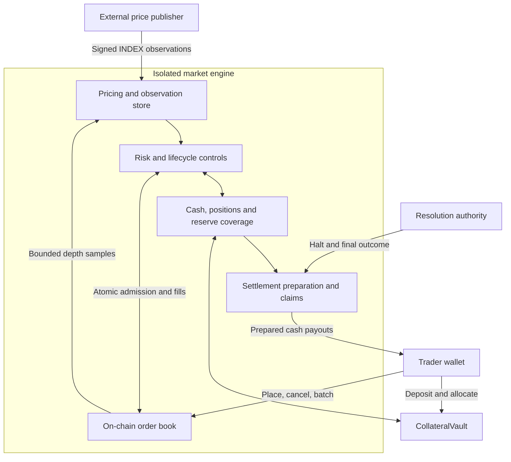

<p align="center">
  <picture>
    <source media="(prefers-color-scheme: dark)" srcset="docs/assets/eros-mark-on-dark.svg">
    
  </picture>
</p>

<h1 align="center">Eros Markets</h1>

<p align="center">On-chain order books and isolated risk for binary event derivatives.</p>

<p align="center">
  <a href="#architecture">Architecture</a> &middot;
  <a href="#local-development">Local development</a> &middot;
  <a href="#interfaces-and-units">Interfaces</a> &middot;
  <a href="#documentation">Documentation</a>
</p>

Eros Markets is a cash-settled event derivatives protocol targeting Monad. Each market combines an on-chain central limit order book with collateral accounting, margin checks, reserve coverage and a defined resolution lifecycle. Traders take signed exposure to a binary outcome; positions settle when the event resolves.

The integrated application uses **Polymarket as an external price reference**. Matching, collateral and positions belong to Eros. Referencing another venue's prices does not supply liquidity to the Eros book: makers must fund and place their own orders.

## Repository status

| Branch | Contents |
| --- | --- |
| [`main`](https://github.com/akronim26/eros-markets/tree/main) | Core order book, risk and clearing contracts, read-only risk SDK, reference models and validation evidence. This README's local commands target this checkout. |
| [`feat/pricefeed`](https://github.com/akronim26/eros-markets/tree/feat/pricefeed) | Integrated trading application, Polymarket publisher, oracle/factory integration, indexer and market operators. See its [application setup](https://github.com/akronim26/eros-markets/blob/feat/pricefeed/frontend/README.md) and [operating runbook](https://github.com/akronim26/eros-markets/blob/feat/pricefeed/docs/integration/TESTNET_OPERATIONS.md). |

The concrete engine on `main` starts with a **1× cap, an uncalibrated risk profile and funding disabled**. The broader risk modules implement leveraged admission, liquidation and funding, but their presence does not enable them in every deployment. The project is a development/testnet implementation; recorded validation is source-specific and is not an independent security audit.

## Architecture



[`BookRiskEngine`](contracts/src/engine/BookRiskEngine.sol) composes the book and risk modules in one market contract. Matching invokes internal risk hooks, keeping admission, paired ledger updates and order reservations within the same transaction. Collateral custody sits in a separate vault, with allocations isolated by market.

External publishers and resolution authorities connect through explicit interfaces. On `main`, the runnable lifecycle fixture supplies a controlled signer, test collateral and a mock resolution authority. The integrated services live on the branch linked above.

### Execution

- **Price-time priority:** FIFO queues at ticks 1–999, with bitmap lookup for the best levels.
- **Order types:** limit, immediate-or-cancel and post-only, plus reduce-only orders and optional block expiry.
- **Bounded work:** the current concrete engine permits eight examined makers per match operation and eight actions per batch. Sampling has a separate 64-node traversal budget.
- **Order validity:** account and market epochs invalidate obsolete orders; generation-tagged IDs prevent recycled slots from reviving old orders.
- **Atomic accounting:** each accepted fill posts both sides and updates risk reservations. A reverting transaction rolls back its economic changes.

### Pricing

The engine separates the external reference from the price observed in its own book:

| Input | Purpose | Window on `main` |
| --- | --- | ---: |
| `INDEX` | Authenticated independent reference price | 300 seconds |
| `PERP` | Price derived from eligible depth in the Eros book | 60 seconds |
| `BASIS` | Difference between the book observation and reference | 900 seconds |
| `MARK` | Risk price derived from these inputs using median and band constraints | Requires valid inputs |

Observations carry for at most 30 seconds. Windows require complete coverage; stale or missing data produces an unavailable price. A captured book sample can publish only in a later block, after an authenticated INDEX observation with a strictly newer source timestamp seals its history.

Fully backed bootstrap trading can begin with a valid INDEX before the book histories are ready. Normal pricing additionally requires complete PERP/BASIS history and promotion at an accounting epoch opening. Normal pricing and permission to use leverage are separate conditions.

The integrated branch has a shorter Monad-testnet-only timing profile. Consult its [pricing configuration](https://github.com/akronim26/eros-markets/blob/feat/pricefeed/docs/integration/FAST_TESTNET_PRICING.md) for those deployments; the table above describes the contracts in this checkout.

### Risk and settlement

Margin checks and reserve coverage address different obligations. Margin constrains individual positions. Reserve coverage constrains aggregate potential trader deficits under both terminal outcomes, including admitted order exposure. Coverage is checked as part of economic actions; it is not deferred until resolution.

Markets use bounded accounting sweeps and explicit lifecycle stages. Scheduled markets require full backing for new commitments from **T−12h30m**, enter the backing-floor stage at **T−12h**, and become reduce-only at **T−1h**. Trading halts at the scheduled time or an authenticated earlier halt.

Snapshot preparation can begin after halt. Payout preparation requires finality and an available settlement price; both preparation passes and the completion step must finish before claims become available. YES, NO and INVALID follow explicit settlement rules. The concrete `main` configuration disables recovery haircuts; insufficient backing blocks claim readiness rather than silently reducing payouts.

## Local development

Use **Foundry 1.8.3**, **Node.js 22 with npm**, and **Python 3** for reference and ABI tooling. The contracts pin Solidity **0.8.30**, the Prague EVM target and optimizer runs **200**. The SDK locks TypeScript **5.9.3**.

The commands below use Bash, including WSL on Windows. The local fixture needs no RPC endpoint, wallet key or testnet funds.

```bash
git clone --recurse-submodules https://github.com/akronim26/eros-markets.git
cd eros-markets

# For an existing checkout, initialize the pinned contract dependencies.
git submodule update --init --recursive

# Install the read-only SDK's locked dependencies.
npm ci --prefix packages/risk-sdk --ignore-scripts --no-audit --no-fund

# Exercise the local contract lifecycle.
FOUNDRY_PROFILE=risk FORGE_SNAPSHOT_EMIT=false \
  forge test --root contracts --match-contract LocalBookRiskSmokeTest -vv

# Typecheck and test the SDK.
npm test --prefix packages/risk-sdk
```

The lifecycle test runs the real book, risk engine and vault with **mock collateral, a mock resolution authority and synthetic signed INDEX history**. It exercises deposits, allocation, matching, YES resolution, bounded settlement preparation and final payouts. It does not launch the web application or demonstrate live external pricing.

### Validation

Run the full contract suite and check generated ABI consistency from the repository root:

```bash
FOUNDRY_PROFILE=ci FORGE_SNAPSHOT_EMIT=false \
  forge test --root contracts

forge fmt --root contracts --check
python scripts/export-risk-abis.py --check
```

The contract suite includes unit, fuzz, invariant, differential, pricing and settlement tests. The CI profile uses 10,000 fuzz runs and 256 invariant runs at depth 128. Python reference models and the `G0`–`G7` runners provide additional arithmetic and integration evidence; their workflow is documented in [Unified Risk and Order Book](docs/merge/UNIFIED_WORKFLOW.md).

Historical results retain their source revisions in [the validation record](artifacts/risk/unified-integration-2026-10-03.json). Local EVM gas snapshots measure regressions; use the [Monad runbook](docs/runbooks/monad-risk-book-testnet.md) for target-chain execution and deployment measurements.

## Interfaces and units

The normal owner flow is:

1. Approve collateral and deposit it into `CollateralVault`.
2. Allocate free vault collateral to a market engine.
3. Place, cancel or batch orders using the engine's public book API.
4. Close or reduce exposure, then release eligible market collateral to the vault.
5. Withdraw free vault collateral. After resolution, use the prepared settlement claim path.

Closing a position, releasing its collateral and withdrawing to a wallet are separate operations. Contract previews determine current eligibility; an SDK projection is not a spendable balance.

| Quantity | Representation |
| --- | --- |
| Collateral | Six decimal places; deposits and withdrawals use integer atoms |
| Order size | One lot = 0.001 claim |
| Order price | Integer tick 1–999; price = tick / 1,000 |
| Probability | WAD, scaled by `10^18` |
| Internal cash | `cashQ`; one collateral atom = `10^18` Q units |
| Time | Unix seconds |

At tick `t`, a fill of `n` lots transfers exactly `n × t × 10^18` Q units. Use integer arithmetic and explicit rounding when converting between units.

The [risk SDK](packages/risk-sdk/README.md) exposes accounting replay and risk/settlement read models. It preserves unavailable values and read identity; contracts remain authoritative. ABI exports are available for the [concrete engine](artifacts/risk/book-risk-engine-abi.json) and [collateral vault](artifacts/risk/vault-abi.json).

## Repository layout

```text
contracts/
  src/Book.sol          On-chain matching and order storage
  src/engine/           Concrete engine and accounting bridge
  src/math/             Fixed-point pricing, margin and coverage math
  src/pricing/          Signed observations and bounded book sampling
  src/risk/             Accounting, admission, lifecycle and liquidation
  src/vaults/           Collateral and reserve custody
  src/settlement/       Frozen ledgers, payout preparation and claims
  test/                 Unit, fuzz, invariant and integration suites
packages/risk-sdk/      TypeScript read models and accounting replay
reference/             Python reference models and arithmetic fixtures
scripts/               Validation, ABI export and deployment verification
artifacts/             ABIs and source-bound validation/deployment evidence
docs/                  Specifications, interfaces, runbooks and handoffs
```

## Documentation

| Start here | Contents |
| --- | --- |
| [Risk and book handoff](docs/risk/HANDOFF.md) | Engine composition, configuration, interfaces and integration requirements |
| [Risk specification](docs/spec/risk_spec.md) | Economic model, units, invariants and selected design decisions |
| [Order book engineering](contracts/README.md) | Storage layout, matching, risk hooks and test coverage |
| [Oracle interface](docs/spec/oracle_interface.md) | Halt, resolution and finality contract |
| [INDEX-prefix sealing](docs/questions/RB-I11-index-prefix-seal.md) | Sampling consistency and authenticated observation ordering |
| [Environment and addresses](docs/runbooks/RISK_BOOK_ENV_AND_ADDRESSES.md) | Configuration inputs and deployment identity |
| [Testnet runbook](docs/runbooks/monad-risk-book-testnet.md) | Rehearsal, execution limits and verification |
| [Address register](addresses.md) | This branch's recorded deployments and their fixture scope |

Deployment addresses and generated artifacts belong to a specific source revision and configuration. Use the manifest and operating instructions from the same branch as the application being run. Keep signing keys and provider credentials outside committed files and browser-visible configuration.
