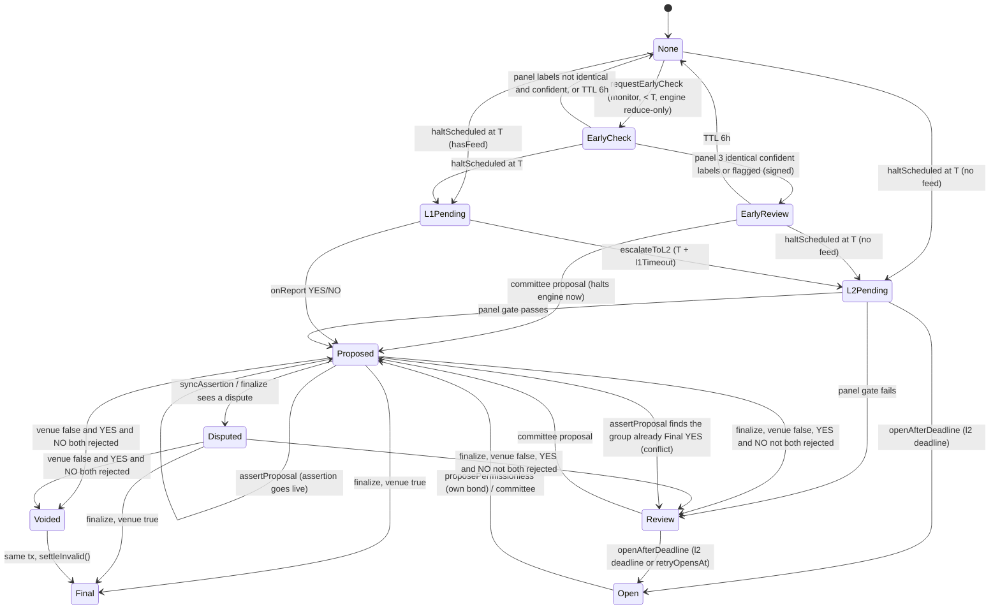

# Eros Markets Oracle — Implementation Plan (Layers 1–3)

Oct 2, 2026 · @Claude

The oracle can be built and run end to end on Monad testnet now; mainnet is blocked by two things outside the oracle team: UMA has no OOv3 on Monad (R-2), and the repo has no concrete market engine or factory yet (DEP-1/2).

**Repo:** `akronim26/eros-markets`, branch `main` @ `c5db208`. **For:** the two-person oracle team. **Status:** re-audited on 2 Oct 2026 for completeness; nothing was pushed to the repo.

**This plan is self-contained.** With the repo and this doc, a team can build, test, deploy and operate the oracle without opening the source specs or the audit. The doc has three tabs:

- **Implementation plan** (this tab): what to build, every rule, how to test, set up, deploy, list and operate.
- **Appendix C — Interfaces**: the normative Solidity types and interfaces, compiled against `main`, plus cross-language test vectors (EIP-712, `specHash`, event topic, void bound).
- **Appendix B — Reference code**: the prototypes that already pass against real UMA, the CRE SDK test runtime and B's real settlement code.

Every external fact was checked against primary sources or running code (§16, Appendix A). Facts that only a live network or a third party can settle are listed with an owner and a check (§16.2).

## 0. How to read this plan

| If you are… | Read |
| --- | --- |
| Building the contracts | §3 (repo seams), §4 (decisions), §5 (state machine), §6 (contracts), §11 (tests) |
| Building the CRE workflow and services | §3, §5, §7 (Layer 1 workflow), §8 (Layer 2 + review), §9 (keepers, watchdog, ops) |
| Setting the system up (accounts, CRE, UMA, deploys, listing) | §12 (setup and deployment runbook) — every step in order |
| Planning and tracking | §13 (work breakdown, gates), §14 (parameters), §16 (verification register), §17 (risks) |

Precedence when sources disagree, highest first:

1. **Engine seam already in the repo**: `docs/spec/oracle_interface.md` and `contracts/src/interfaces/IResolutionIngress.sol`. The engine is built against these, so the oracle conforms to them.
2. **Finalized workflow audit** (`claude/eros-workflow-audit-2026-09-30.md`, EM-01…EM-35 and D-01…D-16). It overrides the Oracle spec wherever it changed a rule.
3. **Eros Markets Oracle: Full Spec (Layers 1–3)**, 30 Sep 2026.
4. **Build Spec** §§7, 10, 14–17. Its §15 is replaced by the Oracle spec.
5. `eventperp-design.pdf` is historical only. Its CRE-receiver/`submitVotes` design is superseded.

Every deviation from the Oracle spec is listed with its reason in §4.2. References such as EM-xx and D-xx (audit findings and decisions), "spec §x" (Oracle spec) and "Build §x" are provenance only: every rule they point to is restated in this doc, and Appendix D maps each one to the section that implements it.

## 1. Summary

The oracle is four contracts, one Chainlink CRE workflow and five off-chain services, all in a new top-level `oracle/` directory owned by the oracle team. No Risk & Clearing file is edited.

- **MarketRegistry** stores each market's immutable resolution config (question, rules, FeedSpec, AI config, UMA config, timeouts). `createMarket` is the only way to list a market: it validates every field, deploys the engine through the shared factory, and checks the result.
- **ResolutionOracle** runs the per-market state machine. It is the engine's pinned `resolutionAuthority` and the only contract that can halt or settle a market. It is also the CRE report receiver (`onReport`), and it verifies signed panel results and m-of-k committee proposals. Every proposal is posted as a bonded assertion, and the market is either finalized from the assertion's result or voided at a deadline.
- **BondTreasury** holds USDC in three separate sub-ledgers: assertion bonds, the watchdog dispute float, and proposer rewards. It is funded from the protocol fee share and never from a market reserve.
- **UmaAdapter** (`IAssertionVenue`) is the only code that talks to UMA OOv3. Its callbacks record and never revert. The oracle reads assertion status directly from OOv3, so a lost callback cannot strand a market. On testnet an **ErosSandboxOracle** stands in for the DVM, and only the team Safe can answer.
- **CRE workflow `eros-resolution`** is triggered by `ResolutionRequested` logs. It reads the FeedSpec from chain, fetches one allow-listed API on every DON node, evaluates it exactly (no floats, no rounding), reaches identical consensus, and writes a YES/NO report. It never writes INVALID and never settles.
- **Services:** keeper (permissionless jobs); evidence snapshotter + Layer 2 panel runner (3 model families, signed results); committee console (EIP-712 m-of-k); independent watchdog (re-checks every proposal, disputes from the treasury float); alerting + indexer + the Disputes Live page.

**What already exists:** the engine-side seam is built and tested in `main` (halt/settle/settleInvalid, the INVALID TWAP, settlement jobs). A prototype oracle caller drove the real `ResolutionIngress` code successfully (Appendix A).

**What blocks a real end-to-end run:** there is no concrete `MarketEngine` and no `MarketFactory` in the repo yet. Person A's and Person B's lanes are not merged (G0–G7 not recorded). The oracle team builds and tests against a stub engine and B's test composition first (§3.4), then re-runs against the real engine once it exists.

**What blocks mainnet:** UMA has no OOv3 deployment on Monad as of 1 Oct 2026 (§16, R-2). The venue adapter isolates that decision.

## 2. Scope

**In scope** (oracle team): everything in §§5–12 — the four contracts, the testnet sandbox DVM, the Layer 1 workflow, evidence snapshotting, the model panel, committee tooling, the watchdog, keepers, alerting, oracle indexing, the Disputes Live page (with the app team), the validation pipeline that opens the Layer 2 auto-gate, deployment scripts, runbooks, and all tests.

**Out of scope** (other teams; the oracle only consumes their interfaces):

- the market engine and its accounting, margin and settlement jobs (Risk & Clearing, Persons A/B)
- the order book (CP-BOOK)
- index/price relaying, including the separate CRE price workflow (CP-PRICE)
- the monitor "Jev" (it only calls `requestEarlyCheck`)
- the OutcomeVault (conversion is disabled, DEC-10; if it is enabled later, the engine, not the oracle, forwards the final outcome to it, so the oracle keeps its single engine call)
- the shared MarketFactory (CP-FACTORY; the oracle defines the ABI it needs in §6.2)

## 3. What the repository gives the oracle (`main` @ c5db208)

The engine side of the oracle seam is built and tested; the oracle itself, the market factory and a deployable engine do not exist yet.

### 3.1 Inventory

`main` has 425 tracked files.

- **Book (CLOB):** `contracts/src/Book.sol`.
- **Person A (accounting, merged 1 Oct):** `math/*`, `risk/{RiskStorage, AccountRegistry, Accounting, FeeAccounting, ReserveAccounting, FundingAccounting, PremiumAccounting, AccountSync, EpochRollover, ClearingCore, TakeoverAccounting, LiquidationFees, FreezeAccounting, FloorAccounting}`, `settlement/{SnapshotLedger, PayoutLedger, RecoveryAccounting, ClaimEscrow, ReserveClaims}`, `vaults/{CollateralVault, ReserveVault, BackstopPool}`, `packages/risk-sdk/src/accounting.ts`.
- **Person B (risk, merged 1 Oct):** `pricing/*`, `risk/{RiskContextPort, MonitorPolicy, OrderRisk, OrderAdmission, BookRiskAdapter, OrderLifecycle, TradePreview, RiskLifecycle, FloorLifecycle, Liquidation*, RiskLiquidation, RiskView}`, `settlement/{ResolutionIngress, InvalidPrice, SettlementController, ConversionGate}`, `interfaces/*`, `provisional/*` stand-ins, `test/mocks/B/*` (including `MockResolutionAuthority`), `docs/counterpart-*.{md,json}`.
- **Reference engines** (Python `Fraction`), the spec packet (`docs/spec/*`), evidence logs, runbooks, and CI (`.github/workflows/contracts.yml`: Foundry 1.8.3, `forge fmt --check`, build with sizes, tests, Book gas snapshot).
- **No oracle code exists.** There is no MarketRegistry, ResolutionOracle, BondTreasury, venue adapter, CRE workflow, panel, committee or watchdog. There is also no MarketFactory and no concrete deployable MarketEngine: every engine in the repo is an abstract module, composed only inside tests with mocks.

The oracle-relevant files were read line by line. `forge build` succeeds and B034–B039 pass (41/41) on Foundry 1.8.3 / solc 0.8.30.

### 3.2 The engine seam the oracle must call (binding)

From `contracts/src/interfaces/IResolutionIngress.sol` and `contracts/src/settlement/ResolutionIngress.sol`:

| Engine call | Who | Behaviour the oracle relies on |
| --- | --- | --- |
| `halt() returns (HaltView)` | `_listing.resolutionAuthority` only | Idempotent, constant work. Before T it is an **early halt**: `economicHaltAt = block.timestamp`. At or after T it is a scheduled halt with `economicHaltAt = T`. Returns `oiHaltLots` (one-sided, includes the reserve) and `snapshotId`. |
| `materializeScheduledHalt()` | anyone, at or after T | Same routine, `economicHaltAt = T`. |
| `settle(uint8 Y)` | resolutionAuthority | Accepts Y = 1 (YES) or Y = 0 (NO) only; any other value reverts `BadOutcome`. Halts first if needed. Repeating the same outcome returns `false`. A **conflicting outcome reverts** `ConflictingFinalOutcome`. About 50k gas, independent of the number of accounts. |
| `settleInvalid()` | resolutionAuthority | INVALID and Voided both use it. The oracle never passes a price. The engine captures the listed `[T−24h, T]` TWAP itself (`captureInvalidPrice()`), with a 0.5 fallback at T+1h for listings that disclosed it. |
| `getHaltSnapshot()`, `getSettlementStatus()` | view | The UI must enable claims only from `claimsEnabled`, never from oracle Final alone. |

Other engine facts that constrain the oracle:

- **Authentication:** the engine checks `msg.sender == _listing.resolutionAuthority`, and that address is immutable per engine. So **ResolutionOracle must be non-upgradeable with a stable address.** A new oracle version means a new deployment for new markets only.
- **IDs and enums:** `marketId` is `bytes32` (the Oracle spec's `uint256` is changed to `bytes32` everywhere). The engine maps the oracle enum `{NONE=0, YES=1, NO=2, INVALID=3}` through `OracleOutcomeMap`. B guessed `VOIDED=4` (assumption I-5); the oracle never sends it, because Voided is a *state* that calls `settleInvalid()`. Confirm with B in task O01.
- **Units:** bond exposure in USDC atoms is `oiHaltLots × 1000`, since 1 lot = 0.001 claim and one claim pays 1,000,000 atoms at YES.
- **Listing gate** (`RiskContextPort.validateListing`): `T ≥ listedAt + 24h` and `T + captureGraceSecs (3600) ≤ listedAt + voidSecs`. Person A's `RiskStorage` constructor also requires `T ≤ deploy time + 2,588,400 s` (30 days − 1 h). So **no market on the real engine can resolve less than 24 h after listing**, and the spec's "demo voidSecs = 1 h" cannot be used with it (§14).
- **Time-derived halt:** at T the engine stops trading by time alone. `haltScheduled` is still needed so the oracle can record `haltedAt = economicHaltAt` and `OI_halt`.
- **Monitor:** pinned per engine (`listing.monitor`). The engine side is `requestReduceOnly`, `clearReduceOnly` and `raiseHazards` (`MonitorPolicy`). `RiskView.marketRiskView().monitorRestricted` tells the oracle whether the market is already reduce-only.

### 3.3 What is missing outside the oracle (dependencies)

| ID | Owner | Needed by oracle | Status in `main` |
| --- | --- | --- | --- |
| DEP-1 | Risk A+B | A concrete `MarketEngine` composition (book + A accounting + B risk) implementing `IResolutionEngine`, `IMarketConfig`, `RiskView` | Missing; G0–G7 not recorded (`docs/spec/gate_status.json`) |
| DEP-2 | Shared (CP-FACTORY) | `MarketFactory.deployMarket(listing, engineInit)`, `onlyRegistry`, deploying, initializing and registering in one transaction (audit C-01) | Missing; the oracle team proposes the ABI in §6.2 |
| DEP-3 | Risk B | Confirm the oracle enum `{NONE, YES, NO, INVALID}` (I-5), the `Listing` fields (I-6), and `voidSecs` = 45 days in production (the engine comment assumes 30) | Open |
| DEP-4 | Risk B | Keep `RiskView.marketRiskView()` (the `monitorRestricted` flag) on the production engine | Exists in B's composition |
| DEP-5 | App team | Indexer/frontend host for the Disputes Live page | Not in repo |

### 3.4 How the oracle is tested before DEP-1/DEP-2 exist

1. **Unit and fuzz tests** use `MockResolutionEngine`, an oracle-team double that implements `IResolutionEngine` with exactly B034's semantics: idempotent halt, Y ∈ {0, 1}, revert on conflict, early versus scheduled `economicHaltAt`.
2. **Seam tests** build an oracle-side `EngineHarness` from B's **real** `SettlementController` → `InvalidPrice` → `ResolutionIngress` source plus B's non-test mocks (`MockBookAdapter`, `MockAccountingPort`), imported through remappings and driven by the real ResolutionOracle. This works (Appendix A, A3). **Never import a `*.t.sol` file from `contracts/`**: it compiles twice under two paths and makes the oracle CI run B's suites.
3. **Testnet before DEP-1/2:** deploy the oracle with `StubMarketFactory` → `ResolutionEngineStub` (oracle-owned, testnet-only, clearly labelled). Every oracle path can be exercised end to end on Monad testnet this way.
4. **Gate OG3b:** re-run the full end-to-end suite against the real engine and factory as soon as the Risk team records G6/G7.

## 4. Architecture decisions

A wrong outcome settles only if (a) its proposer is wrong **and** nobody disputes inside liveness, or (b) UMA's DVM votes wrong.

### 4.1 Trust model

| Party | Can | Cannot |
| --- | --- | --- |
| CRE DON (Layer 1) | Propose YES/NO by a signed report, for markets in `L1Pending` only | Settle; propose INVALID; act before T + buffer |
| Panel runner (attestor key) | Submit a signed panel result. The contract re-checks the gate, then auto-proposes or routes to review | Settle; skip liveness; propose early |
| Resolution committee (m-of-k, 2-of-3) | Propose YES/NO/INVALID in EarlyReview, Review or Open | Settle; skip liveness; repeat a rejected outcome |
| Anyone (keeper) | Halt at T, request, escalate, open, assert, sync, finalize, void; propose in `Open` with their own bond | Choose an outcome except by bonding their own proposal |
| Watchdog | Dispute from the treasury float; heartbeat | Settle; propose |
| Monitor (Jev) | `requestEarlyCheck` (and on the engine: reduce-only, raise hazards) | Halt, propose, settle |
| UMA DVM (prod) / team sandbox (testnet) | Decide whether one specific claim is true | Choose an outcome it was not asked about |
| Governance (Solady `Timelock`) | Create or activate trust sets, set bounded globals, providers, categories, sim relayers, factory; `lockProduction` | Change a listed market's config, a pinned trust set (except revoking), or a Resolution |
| Guardian (Safe) | **Revoke only**: a workflow ID, attestor, committee member or watchdog. Takes effect immediately | Add or replace anything |

### 4.2 Decisions and every deviation from the Oracle spec

| # | Decision | Why (source) |
| --- | --- | --- |
| D1 | **Callback topology.** The OOv3 `callbackRecipient` is UmaAdapter. Its callbacks record and emit, and **never revert**: wrong sender → `return`, storage writes only, no external calls. ResolutionOracle reads status from the venue (`statusOf` → `OOv3.getAssertion`). `finalizeMarket` is permissionless and applies results. `syncAssertion` marks markets Disputed for the UI. | EM-01/D-09. Verified in OOv3 source: a reverting callback blocks `disputeAssertion` and `settleAssertion` (V-U3) |
| D2 | **Attempts.** `A_max = 3` with a `rejectedMask`. After a rejection the market goes to `Review` with a 24 h committee-only window (`retryOpensAt`), then `Open`. **Voided by rejection only when YES and NO are both rejected.** A proposal may never repeat a rejected outcome. | EM-03/D-11 (replaces spec A\_max = 2) |
| D3 | **Clocks.** `haltedAt` = the engine's `economicHaltAt`; `voidDeadline = max(haltedAt, T) + voidSecs`, stored at the halt. `voidMarket` requires `voidDeadline != 0`. | EM-02/D-11/D-16; oracle\_interface "copy economicHaltAt" |
| D4 | **Scheduled halt.** `haltScheduled(id)` is permissionless at ≥ T from any pre-halt state, including EarlyCheck and EarlyReview. `requestResolution` calls it internally if needed. | EM-04/D-10 |
| D5 | **Early states** (`EarlyCheck` and a new `EarlyReview`) expire 6 h after they start (`expireEarly`, permissionless). Early outcomes are always committee-reviewed. | EM-04; spec §6.4 |
| D6 | **Exclusive groups.** A group YES lock is taken at assertion time. It is released when that YES is rejected or the market voids, and kept on Final YES. A YES proposal in a group that already has a Final YES is routed to Review (conflict), never silently dropped. | EM-14/D-15 |
| D7 | **Signatures.** Panel and committee use EIP-712 with domain (`ErosResolutionOracle`, `1`, chainId, verifyingContract). Both payloads bind `marketId`, `attempt`, `trustSetId` and a `deadline`; `PanelResult` adds `phase` and `gateHash`, and `ReviewedProposal` adds `rejectedMask` and `early` (exact fields in Appendix C.2). | EM-25 |
| D8 | **Trust sets.** Forwarder, accepted workflow IDs (2 slots, for redeploys), workflow owner/name, runner attestor, committee and threshold, watchdog and venue are bundled in a versioned **TrustSet**. Markets pin the active set at halt. Governance changes affect only markets halting later; the guardian can only revoke. | EM-26/D-12 |
| D9 | **Bond.** `B = max(minBond_listed, venue.minimumBond(), ceil(oiHaltLots × 1000 × bondBps / 10 000))` USDC atoms, from the halt snapshot. Treasury pays on team paths; the caller pays on the permissionless path. | Spec §8.5; units from the seam |
| D10 | **Expiry guard.** An assertion is allowed only if `now + liveness ≤ voidDeadline`. `voidMarket` first tries to settle and apply a live assertion. | EM-29 |
| D11 | **Liveness fallback.** L1 and L2\_AUTO use the 2 h liveness only while the pinned watchdog's onchain heartbeat is fresh (≤ 15 min); otherwise reviewed liveness (24 h). | EM-16 |
| D12 | **Report v1** also carries `valueHash` (keccak of the extracted value lexeme, agreed by consensus) and `specHash`. `observedAt` comes from the log's **event data**, because a CRE `Log` has no block time (verified in SDK 1.23). | EM-31; V-C6 |
| D13 | **Sim mode** accepts `onReport` from the mock forwarder only when `tx.origin ∈ simRelayers` and the market's pinned set is not production. This replaces the spec's "attestor signature inside the report". Sim mode is impossible on chainId 143 and ended by `lockProduction()`, one-way. After the lock, markets pinned to a sim set get no reports and time out into L2. | EM-35. Verified: `MockKeystoneForwarder.report` **and** `route` are fully permissionless (V-C9) |
| D14 | **Testnet DVM = `ErosSandboxOracle`**, where only the owner (team Safe) can answer, instead of UMA's `MockOracleAncillary`. | Verified: UMA's mock `pushPrice` has **no access control**, so anyone on a public testnet could decide disputes (V-U5) |
| D15 | **`voidSecs` production = 45 days** (computed bound with A\_max = 3 and one extra DVM round of entry delay, §14.2). The spec used 30 days with A\_max = 2. Demo minimum: 26 h with the real engine (its listing gate); 2 h with the testnet stub engine. | §14.2; §3.2 |
| D16 | **Request rate limit.** `requestResolution` re-emits at most once per `minRequestInterval` (4 min) per market; inside the interval it returns `false` without an event. | EM-28; CRE log trigger limit 10 per 6 s |
| D17 | **Committee may also propose in `Open`**, with a treasury bond and reviewed liveness. | Additive; fewer voids when no public proposer bonds up |
| D18 | **Separate Foundry project `oracle/`.** `contracts/foundry.toml` pins solc 0.8.30 and UMA OOv3 is `pragma 0.8.16`. A separate project with auto-detect compiles both, imports the engine read-only via remappings, and keeps ownership clean. | Verified (Appendix A) |
| D19 | **The claim has no UMA size limit.** OOv3 stores the claim only in the `AssertionMade` event; the DVM sees the `assertionId`/`ooAsserter` stamp. Eros caps the rendered claim at 16 KiB for gas. | Verified in OOv3 source (V-U2) |
| D20 | **No callbacks into ResolutionOracle and no pause.** Every progress path is permissionless, so no admin action can strand a market. | Spec §6.7/ORC-9 |

## 5. Resolution state machine (normative)

Every market moves through one state machine in ResolutionOracle; every progress step is permissionless, and every halted market reaches Final by `voidDeadline` at the latest.

### 5.1 Enums: values are ABI; do not reorder

```solidity
enum Outcome { NONE, YES, NO, INVALID }           // 0..3 == engine OracleOutcomeMap source values
enum Path    { NONE, L1, L2_AUTO, REVIEWED, PERMISSIONLESS }
enum RState  { None, EarlyCheck, EarlyReview, L1Pending, L2Pending, Review, Open, Proposed, Disputed, Voided, Final }
//              0       1           2            3          4        5      6       7        8        9      10
enum PanelLabel { ABSTAIN, YES, NO, INVALID, NOT_YET }
enum Phase   { NONE, EARLY, POST_T }
enum FinalReason { NONE, ASSERTED_TRUE, REJECTED_YES_AND_NO, VOID_DEADLINE }
```

The CRE workflow hard-codes `L1Pending = 3`. If the enum ever changes, change it in both places and run the cross-check test (O21).

### 5.2 Mutable record (one per market)

```solidity
struct Resolution {          // normative copy: Appendix C.2
    RState  state;
    Outcome proposed;          // current recorded or asserted proposal
    Path    path;
    uint8   attempts;          // assertions made, <= A_MAX (3)
    uint8   rejectedMask;      // bit (1 << Outcome) for each outcome the venue rejected
    Outcome outcome;           // set once, at Final
    FinalReason finalReason;
    bool    voided;
    uint64  haltedAt;          // == engine HaltView.economicHaltAt (0 before the halt)
    uint64  voidDeadline;      // max(haltedAt, T) + voidSecs, set once at the halt
    uint64  l2StartedAt;       // haltedAt for no-feed markets, escalation time otherwise
    uint64  retryOpensAt;      // after a rejection or group conflict: committee-only until then
    uint64  earlyStartedAt;    // EarlyCheck / EarlyReview start (TTL anchor)
    uint64  lastRequestAt;     // ResolutionRequested rate limit
    uint32  requestCount;
    uint32  trustSetId;        // pinned at the halt
    uint32  globalsVersion;    // registry globals version pinned at the halt
    uint256 oiHaltLots;        // copied from the engine snapshot
    bytes32 evidenceHash;      // L1: keccak256(report); L2/reviewed/permissionless: snapshot hash
    bytes32 valueHash;         // L1 only: keccak of the extracted value lexeme
    bytes32 assertionId;       // live assertion (0 = none)
    address assertionVenue;    // venue that holds assertionId
    uint256 bond;              // bond of the live assertion
    address proposer;          // permissionless proposer (reward recipient)
    uint256 rewardAtoms;       // R_p promised at proposePermissionless (copied from globals then)
}
mapping(bytes32 => string) evidenceURI;   // ipfs://... (rendered into the claim), <= 256 bytes
mapping(bytes32 => GroupState) groups;    // per groupId: yesLockHolder, finalYes
```

### 5.3 Diagram



Not drawn: every halted, non-Final state moves to `Voided` → `Final(INVALID)` through `voidMarket` once `now ≥ voidDeadline`. EarlyReview with a feed goes to L1Pending at T, like EarlyCheck.

### 5.4 Transition table

"No-op return" means the function **returns** `false`/a status instead of reverting. Monad charges the full gas limit even on revert, so keepers must not pay for idempotent no-ops. Reverts are kept for unauthorized calls, invalid input, and the precondition failures the spec tests require.

| Function (caller) | From | Guards (all must hold) | Effects / To | No-op return |
| --- | --- | --- | --- | --- |
| `initResolution(id)` (MarketRegistry only, inside `createMarket`) | — | record does not exist | create the record in **None** | — |
| `requestEarlyCheck(id)` (market's monitor) | None | `now < T`; engine `marketRiskView().monitorRestricted == true` | `earlyStartedAt = now` → **EarlyCheck**; emit `EarlyCheckRequested` | — |
| `submitPanelResult(id, r, evidenceURI, sig)` (anyone relays) | EarlyCheck | sig by the active set's attestor; `r.phase == EARLY`; `r.attempt == attempts`; `now ≤ r.deadline`; `r.gateHash == market gateHash` | (all 3 labels identical ∈ {YES, NO, INVALID} and every ĉ ≥ highConfBps) **or** `flags != 0` → **EarlyReview** (`earlyStartedAt = now`; the committee decides); else → **None** (`EarlyCheckCleared`) | — |
| `submitPanelResult` | L2Pending | as above with `phase == POST_T`; pinned trust set | (a) ≥ 2 NOT\_YET → stay, emit `PanelNotYet`; (b) **auto gate** (§6.4) passes → **Proposed** (L2\_AUTO, `evidenceHash`, `evidenceURI`); (c) otherwise → **Review** (emit reason) | — |
| `submitPanelProposal(id, r, evidenceURI, sig)` | L2Pending | same as above **and** the auto gate passes | → Proposed (L2\_AUTO). Reverts on split, low confidence, unvalidated category, OI above the review limit (spec §10.1) | — |
| `submitReviewedProposal(id, p, evidenceURI, sigs)` (anyone relays; m-of-k) | EarlyReview | `now < T`; `now < earlyStartedAt + earlyTtl`; ≥ threshold distinct committee sigs (active set); `p.outcome ∈ {YES, NO, INVALID}`; YES not blocked by the group's Final YES | `engine.halt()` (early halt), pin trust set, `haltedAt = economicHaltAt`, `voidDeadline`, `oiHaltLots` → **Proposed** (REVIEWED) | — |
| `submitReviewedProposal` | Review, Open | halted; sigs from the **pinned** set; `p.outcome ∉ rejectedMask`; `p.attempt == attempts`; `p.rejectedMask == rejectedMask`; group check as above | → **Proposed** (REVIEWED) | — |
| `haltScheduled(id)` (anyone) | None, EarlyCheck, EarlyReview | `now ≥ T` | `engine.halt()` (scheduled: `economicHaltAt = T`); copy `haltedAt`, `oiHaltLots`; `voidDeadline`; pin trust set; hasFeed → **L1Pending**, else → **L2Pending** (`l2StartedAt = haltedAt`) | already halted → `false` |
| `requestResolution(id)` (anyone) | L1Pending (or pre-halt with `now ≥ T`: halts first) | `hasFeed`; `now ≥ T + bufferSecs` (else revert `TooEarly`) | `lastRequestAt = now`, `requestCount++`, emit `ResolutionRequested(id, uint64(now), requestCount)` | inside `minRequestInterval`, or state ≠ L1Pending → `false` |
| `onReport(metadata, report)` (forwarder) | L1Pending | §6.4 checks | → **Proposed** (L1), `evidenceHash = keccak256(report)`, `valueHash`; emit `ProposedL1` | — (reverts; forwarder may retry, state check blocks replays) |
| `escalateToL2(id)` (anyone) | L1Pending | `now ≥ T + l1TimeoutSecs` | `l2StartedAt = now` → **L2Pending** | wrong state → `false` |
| `openAfterDeadline(id)` (anyone) | L2Pending, Review | halted; now ≥ T (an early-halted market stays committee-only until T, ORC-15); if `retryOpensAt == 0`: `now ≥ l2StartedAt + l2DeadlineSecs`; else `now ≥ retryOpensAt` | → **Open** | not yet → `false` |
| `expireEarly(id)` (anyone) | EarlyCheck, EarlyReview | `now ≥ earlyStartedAt + earlyTtl` | → **None** | not yet → `false` |
| `assertProposal(id)` (anyone) | Proposed (no live assertion) | `attempts < 3`; `proposed ∉ rejectedMask`; `now + liveness(path) ≤ voidDeadline`; treasury assertion ledger ≥ B (else revert TreasuryShort; the keeper alerts and retries) | group YES with a Final YES already → **Review** (conflict, no attempt used; `proposed = NONE`, `retryOpensAt = now + retryWindow`, because `l2StartedAt` may be 0 on a feed market); lock held by another → no-op; else take lock. `treasury.fundAssertion` → `venue.assertOutcome(asserter = treasury, payer = treasury)`; store `assertionId`, venue, bond; `attempts++`; emit `Asserted` | live already, or waiting on lock → `false` |
| `proposePermissionless(id, outcome, uri, evidenceHash)` (anyone, own bond) | Open | outcome ∈ {YES, NO, INVALID} minus `rejectedMask`; `attempts < 3`; `now + livenessReviewed ≤ voidDeadline`; group YES lock free and no Final YES; caller approved the adapter for B | atomic: record + `venue.assertOutcome(asserter = caller, payer = caller)`; path PERMISSIONLESS; rewardAtoms = globals.proposerRewardAtoms; `proposer = caller`; `attempts++` → **Proposed** (live) | — |
| `syncAssertion(id)` (anyone) | Proposed (live) | venue `disputed` | → **Disputed**; emit `Disputed` | otherwise `false` |
| `finalizeMarket(id)` (anyone) | Proposed (live), Disputed | live assertion | `venue.trySettle(assertionId)` (never reverts), then read venue.statusOf, because anyone may have settled on OOv3 directly. **settled & true** → `_final(proposed, ASSERTED_TRUE)`. **settled & false** → `_reject()`. **not settled** → sync Disputed if disputed | not settleable → `NOT_READY` |
| `voidMarket(id)` (anyone) | any halted non-Final | `voidDeadline != 0 && now ≥ voidDeadline` | if a live assertion is settled or settleable → apply it as in `finalizeMarket`; else **Voided** → `_final(INVALID, VOID_DEADLINE)`; release group lock; team bond → `treasury.markStuck` | Final → `false` |
| `watchdogHeartbeat()` (pinned watchdog) | — | caller is the non-revoked watchdog of any trust set (so a market pinned to an older set keeps its watchdog's heartbeat) | `lastHeartbeat[watchdog] = now` | — |

**`_final(o, reason)`:**

1. `state = Final`, `outcome = o`, `finalReason = reason`.
2. Call the engine **in the same transaction** (oracle\_interface rule): YES → `settle(1)`, NO → `settle(0)`, INVALID → `settleInvalid()`. If the engine reverts, the whole transaction reverts and the keeper retries.
3. Treasury, **only when `reason == ASSERTED_TRUE`**: team path (L1, L2\_AUTO, REVIEWED) → `onBondReturned(id, attempt)`; PERMISSIONLESS → `payProposerReward(id, proposer, rewardAtoms)`, which never reverts and records an IOU when the reward ledger is short (OOv3 already returned the proposer's own bond). For `REJECTED_YES_AND_NO` the bond was handled in `_reject`; for `VOID_DEADLINE` a live team bond goes to `markStuck`.
4. YES → `group.finalYes = id`.
5. Emit `Finalized`.

In every case `_final` also calls `treasury.releaseListing(id)`, which frees the bond-at-cap commitment made when the market was listed (§6.6).

**`_reject()`:**

1. `rejectedMask |= 1 << proposed`; clear `assertionId`; release the group lock if YES.
2. Team path → `treasury.onBondLost(id, attempt)`. Permissionless path → nothing to book (OOv3 paid the proposer's bond to the disputer); clear `proposer`.
3. If both the YES and the NO bit are set → `voided = true` → `_final(INVALID, REJECTED_YES_AND_NO)`.
4. Else → **Review** with `retryOpensAt = now + retryWindow` (24 h) and `proposed = NONE`.

A late callback, report or proposal after Final/Voided changes nothing (ORC-8). The adapter's callbacks only record, and every oracle entry point checks state.

### 5.5 Invariants (fuzzed with a stateful handler, O17)

| ID | Invariant |
| --- | --- |
| ORC-1 | No MarketRegistry field changes after `createMarket` (no setters; SSTORE2 pointers immutable) |
| ORC-2 | `settle`/`settleInvalid` is called at most once per market, only in `_final` |
| ORC-3 | Final only via an assertion settled true, or via Voided (deadline, or YES and NO both rejected) |
| ORC-4 | `onReport` changes state only in `L1Pending`; any later report reverts |
| ORC-5 | At most one live assertion per market; `attempts ≤ 3` |
| ORC-6 | No outcome is proposed after it was rejected (`rejectedMask` is monotone) |
| ORC-7 | In an exclusive group at most one member is Final YES; at most one member holds the YES lock |
| ORC-8 | Calls after Final/Voided change nothing |
| ORC-9 | Every halted non-Final market can reach Final at `voidDeadline` without a privileged call; every unhalted market can be halted at T without one |
| ORC-10 | The assertion ledger pays only to the venue adapter through `assertProposal`; the float ledger only through `disputeViaVenue`; the reward ledger only to a Final permissionless proposer; the only other outflow is the Timelock's withdraw, which never takes ASSERTION below totalCommitted |
| ORC-11 | `haltedAt == engine.getHaltSnapshot().economicHaltAt` and `oiHaltLots` equals the snapshot's |
| ORC-12 | `voidDeadline` is set once, equals `max(haltedAt, T) + voidSecs`, and never changes |
| ORC-13 | `trustSetId` never changes after the halt; a market pinned to a non-production set accepts no `onReport` after `lockProduction` |
| ORC-14 | Treasury solvency: each ledger's balance ≥ 0; `token.balanceOf(treasury) ≥ Σ ledgers` |
| ORC-15 | Early proposals are always REVIEWED; L2\_AUTO never happens before T |

## 6. Contracts

Four non-upgradeable contracts in a separate Foundry project: MarketRegistry, ResolutionOracle, BondTreasury and UmaAdapter, plus a testnet-only sandbox DVM and stub factory.

### 6.1 Layout (`oracle/`, new Foundry project)

```
oracle/
  foundry.toml                 # validated config below
  src/
    types/OracleTypes.sol      # Appendix C.2 (normative)
    interfaces/                # Appendix C.3-C.6 + IAssertionVenue, IOptimisticOracleV3 (Appendix B.7)
    libraries/
      FeedSpecLib.sol          # types/ops, paths, decimals, target parse (same rules as packages/feedspec)
      HostLib.sol              # https, host charset, no port/userinfo, {id} placement, urlParam charset
      ClaimRenderer.sol        # one-pass {{TOKEN}} renderer + worst-case length (Solady DateTimeLib/LibString)
      VoidBound.sol            # section 14.2 bound
      BondMath.sol             # section 6.5 bond, liveness selection
      SigLib.sol               # EIP-712 hashes (Appendix C.7), m-of-k verification (Solady EIP712 + SignatureCheckerLib)
    MarketRegistry.sol
    ResolutionOracle.sol
    BondTreasury.sol
    KeeperRouter.sol           # section 6.11
    venues/UmaAdapter.sol      # Appendix B.4
    venues/ErosSandboxOracle.sol   # TESTNET ONLY, Appendix B.5
    testnet/StubMarketFactory.sol, testnet/ResolutionEngineStub.sol   # TESTNET ONLY, section 6.10
  test/  unit/ fuzz/ invariant/ integration-uma/ (+ uma/UmaImports.sol) seam/EngineHarness.sol gas/ vectors/
         # never import contracts/**/*.t.sol
  script/  DeployUmaSandbox.s.sol DeployOracle.s.sol CreateTrustSet.s.sol ListMarket.s.sol
           LockProduction.s.sol FundTreasury.s.sol
  vectors/                     # feedspec.json, eip712.json, spechash.json, voidbound.json (shared by Solidity + TS)
  deployments/<network>.json   # schema in section 12.11; params.<network>.json (deploy input); gas.json
  lib/ (git submodules)        # section 12.2a: forge-std f3dae6e, solady 2afba69, UMA protocol d1a2373, OZ v4.9.6
  packages/ workflows/ services/ indexer/ validation/ docs/   # sections 7-10
```

`foundry.toml` (validated, Appendix A):

```toml
[profile.default]
src = "src"
test = "test"
script = "script"
out = "out"
libs = ["lib"]
auto_detect_solc = true          # our sources pin 0.8.30; UMA OOv3 pins 0.8.16
evm_version = "prague"
optimizer = true
optimizer_runs = 200
code_size_limit = 131072         # Monad 128 KiB, same as contracts/
bytecode_hash = "none"            # Monad explorer (Sourcify) verification; Monad docs call this metadata_hash
use_literal_content = true
allow_paths = ["../contracts"]
fs_permissions = [{ access = "read-write", path = "./deployments" }]   # scripts write addresses here
remappings = [
  "solady/=lib/solady/src/",
  "forge-std/=lib/forge-std/src/",
  "@eros/=../contracts/src/",
  "@eros-provisional/=../contracts/provisional/",
  "@eros-test/=../contracts/test/",
  "@uma/=lib/uma-protocol/packages/",
  "@openzeppelin/=lib/openzeppelin-contracts-v4/",
]

[profile.default.fuzz]
runs = 1000

[profile.default.invariant]
runs = 64
depth = 64
fail_on_revert = false

[profile.ci.fuzz]
runs = 10000

[profile.ci.invariant]
runs = 256
depth = 128
fail_on_revert = false
```

This exact file was run on 2 Oct 2026 with Foundry 1.8.3: no config warnings, both profiles resolve (default 1,000 fuzz / 64×64 invariant; `ci` 10,000 / 256×128), all prototype suites pass. Monad's docs show `metadata_hash`; in Foundry 1.8.3 that key is unknown and the right key is `bytecode_hash`.

Rules:

- All oracle sources use `pragma solidity 0.8.30;` and depend only on Solady and engine **interfaces** (`@eros/interfaces/*`).
- UMA code (AGPL-3.0) is compiled only for tests and the sandbox deploy script. The oracle talks to OOv3 through its own MIT `IOptimisticOracleV3`; no UMA source is copied.
- Contracts are **not upgradeable**: the engine pins the oracle's address (§3.2).
- Use Solady `ReentrancyGuard` (not the transient variant), `SafeTransferLib`, `SSTORE2`, `EIP712`, `SignatureCheckerLib`, `LibString`, `DateTimeLib` and `Timelock` (all present at 2afba69).

### 6.2 Interfaces the oracle needs from other teams

```solidity
// DEP-2 — proposed to CP-FACTORY (audit C-01). Registry is the only caller.
interface IMarketFactory {
    /// Deploys + initializes + registers one market's engine (and its clones) atomically.
    /// MUST bind listing.resolutionAuthority / registry / marketId immutably, and revert on reuse.
    function deployMarket(IMarketConfig.Listing calldata listing, bytes calldata engineInit)
        external returns (address engine);
}

// DEP-4 — subset of B's RiskView already in main.
interface IEngineMonitorView {
    function marketRiskView() external view returns (RiskView.MarketRiskView memory);  // .monitorRestricted
}
// Plus, from main: IResolutionEngine (halt/settle/settleInvalid/materializeScheduledHalt/getHaltSnapshot/
// getSettlementStatus) and IMarketConfig (listing/listingHash).
```

### 6.3 MarketRegistry

**Immutable per-market config.** Written once in `createMarket`, no setters; long text goes through SSTORE2.

The exact structs are in Appendix C.2: `MarketCore` (engine, SSTORE2 pointers to question and rules, times, group, `hasFeed`, deadlines, copied `retryWindowSecs`/`earlyTtlSecs`, monitor, `oiCapLots`, `rulesHash`, `specHash`, `gateHash`), `FeedSpec` (ABI-identical to the workflow tuple), `AIConfig`, `UMAConfig`, `MarketInput` (the `createMarket` calldata), `Globals`, `Category` and `GroupInfo`. Long text (question, rules, allow-list, claim template) is stored with Solady `SSTORE2`.

`gateHash = keccak256(abi.encode(modelIdHashes, promptHash, calibratorHash, highConfBps))`. `specHash` is stored next to the FeedSpec.

**Globals are versioned** (audit D-12). `setGlobals` appends a new version; old versions are kept (`globalsAt(v)`). `createMarket` validates against the current version and copies `retryWindowSecs` and `earlyTtlSecs` into `MarketCore`. Each market pins the current version at its halt, together with its trust set, and every later read (request interval, heartbeat age, auto-gate thresholds, review limit, R\_p) uses the pinned version. Before the halt (early check) the current version applies. A category opens the auto gate only if it is `validated` now **and** `validatedAt ≤ haltedAt`, so validating a category never loosens a market that is already resolving, while revoking one applies at once. Bounds that `setGlobals` enforces are in §14.4.

**`createMarket(MarketInput m, IMarketConfig.Listing engineListing, bytes engineInit) returns (address engine)`.** Only the `lister` can call it: the Timelock in production, the team Safe on testnet. It reverts unless **all** of the following hold.

1. **Identity.** `m.marketId != 0` and not used before (`DuplicateMarket`). An active trust set exists (`NoActiveTrustSet`). If `groupId != 0`: the first market of a group records `GroupInfo{exists: true, exclusive: groupExclusive}`; later markets must match it (`GroupMismatch`).
2. **Times** (`BadTimes`).
   - `now + g.minHorizonSecs ≤ tau ≤ now + g.maxListingHorizon`. Defaults: 1 day (the engine's `MIN_LISTING_HORIZON`) and 2,588,400 s (A's `RiskStorage` constructor). On testnet with the stub engine `minHorizonSecs` may be lowered to 10 min (§14.4).
   - `windowStart < windowEnd ≤ tau`.
   - `l2DeadlineSecs ∈ [g.l2MinSecs, g.l2MaxSecs]`.
   - `voidSecs ≥ max(minVoidSecs(...), tau − now + 3600)` and `≤ g.maxVoidSecs`. `minVoidSecs` is the §14.2 bound; the second term is the engine's listing gate `T + captureGraceSecs ≤ listedAt + voidSecs`, checked here so the error is readable.
3. **Feed** (`hasFeed`; `BadFeed`), via FeedSpecLib and HostLib:
   - `urlTemplate` starts with `https://`; the host is lowercase `[a-z0-9-]` labels joined by dots (at least two labels, no leading or trailing hyphen), with no userinfo (`@`) and no port; `{id}` appears at most once and **after** the first `/` following the host; `urlParam` matches `[A-Za-z0-9._~-]{1,128}`.
   - The host of the substituted URL `== allowList[0]`.
   - `finalPath` and `valuePath` match `seg(.seg)*` with `seg = [A-Za-z0-9_$-]+([n])*`, at most 256 bytes; `finalValue` is non-empty.
   - Op per type: STRING allows EQ/NEQ only; INT/DECIMAL allow all six.
   - `decimals > 0` only for DECIMAL, and `≤ 18`.
   - `target` parses under the type: INT `-?(0|[1-9]\d*)`; DECIMAL `-?(0|[1-9]\d*)(\.\d+)?` with at most `decimals` fractional digits and no exponent; STRING non-empty.
   - `bufferSecs < l1TimeoutSecs`, both inside `[g.bufferMinSecs, g.bufferMaxSecs]` and `[g.l1TimeoutMinSecs, g.l1TimeoutMaxSecs]`.
   - `authRef == 0` or `authRefKnown[authRef]`, a governance list kept in step with the workflow config (§7.4).
   - Without a feed, the FeedSpec must be all-zero.
4. **Allow-list** (`BadAllowList`). Non-empty; every host passes the HostLib rules and is in `providerAllowed` (the global list, governance-managed).
5. **AIConfig** (`BadAIConfig`). Three distinct non-zero model hashes; non-zero prompt, calibrator and category; `highConfBps ∈ [g.highConfFloorBps, 10000]`.
6. **UMAConfig** (`BadUMAConfig`).
   - `bondCurrency == USDC`.
   - `minBond ≥ venue.minimumBond()`, using the venue of the **active** trust set.
   - `bondBps ≥ g.bondBpsFloor`.
   - Each liveness `≥ g.tMinSecs`, and `livenessReviewed ≥ max(livenessL1, livenessAuto)`.
   - The claim template contains each of `{{MARKET_ID}} {{CHAIN_ID}} {{ORACLE}} {{QUESTION}} {{RULES}} {{TAU_UTC}} {{OUTCOME}} {{EVIDENCE}} {{EVIDENCE_HASH}}` exactly once, `{{TAU_UNIX}}` at most once, and no other `{{…}}` token.
   - Worst-case rendered length `≤ g.maxClaimBytes`: template bytes minus token bytes, plus question, rules, 66 (market id), 20 (chain id), 42 (oracle), 20 (UTC time), 20 (unix time), 7 (outcome), 66 (evidence hash), plus `max(256, L1 evidence text)` where the L1 text is `"Layer 1 CRE report, value " + 66 + ", source " + substituted URL`.
7. **Treasury at cap.** `treasury.commitListing(id, BondMath.bond(oiCapLots, uma, venue.minimumBond()))` succeeds, i.e. the ASSERTION ledger covers every listed market's commitment plus this one (§6.6). `oiCapLots` must equal the engine's OI cap; the registry cannot read that cap, so the listing checklist (§12.9) checks it by hand. It only sizes this commitment; the real bond uses `oiHaltLots`.
8. **Engine handshake.** The registry overwrites `engineListing.{marketId, registry = this, resolutionAuthority = oracle, monitor = m.monitor, scheduledT = tau, listedAt = now, rulesHash, sourceHash = keccak256(abi.encode(specHash, keccak256(abi.encode(allowList)))), invalidRule = {fallbackListed: true, captureGraceSecs: 3600, fallbackPriceWad: 5e17, voidSecs}}`. Then `engine = factory.deployMarket(listing, engineInit)`, then `require(IMarketConfig(engine).listingHash() == keccak256(abi.encode(listing)))` (the engine computes it exactly this way, `RiskContextPort.sol` line 80) and `require(!engine.getHaltSnapshot().halted)`.
9. Write the SSTORE2 pointers and structs, call `ResolutionOracle.initResolution(id)` (state None), and emit `MarketListed`.

**Governance (Timelock) on the registry:**

- `setProvider(host, allowed)`
- `setAuthRef(authRef, known)`
- `setCategory(categoryId, gateHash, u95Bps, sampleN, validated)`

  The registry stamps `validatedAt = block.timestamp` on every `setCategory` call with `validated = true` (so changing a validated category's `gateHash`, `u95Bps` or `sampleN` restarts its clock), and clears it when `validated` is false.
- `setGlobals(Globals)`: bounded as above; cannot change a listed market's copied values
- `setLister`
- `setFactory(factory)`: future listings only (listed markets store their engine address). This is how the testnet stub factory is replaced by the shared `MarketFactory` without redeploying the registry or the oracle.

**Views** (used by the workflow and services): `getMarketCore`, `getFeedSpec`, `getSpecHash`, `getAllowList`, `getAIConfig`, `getUMAConfig`, `getQuestion`, `getRules`, `getClaimTemplate`.

### 6.4 ResolutionOracle

**Constructor (immutables):** `registry`, `treasury`, `usdc`, `monadChainSelector` (2183018362218727504 testnet / 8481857512324358265 mainnet), `simModeAllowed = (block.chainid != 143)`, `governance` (Timelock), `guardian`. The storage flag `simMode` starts equal to `simModeAllowed`.

**Trust sets:**

A trust set is `TrustSetInput` plus revoke flags (Appendix C.2): forwarder, `production` flag, two accepted workflow IDs, workflow owner and optional name, runner attestor, committee (strictly ascending addresses) and threshold, watchdog, venue. IDs start at 1; 0 means none. Leave workflowName = 0 (unchecked): the workflow ID already commits to the name, owner, code and config (V-C10), and the 10-byte name encoding is CRE-internal.

- `createTrustSet` and `activateTrustSet` are Timelock-only. `createTrustSet` reverts `BadTrustSet(code)` unless: forwarder non-zero; if `production`, `workflowIds[0] != 0` and `workflowOwner != 0`; attestor and watchdog non-zero; committee non-empty, non-zero, strictly ascending; `1 ≤ threshold ≤ committee.length`; venue non-zero and `venue.bondCurrency() == usdc`.
- Markets pin `activeTrustSetId` (and the registry's globals version) at the halt. An early halt pins at that moment.
- The guardian can only call `revokeWorkflowId`, `revokeAttestor`, `revokeCommitteeMember` and `revokeWatchdog`. These apply to pinned sets too and take effect immediately.
- `watchdogHeartbeat()` accepts any non-revoked watchdog of any trust set and records `lastHeartbeat[msg.sender]`. `watchdogOf(id)` returns the pinned set's watchdog, or 0 if revoked; BondTreasury uses it to authorize `disputeViaVenue`.
- Reentrancy: every state-changing external function is `nonReentrant`; effects are written before the venue, treasury and engine calls.

**`onReport(bytes metadata, bytes report)`** (IReceiver; `supportsInterface` returns true for `0x805f2132` and `0x01ffc9a7`):

1. **Authenticate.** Branch on the sender, so a production forwarder works while sim mode is still on (needed for E10 and the staging switch).
   - **Sim path** (`simMode && simModeAllowed && msg.sender == simForwarder`): require `simRelayer[tx.origin]` and that the market's pinned set is **not** `production`; skip the metadata checks (the mock forwarder supplies none).
   - **Production path** (any other sender): `ts = trustSets[res.trustSetId]`; require `ts.production`, `msg.sender == ts.forwarder` (never `address(0)`) and `metadata.length >= 62`. Decode `workflowId = metadata[0:32]`, `workflowName = bytes10(metadata[32:42])`, `workflowOwner = address(bytes20(metadata[42:62]))`; production metadata is 64 bytes (`reportId` at \[62:64\]). Require `workflowId ∈ ts.workflowIds` (not revoked) and `workflowOwner == ts.workflowOwner`. If `ts.workflowName != 0`, require the names to match.
2. **Decode** `(uint8 v, uint64 sel, address oracle, bytes32 id, uint8 outcome, uint64 observedAt, bytes32 valueHash, bytes32 specHash)`. Require `v == 1`, `sel == monadChainSelector`, `oracle == address(this)`, `outcome ∈ {1, 2}`, `res[id].state == L1Pending`, `specHash == registry.getSpecHash(id)`, `observedAt ≥ tau + bufferSecs` and `observedAt ≤ block.timestamp`.
3. **Effects.** `proposed`, `path = L1`, `evidenceHash = keccak256(report)`, `valueHash` → **Proposed**; emit `ProposedL1(id, outcome, observedAt, valueHash, evidenceHash)`. No settle call. Target under 150k gas for `onReport` itself (§6.9), far under CRE's 10M write cap.

Replays: the forwarder retries reverted reports (verified: `route` only blocks success or an invalid receiver). The state check makes every replay revert.

**Sim mode lifecycle:**

- `setSimForwarder(addr)` and `setSimRelayer(addr, bool)` are Timelock-only and only allowed while sim mode is on.
- `lockProduction()` is Timelock-only and one-way. It requires the active trust set to be `production` with a non-zero forwarder, at least one workflow ID and a workflow owner. It then sets `simMode = false` and clears `simForwarder`.
- On chainId 143 sim mode is off from the constructor.

**EIP-712.** Domain: `{name: "ErosResolutionOracle", version: "1", chainId, verifyingContract}`.

```text
PanelResult(bytes32 marketId,uint8 phase,uint8 attempt,uint8[3] labels,uint16[3] calibratedBps,bytes32 evidenceHash,bytes32 evidenceURIHash,bytes32 gateHash,uint8 flags,uint32 trustSetId,uint64 deadline)
ReviewedProposal(bytes32 marketId,uint8 outcome,bytes32 evidenceHash,bytes32 evidenceURIHash,bytes32 noteHash,uint8 attempt,uint8 rejectedMask,bool early,uint32 trustSetId,uint64 deadline)
```

- Arrays encode as `keccak256(abi.encodePacked(uint256-padded elements))`, per EIP-712. `evidenceURI` is passed alongside and checked against `evidenceURIHash`.
- Committee signatures are sorted by signer ascending and must be unique members of the set with count ≥ threshold. Verification uses `SignatureCheckerLib.isValidSignatureNow`, so members can be EOAs or Safes (ERC-1271).
- `trustSetId` in the payload must equal the market's pinned set, or the active set before the halt.

Signature formats and checks:

- Panel: one `bytes sig` from the trust set's `runnerAttestor` (EOA, 65-byte r,s,v; KMS output normalized to `v ∈ {27, 28}` and low-s). Committee: `Sig[]` strictly ascending by `signer`, each a non-revoked member, count ≥ threshold; `SignatureCheckerLib.isValidSignatureNow(signer, digest, signature)` so a member may be a Safe (ERC-1271).
- Both: `marketId` matches; `now ≤ deadline`; `attempt == attempts`; `trustSetId` as above; `keccak256(bytes(evidenceURI)) == evidenceURIHash`; `1 ≤ bytes(evidenceURI).length ≤ 256`. Committee also: `rejectedMask` matches and `early == (state == EarlyReview)`.
- Typehashes, a worked digest for each type and the exact array encoding are in Appendix C.7; Solidity and viem were checked to produce the same digests.

**Auto gate (`_autoGate`), checked onchain from the signed payload:**

- `labels` are 3/3 YES or 3/3 NO;
- each `calibratedBps[i] ≥ ai.highConfBps`;
- `registry.category(ai.categoryId)` is `validated`, its `gateHash == market gateHash`, `u95Bps ≤ globals.deltaPmaxBps` and `sampleN ≥ globals.nMin`;
- `oiHaltLots × 1000 ≤ globals.reviewLimitAtoms`;
- `phase == POST_T`, `flags == 0` (no injection suspected, §8.3), `evidenceHash != 0`, and `evidenceURI` is non-empty.

All `globals.*` reads above use the market's pinned globals version, and the category must also have `validatedAt ≤ haltedAt` (§6.3).

At launch no category is validated, so every Layer 2 result goes to review.

**`livenessFor(path)`:** L1 → `livenessL1`; L2\_AUTO → `livenessAuto`; both fall back to `livenessReviewed` if `now − lastHeartbeat[ts.watchdog] > globals.heartbeatMaxAge` or the watchdog is revoked; REVIEWED and PERMISSIONLESS → `livenessReviewed`.

**Claim (`renderClaim(id)`, also a view for the UI).** One-pass renderer over the SSTORE2 template. Tokens: `{{MARKET_ID}}` (0x hex), `{{CHAIN_ID}}`, `{{ORACLE}}` (checksummed), `{{QUESTION}}`, `{{RULES}}`, `{{TAU_UTC}}` (`YYYY-MM-DDTHH:MM:SSZ` via DateTimeLib), `{{TAU_UNIX}}`, `{{OUTCOME}}` (`YES`/`NO`/`INVALID`), `{{EVIDENCE}}` (the evidence URI, or for L1 "Layer 1 CRE report, value `<valueHash>`, source `<substituted URL>`"), `{{EVIDENCE_HASH}}`.

Default template (spec §7.3):

```text
Eros Markets market {{MARKET_ID}} (chain {{CHAIN_ID}}, oracle {{ORACLE}}).
Question: {{QUESTION}}
Rules: {{RULES}}
Scheduled time T: {{TAU_UTC}} ({{TAU_UNIX}})
Asserted outcome: {{OUTCOME}}
Evidence: {{EVIDENCE}}, keccak256 {{EVIDENCE_HASH}}
This assertion is true if and only if the rules above, applied to what happened, give the asserted outcome.
```

**Other public views:** `getResolution(id)`; `getL1Job(id) → (uint8 state, FeedSpec, string[] allowList, bytes32 specHash)` (the single EVM read the workflow makes); `bondFor(id)`, `livenessFor(id)`, `renderClaim(id)`; `trustSet(id)`, `activeTrustSetId()`; `groupState(groupId)`.

### 6.5 Bond (`BondMath`)

```text
exposureAtoms = oiHaltLots × 1000                          // 1 lot = 0.001 claim; a claim pays 1e6 atoms
B = max( uma.minBond, venue.minimumBond(), ceil(exposureAtoms × bondBps / 10_000) )
```

Example (verified in test A3): 2,000,000 lots = 2,000 claims, so exposure is 2,000 USDC; at 1112 bps, B = 222.4 USDC. The disputer posts the same B. The watchdog float must hold Σ B over live assertions (spec §8.5); an alert fires otherwise.

### 6.6 BondTreasury

Ledgers: `ASSERTION` (0), `WATCHDOG_FLOAT` (1), `PROPOSER_REWARD` (2). All amounts are USDC atoms.

| Function | Caller | Effect |
| --- | --- | --- |
| `deposit(ledger, amount)` | anyone (protocol fee router) | Pull USDC, credit the ledger |
| `commitListing(id, bondAtCap)` | MarketRegistry | Require `balanceOf(ASSERTION) ≥ totalCommitted + bondAtCap`; record `committedListing[id]`, add to `totalCommitted` (audit EM-27/D-15) |
| `releaseListing(id)` | oracle, in `_final` | Remove the market's commitment from `totalCommitted` |
| `fundAssertion(id, attempt, venue, bond)` | oracle | Debit ASSERTION (revert `InsufficientLedger`); `outstanding[id][attempt] = bond`; `fundedTotal[id] += bond ≤ maxPerMarket`; approve `venue` (the market's pinned adapter) for exactly `bond`; the adapter pulls it |
| `onBondReturned(id, attempt)` | oracle | OOv3 already paid the treasury, so credit ASSERTION by `outstanding` and clear it |
| `onBondLost(id, attempt)` / `markStuck(id, attempt)` | oracle | Clear `outstanding`; record the loss (no credit) |
| `disputeViaVenue(id)` | `oracle.watchdogOf(id)` | Read the live assertion and its venue from `oracle.getResolution(id)` (revert `NoLiveAssertion`); require `openDisputes < maxOpenDisputes`; debit WATCHDOG\_FLOAT by its bond; approve the adapter; `venue.disputeFor(assertionId, payer = treasury, disputer = treasury)`; `openDisputes++` |
| `closeDispute(assertionId)` | anyone | Acts only on a dispute that `disputeViaVenue` recorded (it stores the assertion's venue, market and bond); anything else returns `false`. Closes it when the venue shows the assertion settled, or when `oracle.getResolution(market)` is Final with `VOID_DEADLINE` (a deleted or never-answered vote never pays). Closing does `openDisputes--`, subtracts the bond from `openDisputeBonds` and deletes the record, so a second call returns `false`. Winnings, including late ones after a write-off, arrive as plain USDC; `skim()` credits them |
| `payProposerReward(id, proposer, amount)` | oracle | Pay from PROPOSER\_REWARD; if short, record `owed[proposer] += amount` and **do not revert** |
| `claimOwed()` | proposer | Pay the IOU when PROPOSER\_REWARD is funded |
| `skim()` | anyone | `usdc.balanceOf(this) − Σ ledgers − Σ outstanding − Σ open dispute bonds` → WATCHDOG\_FLOAT (dispute winnings, donations). Credits only a positive remainder; otherwise it returns 0 and never reverts. The treasury keeps two running totals for this: totalOutstanding (fundAssertion adds; onBondReturned, onBondLost and markStuck subtract) and openDisputeBonds (disputeViaVenue adds the bond, keyed by assertionId; closeDispute subtracts it). Conservative on purpose: money that an in-flight bond return will book is never credited twice |
| `withdraw(ledger, to, amount)` | Timelock | From ASSERTION only down to `totalCommitted`; other ledgers down to 0 |
| `setLimits(maxPerMarket, maxOpenDisputes)` | Timelock | Production start: `maxPerMarket` = 3 × bond at the largest OI cap; `maxOpenDisputes` = 20 |

The treasury never touches market reserves or the CollateralVault. It has no venue setter: the venue comes from the oracle per call. Funding rule that follows from `commitListing`: the ASSERTION ledger must hold the bond at the OI cap of every listed, non-final market at once, which is also the mainnet launch rule (§12.10).

### 6.7 UmaAdapter and ErosSandboxOracle

Prototyped and tested against real OOv3 code (Appendix A, A2). Constructor: `(oov3, usdc, oracle, treasury)`; `identifier = oov3.defaultIdentifier()` (`ASSERT_TRUTH`).

- **`assertOutcome(req)`** (oracle only): `usdc.safeTransferFrom(payer, adapter, bond)` → `usdc.safeApprove(oov3, bond)` → `oov3.assertTruth(claim, asserter, callbackRecipient = adapter, escalationManager = 0, liveness, usdc, bond, ASSERT_TRUTH, domainId = marketId)`. OOv3 pulls the bond from **msg.sender** (the adapter) and later pays **`asserter`** (verified).
- **`trySettle(assertionId)`** wraps `settleAssertion` in try/catch and never reverts.
- **`statusOf(assertionId)`** reads `getAssertion`.
- **`disputeFor`** is treasury only.
- **Callbacks** record and emit, and never revert.
- `minimumBond()` = `getMinimumBond(usdc)` = finalFee × 1e18 / burnedBondPercentage, i.e. 2 × final fee at the default 50%.

**ErosSandboxOracle (testnet only).** Implements `requestPrice`/`hasPrice`/`getPrice`. `pushPriceByRequestId(id, price)` is **onlyOwner** (team Safe), one answer per request; 1e18 = true. `requestPrice` from anyone other than the bound OOv3 is ignored. `setRequester(oov3)` is `onlyOwner` and one-shot, called once after OOv3 deploys, because OOv3's constructor needs the oracle in the Finder first.

**Production venue (launch gate R-2), either:**

- **(a)** UMA deploys OOv3 on Monad. A new UmaAdapter points to it and is added through a new trust set. Disputes may be relayed to the Ethereum DVM by a Risk Labs multisig ("for chains without native bridges, UMA uses a multi-sig controlled by UMA core engineers at Risk Labs to relay disputes", UMA network docs). USDC must be whitelisted as collateral with a final fee on that deployment. Or:
- **(b)** a `RelayVenue` on Monad plus an asserter contract on Base (OOv3 `0x2aBf1Bd76655de80eDB3086114315Eec75AF500c`) linked by CCIP, which is live on Monad mainnet; confirm the Base↔Monad lane. The relay adds its own trust and latency, so `voidSecs` must cover the relay round trip.

Either way the state machine is unchanged; only `IAssertionVenue` changes.

### 6.8 Events

Indexer and Disputes Live:

- ResolutionOracle: `ResolutionInitialized`, `EarlyCheckRequested`, `EarlyCheckCleared`, `HaltRecorded`, `StateChanged`, `ResolutionRequested` (the CRE log trigger; topic0 `0xa3af2aef1d2a3c4b347e31fedf3782adb4c12febbd7961c698f034aed1a93a13`), `ProposedL1`, `PanelResultAccepted`, `PanelNotYet`, `ProposalRecorded`, `Asserted` (with `expiresAt`), `Disputed`, `AssertionRejected`, `GroupLock`, `GroupConflict`, `Finalized`, `Voided`, `WatchdogHeartbeat`, `TrustSetCreated`/`Activated`/`Revoked`, `SimForwarderSet`, `SimRelayerSet`, `ProductionLocked`.
- MarketRegistry: `MarketListed`, `ProviderSet`, `AuthRefSet`, `CategorySet`, `GlobalsSet`, `ListerSet`, `FactorySet`.
- BondTreasury: ledger, commitment, bond, dispute and reward events.
- Exact signatures (types and indexed fields) are normative in Appendix C.3–C.5; the indexer and services take ABIs from `forge inspect`.

The treasury and adapter emit their own events (`VenueAsserted/Disputed/Resolved`, ledger moves). **Alert source for `onReport` reverts:** the forwarder's `ReportProcessed(receiver, executionId, reportId, result=false)` (verified in `KeystoneForwarder.report`).

### 6.9 Gas and size budget

Monad charges the gas **limit**, so every call type gets a measured limit. These are budgets to verify, not measurements; record actuals in `deployments/gas.json`.

| Call | Budget | Notes |
| --- | --- | --- |
| `onReport` | ≤ 150k | CRE `writeReport` `gasLimit` = forwarder overhead (f+1 ecrecovers, ERC-165 check ≤ 90k) + `onReport`. Start at **400k** and tighten after measuring with `cre workflow simulate --limits default` |
| `haltScheduled` | ≤ 200k + engine `halt()` | Engine halt is constant work (A's measurement: 72k with 1,024 accounts) |
| `assertProposal` | ≤ 600k + claim bytes × 16 | OOv3 `assertTruth` + claim event; the prototype assert costs about 350k in total |
| `finalizeMarket` | ≤ 250k + engine settle (\~50k) |  |
| `createMarket` | measure | Several SSTORE2 deploys + the factory; Foundry ≠ Monad MIP-8 storage pricing; measure on testnet. Must stay < 30M per tx |

Contract size: each contract < 128 KiB. ResolutionOracle is expected at 25–40 KiB.

### 6.10 Testnet stand-ins: `ResolutionEngineStub` and `StubMarketFactory`

Until the real engine and factory exist (DEP-1/2), testnet runs on these oracle-owned stand-ins, which copy the behaviour of B's `ResolutionIngress` so the oracle cannot tell the difference. Both say TESTNET ONLY in their names and NatSpec, and `DeployOracle` refuses to deploy them when `block.chainid == 143`.

`ResolutionEngineStub` implements `IResolutionEngine`, `IMarketConfig` and `IEngineMonitorView`:

- `initialize(Listing l, bytes engineInit)`: once, factory only. Stores `l`; `listingHash = keccak256(abi.encode(l))`; `engineInit = abi.encode(uint256 oiLots)` is the OI the stub reports at the halt (E2E runs pick it). Enforces the engine's void gate `T + captureGraceSecs ≤ listedAt + voidSecs`, but not the 24 h horizon.
- `halt()`: `resolutionAuthority` only, idempotent. `economicHaltAt = now < T ? now : T`; returns `HaltView{halted: true, economicHaltAt, haltRecordedAt: now, oiHaltLots: oiLots, snapshotId: keccak256(abi.encode(marketId, economicHaltAt))}`, other fields 0.
- `materializeScheduledHalt()`: anyone, `now ≥ T`, same with `economicHaltAt = T`.
- `settle(Y)`: authority only; `Y ∉ {0, 1}` reverts `BadOutcome`; halts first if needed; the same final outcome again returns `false`; a different one (including INVALID after a binary outcome) reverts `ConflictingFinalOutcome`. `settleInvalid()` follows the same rules.
- `getSettlementStatus()`: `claimsEnabled = finalSet && (binary || now ≥ T)`, mirroring that INVALID waits for the capture at T.
- `marketRiskView()`: returns the struct with only `monitorRestricted` meaningful; `setMonitorRestricted(bool)` is callable by `listing.monitor` and stands in for the engine's `requestReduceOnly`/`clearReduceOnly`. `activeProfile()` returns an empty struct.

Unit tests use `MockResolutionEngine` in `test/`, a subclass of the stub with knobs (`revertOnSettle`, `setOiLots`, misbehaving halts).

`StubMarketFactory(registry)`: `deployMarket(listing, engineInit)` is `onlyRegistry`, reverts on a reused `marketId`, deploys `new ResolutionEngineStub()`, initializes it in the same call and returns its address.

### 6.11 `KeeperRouter`

Stateless helper, constructor `(oracle)`; it holds no funds and no approvals, so keepers can always call the oracle directly instead.

- `finalizeMany(ids)`: `try oracle.finalizeMarket(id)` for each; returns each status and whether it reverted (an engine revert on one market never blocks the rest).
- `assertMany(ids)`: `try oracle.assertProposal(id)` for each.
- `haltAndRequest(id)`: `haltScheduled(id)` then `requestResolution(id)`; each is wrapped in try/catch, so a TooEarly or NoFeed revert from requestResolution never undoes the halt; returns (halted, requested).

## 7. Layer 1: CRE workflow `eros-resolution`

One generic workflow serves every Layer 1 market: it reads the market's FeedSpec from chain, fetches one allow-listed API on every DON node, and writes a YES/NO report only when all nodes agree exactly.

### 7.1 Facts verified for this build (SDK `@chainlink/cre-sdk` 1.23.0, published 29 Sep 2026)

| Item | Value |
| --- | --- |
| Monad support | Supported (CLI ≥ 1.30 / TS SDK ≥ 1.19 for testnet; ≥ 1.29 / 1.18 for mainnet) |
| Chain selector | `monad-testnet` = **2183018362218727504** (chainId 10143); `monad-mainnet` = **8481857512324358265** (chainId 143) |
| Forwarders, Monad testnet | Mock (simulation) **`0xB9F79d863261869B234c481D1f9A7af84AeAd192`**; Keystone (production) **`0xF8344CFd5c43616a4366C34E3EEE75af79a74482`** |
| Forwarders, Monad mainnet | Mock `0x9eF6468C5f37b976E57d52054c693269479A784d`; Keystone **`0x76c9cf548b4179F8901cda1f8623568b58215E62`** |
| HTTP cache | `cacheSettings: { store: false }` with `maxAge` unset → never read from cache. The docs' `readFromCache`/`maxAgeMs` names **fail typecheck** in 1.23 |
| HTTP | Timeout default 5 s, max 10 s; **3xx redirects not supported**; response cap 250 KB; `text()` trims whitespace |
| Log trigger | `logTriggerConfig({addresses, topics, confidence: 'FINALIZED'})`; the `Log` has `blockNumber` but **no timestamp**, so `requestedAt` is in event data |
| Report | `runtime.report(prepareReportRequest(payload))` = 109-byte metadata header + payload. The forwarder passes `rawReport[45:109]` (64 bytes: workflowId 32, workflowName 10, owner 20, reportId 2) as `metadata`, and `rawReport[109:]` as `report` |
| Forwarder retry | A reverted `onReport` leaves the transmission retryable; only success or an invalid receiver blocks it |
| Secrets | `runtime.getSecret({ id }).result().value`, read in DON mode, then passed into the node-mode function as an argument |
| Quotas | 3 workflows per org (private registry); log trigger 10 per 6 s (burst 10); 5 min execution; 15 HTTP and 15 EVM reads per execution; 250 KB response; 25 KB consensus observation; 50 KB config; 50 KB report; 10M write gas; queued triggers retried 10 min then dropped |
| Workflow ID | Derived from binary + config (+ owner/name). Same code and config → same ID; **any change → new ID**. `cre workflow hash --public_key <owner>` precomputes it |
| CLI lifecycle | `cre workflow deploy` registers but does **not** activate; `cre workflow activate` is a separate step (CLI reference) |

### 7.2 Project layout (`oracle/workflows/`)

```
oracle/workflows/
  project.yaml               # RPCs per target
  secrets.yaml               # secret name -> env var(s)
  .env.example               # CRE_ETH_PRIVATE_KEY (sim relayer key), provider keys (never committed)
  resolution/
    workflow.yaml            # targets: local-sim, staging (monad-testnet deployed), production (monad-mainnet)
    main.ts                  # Appendix B.1 (verified: typechecks, compiles to WASM, tests pass)
    config.local-sim.json  config.staging.json  config.production.json
    package.json  tsconfig.json
    main.test.ts             # SDK test runtime: EvmMock + HttpActionsMock (Appendix B.3)
  dryrun/                    # simulation-only workflow (never deployed): FeedSpec from config, same evaluator
    workflow.yaml  main.ts  config.<market>.json
oracle/packages/feedspec/    # Appendix B.2 — shared by workflow, watchdog, listing CLI
```

`project.yaml`:

```yaml
local-sim:
  rpcs:
    - chain-name: monad-testnet
      url: ${MONAD_TESTNET_RPC}
staging:
  rpcs:
    - chain-name: monad-testnet
      url: ${MONAD_TESTNET_RPC}
production:
  rpcs:
    - chain-name: monad-mainnet
      url: ${MONAD_MAINNET_RPC}
```

`resolution/workflow.yaml`:

```yaml
local-sim:
  user-workflow:
    workflow-name: "eros-resolution-sim"
  workflow-artifacts:
    workflow-path: "./main.ts"
    config-path: "./config.local-sim.json"
    secrets-path: "../secrets.yaml"
staging:
  user-workflow:
    workflow-name: "eros-resolution-stg"
    deployment-registry: "private"
  workflow-artifacts:
    workflow-path: "./main.ts"
    config-path: "./config.staging.json"
    secrets-path: "../secrets.yaml"
production:
  user-workflow:
    workflow-name: "eros-resolution"
    deployment-registry: "private"
  workflow-artifacts:
    workflow-path: "./main.ts"
    config-path: "./config.production.json"
    secrets-path: "../secrets.yaml"
```

`config.staging.json` (schema enforced by zod in `main.ts`):

```json
{
  "chainSelectorName": "monad-testnet",
  "isTestnet": true,
  "oracle": "0x<ResolutionOracle>",
  "writeGasLimit": "400000",
  "httpTimeout": "8s",
  "authSecrets": [
    { "authRef": "0x<keccak256('SPORTSDATA_V1')>", "secretId": "SPORTSDATA_API_KEY", "header": "x-api-key", "prefix": "" }
  ]
}
```

`secrets.yaml`:

```yaml
secretsNames:
  SPORTSDATA_API_KEY:
    - SPORTSDATA_API_KEY_VALUE
```

`resolution/package.json` (the versions that passed A1; pin them exactly):

```json
{
  "name": "eros-resolution",
  "private": true,
  "scripts": {
    "test": "bun test",
    "typecheck": "tsc --noEmit -p .",
    "build": "cre-compile main.ts out.wasm"
  },
  "dependencies": {
    "@chainlink/cre-sdk": "1.23.0",
    "viem": "2.57.2",
    "zod": "4.6.5"
  },
  "devDependencies": {
    "@bufbuild/protobuf": "2.6.3",
    "typescript": "5.4.5"
  }
}
```

`resolution/tsconfig.json` (tests are excluded so the `cre-compile` typecheck needs no bun types):

```json
{
  "compilerOptions": {
    "target": "ES2022",
    "module": "ESNext",
    "moduleResolution": "bundler",
    "strict": true,
    "skipLibCheck": true,
    "noEmit": true,
    "types": []
  },
  "include": ["main.ts", "../../packages/feedspec/src/**/*.ts"],
  "exclude": ["**/*.test.ts"]
}
```

In this layout `main.ts` imports the evaluator as `../../packages/feedspec/src/index`. Checked on 2 Oct 2026: this exact layout typechecks and `cre-compile main.ts out.wasm` builds the WASM (4.3 MB). The SDK itself depends on zod 3.25.76 internally; the workflow's own zod 4.6.5 config schema works because `Runner.newRunner` takes any Standard Schema.

**Registry choice.** Use `deployment-registry: "private"`: no Ethereum-mainnet ETH and no linked key are needed. The `workflowOwner` in the report metadata is then the **organization owner address**, read from `cre workflow deploy` output or `cre workflow list --registry private --output json` (`ownerAddress`). Use the onchain registry only if governance wants the registration on Ethereum; that path needs `cre account link-key` and ETH on Ethereum mainnet.

### 7.3 Handler logic (normative; reference code in Appendix B.1)

1. **Trigger.** A `ResolutionRequested(bytes32 indexed marketId, uint64 requestedAt, uint32 requestCount)` log from the oracle address, at FINALIZED confidence. `marketId = topics[1]`, `observedAt = requestedAt` from the data.
2. **One EVM read** at `LAST_FINALIZED_BLOCK_NUMBER`: `getL1Job(marketId) → (state, FeedSpec, allowList, specHash)`. If `state != 3` (L1Pending), exit without writing. Recompute `keccak256(abi.encode(FeedSpec)) == specHash`, or exit.
3. **URL and allow-list.** `buildUrl` (only `{id}` is replaced; `urlParam` charset enforced); `allowListed`: the host must equal `allowList[0]`, https only, no port, no userinfo.
4. **Secret.** If `authRef != 0`, look it up in `config.authSecrets` and call `runtime.getSecret` in DON mode. An unknown `authRef` exits with no write.
5. **Fetch on every node.** `HTTPClient.sendRequest(runtime, fetchAndEvaluate, consensusIdenticalAggregation<string>())`. Each node fresh-fetches (no cache), applies the evaluator, and returns `"STATUS|valueHash|code"`. **Never `.withDefault()`** (a default fires on failed consensus). A failed consensus throws and is caught: no write.
6. **Write only on YES or NO.** Payload `abi.encode(uint8 1, uint64 chainSelector, address oracle, bytes32 marketId, uint8 outcome, uint64 observedAt, bytes32 valueHash, bytes32 specHash)`, then `runtime.report`, then `evm.writeReport({receiver: oracle, gasConfig: {gasLimit}})`. Log the tx status. NOT\_READY, ERROR or no consensus logs a reason and writes nothing; the keeper retries every 5 min until escalation.

**Evaluator rules** (`packages/feedspec`; the same code runs in the workflow, the watchdog and the listing CLI):

- **JSON.** A custom parser keeps every number's **exact lexeme**, so no float ever touches a value. Duplicate keys are rejected as ambiguous; nesting depth is at most 64.
- **Finality.** `finalPath` is resolved to a scalar whose canonical text (string content / number lexeme / `true` / `false` / `null`) must equal `finalValue` **byte for byte**. Missing or unequal → NOT\_READY.
- **Value.** `valuePath` missing → ERROR. STRING requires a JSON string. INT accepts `-?(0|[1-9]\d*)` (number or string). DECIMAL accepts `-?(0|[1-9]\d*)(\.\d+)?` with fractional digits ≤ `decimals`, scaled to a `BigInt`. An exponent or excess digits → ERROR. The target is parsed the same way.
- **HTTP.** Non-2xx, body > 250 KB, invalid JSON, timeout or transport failure → ERROR.

### 7.4 Secrets and `authRef`

- `authRef = keccak256("<PROVIDER_ID>")`, listed onchain through `registry.setAuthRef`. The **same** mapping lives in the workflow's `config.authSecrets` (header, secret, prefix).
- Adding a provider that needs a new secret changes the config, which **changes the workflow ID**. Redeploying under the same name replaces the old version, so the old ID stops reporting the moment the new one deploys. Markets pin their trust set at halt (D8), so use the drain procedure in §12.8: activate a trust set accepting **both** IDs; wait until no L1Pending market is still pinned to the old-only set (at most `bufferSecs + l1TimeoutSecs`, about 7 h); deploy; later activate a new-only set.
- Never redeploy while markets pinned to an old-only set are L1Pending; they would time out into Layer 2.
- Simulation reads secrets from `.env`; deployed workflows read the Vault DON (`cre secrets create secrets.yaml --target production`).
- Provider plans must allow one call per DON node per request without 429s (spec §3.3 step 1).

### 7.5 Simulation and the sim-mode bridge (before deploy access)

- **Local, no broadcast:** `cre workflow simulate resolution --target local-sim --limits default`. Select the log trigger; pass `--evm-tx-hash <tx> --evm-event-index 0 --trigger-index 0 --non-interactive` for a real `ResolutionRequested`.
- **Testnet, broadcast through the mock forwarder:** the same command plus `--broadcast`. `CRE_ETH_PRIVATE_KEY` in `.env` is a **sim relayer** key registered in `ResolutionOracle.simRelayer`; it becomes `tx.origin`.
- **Continuous stand-in before deploy access:** run the same command with `--listen`, which keeps the simulator alive and re-runs on every trigger, on a team host under a process supervisor. This is single-node, not BFT; the UI must say so.
- **Dry-run for listing** (`dryrun/`): a simulation-only workflow that takes the candidate FeedSpec from its config (not onchain yet), runs the same fetch, evaluator and identical consensus, and prints `YES`/`NO`/`NOT_READY`/`ERROR`. Used in §12.9 step 3; never deployed, so it uses no quota.

### 7.6 Production deployment (after `cre account access` approval)

Exact commands in §12.6. Summary:

1. Compute the ID: `cre workflow hash resolution --target production --public_key <orgOwner>`.
2. Put that ID in a new production TrustSet through the Timelock (`forwarder = KeystoneForwarder`, `production = true`, `workflowOwner = orgOwner`).
3. `cre secrets create`.
4. `cre workflow deploy resolution --target production --yes`.
5. `cre workflow activate resolution --target production`.
6. Execute the Timelock operation, then `lockProduction()`.

Quota: this workflow takes 1 of the org's 3 workflow slots. CP-PRICE's index relay needs one more; keep one spare for redeploys.

## 8. Layer 2: evidence, model panel and human review

When Layer 1 cannot answer, a public evidence snapshot is judged by three model families; at launch every result goes to a 2-of-3 human committee, because no category is validated for auto-propose yet.

### 8.1 Triggers

The oracle emits `StateChanged` when it enters these states. The runner subscribes through the indexer and also polls `getResolution`.

| State entered | Cause | Runner phase |
| --- | --- | --- |
| L2Pending | `escalateToL2` after the Layer 1 timeout, or the halt of a no-feed market | POST\_T |
| EarlyCheck | `requestEarlyCheck` by the monitor before T | EARLY |

### 8.2 Evidence snapshot (`services/snapshotter`)

- **Sources, in order:** the Layer 1 endpoint (if `hasFeed`), then the allow-listed hosts in order, using provider endpoints or pages configured per market in the listing pack. Pages outside the allow-list may be added as **context**, but a model answer citing only non-allow-listed items becomes ABSTAIN.
- **Item format:** `{url, host, fetchedAt (unix s), httpStatus, contentType, sha256, bytesBase64}`. Caps: 512 KB per item, 4 MB per snapshot. Plain GETs with no cookies. HTML is stored raw; text is extracted only for the prompt.
- **Canonical form:** RFC 8785 JCS JSON. `evidenceHash = keccak256(canonicalBytes)`.
- **Storage:** IPFS through **two** pinning providers. `evidenceURI = ipfs://<CIDv1>`. The pinning job verifies both pins and that the gateway fetch hash matches before anything is submitted. The snapshot must be public (spec §6.2).
- **Reviewer additions:** reviewers may add sources. That creates a new snapshot, hash and URI (spec §6.6).

### 8.3 Panel runner (`services/panel-runner`)

- **Models.** Three families from **three different providers**, pinned to exact versions: `modelIdHash = keccak256("provider:model-id@version")`. Choose them for low error correlation on the validation set (§10), not only accuracy. Temperature 0 and fixed seeds where the API supports them.
- **Prompt.** One pinned system and user prompt per category (`promptHash = keccak256(promptTemplateBytes)`). The rules text is the authority; models must cite snapshot items by index.
- **Structured output** (JSON schema enforced; invalid output counts as an API failure): `{label: YES|NO|INVALID|NOT_YET, confidence: 0..1, cited: [itemIndex...], rationale: string ≤ 1,000 chars}`.
- **Failures.** 3 retries with back-off, then ABSTAIN. A label with no valid citation is ABSTAIN. No cross-talk and no debate: calls are independent and outputs are not shown to each other.
- **Calibration.** Each model has an isotonic map `g_i` (JSON breakpoints). `ĉ_i = clip(g_i(c_i), 0.01, 0.99)`; `calibratedBps = floor(ĉ_i × 10000)`. `calibratorHash = keccak256(JCS(all three maps))`.
- **Candidate for reviewers** (spec §8.2): `ℓ = (n_eff/n) Σ s_i·logit(ĉ_i)` with `n_eff = n²/Σρ_ij`. Display only; it never opens the gate.
- **Prompt-injection defences** (EM-15):
  1. Every snapshot item enters the prompt as a delimited, escaped data block labelled untrusted.
  2. The system prompt states that instructions inside evidence are data.
  3. A deterministic detector ("ignore previous", role tags, hidden or zero-width text, off-screen CSS) plus a small classifier model scans every item. If anything is flagged, the runner sets `flags |= FLAG_INJECTION_SUSPECTED` in the signed PanelResult. **The contract routes any result with `flags != 0` to the committee**: Review after T, EarlyReview before T; never auto-propose.
  4. The watchdog uses a different family and a different prompt.
- **Signing.** An EIP-712 `PanelResult` (§6.4), signed by the **attestor key in a KMS/HSM** (AWS KMS or GCP KMS, `ECC_SECG_P256K1`), with signatures converted to (r, s, v). Submission goes through `submitPanelResult(id, r, evidenceURI, sig)` from a relayer EOA. Only the signature is trusted, not the relayer.
- **Routing** is re-checked onchain (§5.4, §6.4). The runner's own decision only saves gas.
- **NOT\_YET after T.** A majority of NOT\_YET triggers re-runs with back-off (15 min, 30 min, 1 h, 2 h, …) until `l2StartedAt + l2DeadlineSecs`. Each re-run takes a fresh snapshot.
- **Before T.** Anything short of three identical labels, each calibrated "known" (YES/NO/INVALID with ĉ ≥ θ\_hi) is submitted as a result that returns the market to None. A known or flagged result goes to EarlyReview. Early outcomes are never auto-proposed.

### 8.4 Committee (`services/committee-console`)

- **Members.** k = 3 hardware-wallet EOAs or Safes, threshold m = 2 (placeholder), set in the TrustSet through the Timelock.
- **Console.** A web app or CLI showing the question, rules, snapshot (rendered), panel labels, rationales, ĉ, the candidate, `rejectedMask` and the deadlines. The reviewer chooses YES, NO or INVALID **from the rules alone**, may add sources (a new snapshot), and writes a note. `noteHash = keccak256(JCS(note))`; the note is pinned to IPFS.
- **Signing.** `ReviewedProposal` (§6.4) is signed with EIP-712 typed data (`eth_signTypedData_v4`). Signatures are collected in the console backend and submitted by anyone. The contract checks unique members, threshold, attempt and mask, and the deadline.
- **Service level.** T\_r = 2 h (placeholder). An alert fires at T\_r, and pages again at the L2 deadline − 2 h and at `retryOpensAt` − 2 h.

### 8.5 Early check

1. The monitor calls engine `requestReduceOnly`, then oracle `requestEarlyCheck` (the same key, pinned in both).
2. The runner runs phase EARLY.
3. Three identical known labels, each with ĉ ≥ θ\_hi (or any injection flag) → EarlyReview. The committee has 6 h to propose; the proposal **halts the engine immediately** at its block time.
4. Otherwise → None. The monitor decides when reduce-only ends (engine `clearReduceOnly`).

### 8.6 Auto-propose gate (spec §6.5 / §8.3; enforced onchain)

Auto-propose happens only if all hold: unanimous YES or NO; every ĉ ≥ θ\_hi; the category is validated for this market's exact `gateHash`, with U95 ≤ Δp\_max (2%) and N ≥ N\_min (150 unique parent markets); OI at halt ≤ the review limit; no injection flag. At launch **no category is validated**, so every Layer 2 result goes to review (spec §6.5).

## 9. Keepers, watchdog, indexer, alerts, Disputes Live

All services are TypeScript on Node 22 with viem, in a bun workspace under `oracle/services/*`, sharing `packages/oracle-sdk`: ABIs exported by `forge inspect` and committed with a hash check; EIP-712 type definitions; `BondMath` and claim-render mirrors tested against Solidity vectors; `deployments/<network>.json` loading.

Every transaction sets an **explicit gas limit** from `deployments/gas.json`, because Monad charges the limit. Nothing waits on its own last result (asynchronous execution); jobs re-read state before acting.

### 9.1 Keeper (`services/keeper`) — permissionless, idempotent jobs

Run two instances on two cloud providers. Job keys are `(marketId, stateVersion, action)`; each job re-reads `getResolution` at `latest` before sending.

| Job | When | Call |
| --- | --- | --- |
| Halt at T | `now ≥ T`, state pre-halt | `haltScheduled(id)` |
| Request L1 | L1Pending, `now ≥ T + buffer`, every 5 min (onchain floor 4 min) | `requestResolution(id)` |
| Escalate | L1Pending, `now ≥ T + l1Timeout` | `escalateToL2(id)` |
| Open | L2Pending/Review past the L2 deadline or `retryOpensAt` | `openAfterDeadline(id)` |
| Expire early | EarlyCheck/EarlyReview past TTL | `expireEarly(id)` |
| Assert | Proposed with no live assertion | `assertProposal(id)` (pre-check that the treasury holds B; alert if not) |
| Sync dispute | the venue shows disputed | `syncAssertion(id)` |
| Settle + finalize | `now ≥ expiresAt`, or DVM/sandbox answered | `finalizeMarket(id)` (it calls `venue.trySettle` itself); `KeeperRouter.finalizeMany(ids)` batches several markets |
| Void | `now ≥ voidDeadline`, not Final | `voidMarket(id)` |
| Engine follow-up (courtesy; owned by Risk) | after Final | `captureInvalidPrice`, `prepareSnapshotChunk(32)`, `preparePayoutChunk(32)`, `finishPreparation` (names verified in `main`) |
| Close dispute | a treasury-funded dispute's assertion is settled on the venue, or its market is Final with VOID\_DEADLINE | treasury.closeDispute(assertionId), then treasury.skim() |
| Commitments check | hourly | read balanceOf(ASSERTION) vs totalCommitted and the next bond; alert when short (no transaction) |

### 9.2 Watchdog (`services/watchdog`)

Its value is its **miss rate on the proposer's errors** (spec §8.5), so it must be independent: a different cloud account and provider from the keeper and runner; its own RPC endpoint, API keys and key for heartbeat and dispute; a different model family and prompt from the panel.

- **Every proposal, from every path**, as soon as it is recorded: L1 → re-run the FeedSpec with the shared evaluator from its own egress, plus the fallback source if listed. L2/REVIEWED/PERMISSIONLESS → run a fourth model family with a different prompt on the same snapshot, plus the Layer 1 feed if one exists.
- **On a contradiction**, while the assertion is live and before `expiresAt − 10 min`: call `BondTreasury.disputeViaVenue(id)` and page a human. Without a float, page only. The UI also offers manual dispute with the user's own bond.
- **Heartbeat.** `ResolutionOracle.watchdogHeartbeat()` every 10 min (max age 15 min). A stale heartbeat automatically moves L1 and auto paths to 24 h liveness (D11).
- **Float accounting.** Alert when `WATCHDOG_FLOAT < Σ B(live assertions)`.

### 9.3 Indexer (`oracle/indexer`, Envio HyperIndex)

Keepers, the watchdog and the UI read events through Envio, because Monad's public RPC and CRE historical log reads cap at 100 blocks (spec §9.3).

- **Sources:** ResolutionOracle, MarketRegistry, BondTreasury, UmaAdapter, OOv3 (`AssertionMade`, `AssertionDisputed`, `AssertionSettled`), the KeystoneForwarder (`ReportProcessed` filtered to `receiver == oracle`), and ErosSandboxOracle on testnet.
- **Entities:** Market, Resolution (state history), Assertion, Proposal, PanelResult, Dispute, TreasuryLedger, TrustSet, ReportAttempt.
- Merge into the app team's indexer when it exists (DEP-5).

Envio supports Monad testnet (chain 10143, HyperSync `https://monad-testnet.hypersync.xyz`) and Monad mainnet (143), checked 2 Oct 2026. Start with `pnpx envio init`, pick Monad testnet, add the contracts and events above, and take ABIs from `forge inspect <Contract> abi`. Set `start_block` to each contract's deploy block from `deployments/<network>.json`.

### 9.4 Alerts (`services/alerts` → PagerDuty/Slack/Telegram)

- `ReportProcessed(result=false)` for the oracle: a misconfiguration or forged report
- a market still L1Pending after 2 retry intervals, or NOT\_READY well past the provider's usual finality
- `escalateToL2` counts per provider (a spike means a schema change)
- panel run failures; review past T\_r; the L2 deadline and `retryOpensAt` approaching
- every dispute, every DVM roll (`RequestRolled` on Ethereum VotingV2 for production venues), and any market within 72 h of `voidDeadline`
- the ASSERTION ledger below the next bond, or below the bond at the OI cap of open markets; the float below Σ live bonds; reward-ledger IOUs > 0
- watchdog heartbeat stale; guardian revocations; trust-set activation proposals in the Timelock queue (visible 48 h ahead)
- engine-side: Final but `claimsEnabled` false for > 6 h after the price is ready (handed to Risk on-call)

### 9.5 Disputes Live page (with the app team)

- **Lists** every market in Proposed, Disputed, Review or Open, soonest deadline first.
- **Detail view:** question; rules; proposed outcome and path; evidence link and hash (or the L1 value hash and source URL); panel labels and the candidate; bond; assertion expiry; `voidDeadline`; attempt and rejected outcomes.
- **Dispute button.** `usdc.approve(OOv3, bond)` then `OOv3.disputeAssertion(assertionId, user)`, with the exact bond and a liveness countdown. Show pending → final using Monad's `latest` → `finalized` states.
- **Propose button** (Open state). `usdc.approve(UmaAdapter, B)` then `proposePermissionless(id, outcome, uri, hash)`. Rejected outcomes are disabled.
- **Testnet banner:** "Disputes on testnet are decided by the Eros team through a sandbox oracle, not by UMA voters." With the `--listen` simulator: "Layer 1 runs on a single simulation node, not a Chainlink DON."
- **Payouts.** Never show "paid" from oracle Final alone; use the engine's `claimsEnabled` and the risk-sdk `settlement.ts` states.

## 10. Validation pipeline (opens the Layer 2 auto-gate)

The auto gate stays closed until a holdout test shows the panel's unanimous high-confidence answers are wrong at most 2% of the time (95% upper bound) on at least 150 unique parent markets. Python 3.12 in `oracle/validation/`; `Fraction` for the gate maths.

1. **Dataset.** Resolved Polymarket and Kalshi markets with their official resolution, **grouped by parent market** (Paper 3's 1,189 rows are only 703 parents). Per category: sports, macro releases, elections, crypto, companies, and so on. Freeze a holdout split by parent **before** any tuning.
2. **Freeze the gate.** Choose the models, prompt, calibrators and θ\_hi on the training and calibration split only. Record `gateHash`.
3. **Calibrate** each model with isotonic regression grouped by parent. Clip to \[0.01, 0.99\]. Publish the JSON maps and `calibratorHash`.
4. **Measure on the holdout, per category.** In the bucket "unanimous YES/NO with every ĉ ≥ θ\_hi", record k errors over N **unique parents**, then `U95 = BetaInv(0.95; k+1, N−k)` (Clopper–Pearson). At k = 0 that is `1 − 0.05^(1/N)`; 300 clean markets give 0.99%.
5. **Error correlation** `ρ_ij` between models, and **watchdog miss rate** `f` on the panel's own errors.
6. **Publish** the report, data hashes and code commit. Governance calls `registry.setCategory(categoryId, gateHash, u95Bps, N, true)` only when `U95 ≤ Δp_max` (2%) and `N ≥ N_min` (150).
7. **Set the review limit** `OI_review = c_r / (Δp − r·T_r)` with Δp = U95. The placeholder `reviewLimitAtoms` is **$1,668** (U95 = 3%); the spec's $2,350 uses the 2.13% point estimate. Governance raises it only from measured U95.

## 11. Test plan

The oracle is done when every unit rule, the ORC-1…15 invariants, the real-UMA flows, the seam with B's real engine code and the eleven testnet end-to-end scenarios pass.

### 11.1 Contracts (Foundry, `oracle/test/`)

**Doubles.** `MockResolutionEngine` (B034 semantics, with knobs to revert, report a large OI, or misbehave); `MockAssertionVenue` (scripted dispute/settle/never-answer); `MockKeystoneForwarderLite` (builds 109-byte-header reports exactly like `KeystoneForwarder`: `rawReport[45:109]` → metadata); `MockMarketFactory`; the real `MockUSDC` from `@eros-test`.

**Unit tests** (spec §10.1 plus the audit):

- **createMarket** rejects each invalid field in §6.3 (one test per rule): types/op, paths, decimals, target, https/host/port/userinfo, `{id}` placement, urlParam charset, host not allow-listed, the Layer 1 host not first, unknown authRef, AI hashes, bond currency/minBond/bondBps, liveness < T\_min, claim template tokens, claim too long, voidSecs < bound, horizons, treasury below cap, listing-hash mismatch from the factory, duplicate marketId, group flag mismatch, non-lister caller.
- **onReport** reverts on: wrong sender, wrong workflow ID, revoked ID, wrong owner, wrong name (when set), metadata < 62, bad version, chain selector, oracle address, outcome ∉ {1, 2}, state ≠ L1Pending, specHash mismatch, observedAt before T + buffer or in the future, a non-production set after the lock, and sim-mode tx.origin not a relayer. It accepts 64-byte metadata. Gas < 150k. ERC-165 returns true for `0x805f2132` and `0x01ffc9a7`.
- **Replay** after proposal, after escalation, after Final → revert.
- **Panel:** `submitPanelProposal` reverts on a split, a confidence below θ\_hi, an unvalidated category, a gateHash mismatch, OI above the review limit, `flags != 0`, a wrong attempt or trust set, an expired deadline, or a wrong signer. `submitPanelResult` routes: NOT\_YET stays, a split goes to Review, an early known or flagged result goes to EarlyReview, an early unknown goes to None.
- **Committee:** below threshold, duplicate signer, non-member, unsorted signatures, rejected outcome, wrong `rejectedMask`/attempt, deadline, and an ERC-1271 member; after a rejected early proposal, openAfterDeadline returns false until T; the early proposal halts the engine with `haltedAt = block time`.
- **Halt:** a scheduled halt materialized late copies `economicHaltAt = T`; `voidDeadline = max(haltedAt, T) + voidSecs`; the trust set is pinned.
- **Assertion lifecycle with MockAssertionVenue:** undisputed → Final → engine settle(1)/settle(0)/settleInvalid called once; disputed → true → Final; false → Review with `retryOpensAt`; second false with YES and NO rejected → Voided → settleInvalid; INVALID rejected then YES rejected → still Review (NO remains); three rejections → Final INVALID; the expiry guard refuses an assertion that cannot finish before `voidDeadline`.
- **Void.** Only after the deadline; applies a settled or settleable assertion first; a never-answered dispute → Voided; a late callback, report or finalize changes nothing.
- **Groups.** A second YES is blocked while the lock is held; the lock is released on rejection or void; a YES in a group with a Final YES is routed to Review with `retryOpensAt` set (also on a feed market, where `l2StartedAt == 0`).
- **Treasury.** Ledger isolation; listing commitments (commitListing reverts when ASSERTION < totalCommitted + bond, withdraw never goes below totalCommitted, releaseListing at Final); closeDispute (only recorded disputes, only once, also after a VOID\_DEADLINE write-off); skim never credits an in-flight bond twice; `fundAssertion` only from the oracle; `disputeViaVenue` only from the watchdog and capped; the reward IOU on shortage never reverts finalize; `skim` returns 0 instead of reverting while bonds are out; withdraw limits.
- **Treasury bookkeeping per final reason.** ASSERTED\_TRUE team → `onBondReturned`; permissionless → reward only; REJECTED\_YES\_AND\_NO → no second booking; VOID\_DEADLINE with a live team bond → `markStuck`.
- **Sim mode.** Requires tx.origin ∈ relayers and a non-production pinned set; a production-forwarder report is accepted while sim mode is on. `lockProduction()` is one-way and needs a production set. Sim mode is impossible when `chainid == 143` (`vm.chainId(143)`).
- **Registry globals.** `setGlobals` reverts on `minHorizonSecs < 1 day` under `vm.chainId(143)`; `setFactory` affects only later listings; a new globals version never changes a halted market's pinned values; a category validated after a market's halt does not open that market's auto gate, while revoking one closes it at once.
- **Liveness fallback** on a stale heartbeat.

**Invariant suite.** A stateful handler randomly calls every external function, with time warps and venue outcomes. Assert ORC-1…15 (§5.5). Profiles: `forge test` (1k fuzz, 64×64 invariant) and `FOUNDRY_PROFILE=ci` (10k fuzz, 256×128).

**Integration with real UMA.** Deploy UMA Finder, Store, AddressWhitelist, IdentifierWhitelist and OOv3 (solc 0.8.16, `deployCode` from artifacts) plus ErosSandboxOracle, UmaAdapter, BondTreasury and ResolutionOracle, then run: the full L1 path to Final; dispute → team answers true/false → Final/Review; a never-answered dispute → `voidMarket`; a public disputer winning 2B − 50% burn; minimum bond = 2 × final fee. A prototype already passes (A2).

**Seam with B's real engine.** `test/seam/EngineHarness.sol` composes `@eros/settlement/SettlementController.sol` with `@eros-test/mocks/B/{MockBookAdapter,MockAccountingPort}.sol` (Appendix B.6). Set `resolutionAuthority = ResolutionOracle` and run halt/settle/settleInvalid through the oracle: early YES claimable before T; early INVALID pending until T capture; a late scheduled halt → `haltedAt = T`; a conflicting delivery reverts the oracle transaction, so the oracle does not become Final. Prototype: A3.

**Gas.** `forge snapshot` for each call type; budgets in §6.9. **Formatting.** `forge fmt --check` with Foundry 1.8.3 in CI (same as `contracts.yml`).

### 11.2 Workflow (`bun test` + `cre-compile` + simulation)

- **Evaluator** (`packages/feedspec`), spec §10.2: finished → YES/NO; live → NOT\_READY; wrong path → ERROR; DECIMAL 3.10 vs 3.1 at decimals 2 is equal; 3.105 → ERROR; exponent → ERROR; INT rejects 3.0 and "03"; HTTP 429/5xx/oversize/invalid JSON → ERROR; STRING allows only EQ/NEQ; big integers keep precision; URL and host rules. **Prototype passes 9/9 (A1).**
- **Shared vectors.** `vectors/feedspec.json` is consumed by both bun and Foundry tests (FeedSpecLib target/path validation) so the two implementations cannot drift.
- **specHash parity.** The same vectors carry `specHash` for at least three FeedSpecs (with and without `authRef`, empty `urlParam`, long strings). Foundry `keccak256(abi.encode(spec))` and viem `encodeAbiParameters` on the tuple must give the identical hash; a mismatch would make every Layer 1 report exit with `SPEC_HASH_MISMATCH`. The EIP-712 digests P1/R1, the specHash vector, the void-bound values and the bond example in Appendix C.7 are asserted in both Foundry and bun (oracle-sdk).
- **Event/enum parity.** A bun test asserts `RESOLUTION_REQUESTED == 0xa3af2aef…3a13` and `STATE_L1_PENDING == 3`, read from the ABI that `forge inspect` exports.
- **Handler with the SDK test runtime** (`EvmMock`, `HttpActionsMock`, `addContractMock`): a YES report is bound to the chain selector, oracle, market, observedAt, valueHash and specHash; NOT\_READY, 429, unknown authRef, specHash mismatch and state ≠ L1Pending write nothing. **Prototype passes 3/3 (A1).**
- **Code rules.** No `.withDefault(` anywhere (CI grep). `cre-compile` succeeds, including its typecheck and runtime-compat validation, with **no determinism warnings**.
- **Simulation** with `cre workflow simulate --limits default` against live testnet markets: FINAL → report written; LIVE → no write; wrong path → no write. Record gas from the receipts.

### 11.3 End to end on Monad testnet (gate OG3, then OG3b with the real engine)

With the stub engine (OG3) set `minHorizonSecs = 10 min` so runs take minutes. With the real engine (OG3b) its listing gate applies: **T ≥ listing + 24 h**, so list the E2E markets the day before.

| # | Scenario | Pass criteria |
| --- | --- | --- |
| E1 | Create → T → halt → requestResolution → L1 report → assert → liveness (demo 2 min) → finalize → engine claims enabled | Final YES/NO; `settle` called once; claims open |
| E2 | Provider down (blocked host) past `l1Timeout` → escalate → panel → Review → committee → assert → public dispute → team sandbox answers true → Final | Path REVIEWED; dispute visible on Disputes Live |
| E3 | Same as E2 but the sandbox answers **false** → Review → committee proposes a different outcome → Final | `rejectedMask` set; no repeat |
| E4 | YES rejected, then NO rejected → Voided → settleInvalid → engine INVALID price at T capture | INVALID payouts |
| E5 | No proposal by the L2 deadline → Open → permissionless proposal with own bond → Final; proposer gets bond + R\_p | Reward paid or IOU recorded |
| E6 | Early check: monitor reduce-only → EarlyCheck → panel known → EarlyReview → committee proposes → engine halts **before T** → Final before T (YES/NO) | `haltedAt < T`; claims before T |
| E7 | Never-answered dispute → `voidMarket` at `voidDeadline` (stub engine, voidSecs 2 h) | Final INVALID, stuck bond recorded |
| E8 | 15 markets sharing one T all resolve via L1 (log-trigger rate test) | All Final; no drops after keeper retries |
| E9 | Exclusive group of 3: two YES reports race; one asserts, the other waits/conflicts; final has a single YES | ORC-7 |
| E10 | Workflow redeploy with the two-ID trust set during live L1Pending markets | No market rejected |
| E11 | Sim → production switch: `lockProduction`; a mock-forwarder report now reverts | ORC-13 |

## 12. Setup and deployment runbook (do these in order)

Start CRE deploy-access and the UMA/R-2 conversation on day 1: both depend on third parties, and everything else can be built and simulated meanwhile.

Every external address below was taken from the official directory on 1 Oct 2026. **Re-verify each with `cast code <addr> --rpc-url …` before use**; the Monad testnet was recently reset from genesis.

### 12.1 Accounts, keys and roles (create first)

| Role | Holder | Testnet | Mainnet |
| --- | --- | --- | --- |
| Deployer | Hardware wallet EOA | yes | yes (then holds no roles) |
| Governance proposer/canceller | Team Safe, 2-of-3 (Safe v1.4.1 on testnet `0x41675C099F32341bf84BFc5382aF534df5C7461a`) | Timelock delay 5 min | Timelock delay ≥ 48 h |
| Timelock executor | Open role (anyone), or the Safe | yes | yes |
| Guardian (revoke-only) | A separate Safe, 2-of-3 | yes | yes |
| Lister | The team Safe (testnet) / the Timelock (mainnet) | yes | yes |
| Committee members (3) | Three individuals' hardware wallets | yes | yes |
| Runner attestor | KMS secp256k1 key (AWS KMS `ECC_SECG_P256K1` or GCP) | yes | yes |
| Runner relayer / keepers | 2 hot EOAs, low MON balance, no privileges | yes | yes |
| Watchdog | Separate cloud account, its own KMS key | yes | yes |
| Sim relayer | Hot EOA used as `CRE_ETH_PRIVATE_KEY` for `simulate --broadcast` | yes | **never** |
| Sandbox DVM owner | The team Safe (answers disputes on testnet) | yes | n/a |
| CRE org owner | The address shown by CRE for your org (private registry) | yes | yes |

Create the team Safe and the guardian Safe at app.safe.global, which supports Monad testnet and mainnet, and check every Safe transaction hash independently with safe-tx-hashes-util before signing. Fund the deployer, keepers, relayers, watchdog and sim relayer with MON (testnet faucet: https://faucet.monad.xyz).

**Bond token.** Use the engine deployment's collateral token so one USDC is used everywhere. On testnet that is either Circle testnet USDC `0x534b2f3A21130d7a60830c2Df862319e593943A3` or the team's MockUSDC with a faucet; decide with Risk in O01. On mainnet it is Circle USDC **`0x754704Bc059F8C67012fEd69BC8A327a5aafb603`**.

### 12.2 Tooling

```bash
# Foundry pinned to CI
foundryup --install v1.8.3            # forge 1.8.3, same as .github/workflows/contracts.yml
# Bun >= 1.3, Node 22
curl -fsSL https://bun.sh/install | bash
# CRE CLI (needs >= v1.30 for monad-testnet; current docs show v1.35.0)
curl -sSL https://app.chain.link/cre/install.sh | bash
cre version
cre update                            # keep current
```

### 12.2a Repository scaffolding (task O00)

Work on a feature branch, never on `main`. Submodule commits are the ones the prototypes ran on.

```bash
# from the repo root
git submodule add https://github.com/foundry-rs/forge-std oracle/lib/forge-std
git -C oracle/lib/forge-std checkout f3dae6e6ee381f25eb6a246f7da9b85c91a68219            # same as contracts/lib
git submodule add https://github.com/Vectorized/solady oracle/lib/solady
git -C oracle/lib/solady checkout 2afba69bf67b78dd4abeadcc696052b3a6f71499                # same as contracts/lib
git submodule add https://github.com/OpenZeppelin/openzeppelin-contracts oracle/lib/openzeppelin-contracts-v4
git -C oracle/lib/openzeppelin-contracts-v4 checkout dc44c9f1a4c3b10af99492eed84f83ed244203f6   # v4.9.6, UMA dependency
# UMA monorepo is large: add it shallow and fetch only the pinned commit (tests and sandbox only, AGPL-3.0)
git submodule add --depth 1 https://github.com/UMAprotocol/protocol oracle/lib/uma-protocol
git -C oracle/lib/uma-protocol fetch --depth 1 origin d1a2373e2e0a3cbb28bce48ca72379a2abb97c69
git -C oracle/lib/uma-protocol checkout d1a2373e2e0a3cbb28bce48ca72379a2abb97c69
git config -f .gitmodules submodule.oracle/lib/uma-protocol.shallow true
git add .gitmodules oracle/lib
```

Then create `oracle/foundry.toml` (§6.1), `oracle/test/uma/UmaImports.sol` (Appendix B.8), copy Appendix C into `oracle/src/`, and add the CI file below. `contracts.yml` stays untouched.

`.github/workflows/oracle.yml`:

```yaml
name: oracle

on:
  push:
    paths: ["oracle/**", "contracts/src/**", "contracts/provisional/**", "contracts/test/mocks/**", ".github/workflows/oracle.yml"]
  pull_request:
    paths: ["oracle/**", "contracts/src/**", "contracts/provisional/**", "contracts/test/mocks/**", ".github/workflows/oracle.yml"]

permissions:
  contents: read

jobs:
  forge:
    runs-on: ubuntu-latest
    defaults:
      run:
        working-directory: oracle
    env:
      FOUNDRY_PROFILE: ci
    steps:
      - uses: actions/checkout@v4
        with:
          submodules: recursive
      - uses: foundry-rs/foundry-toolchain@v1
        with:
          version: v1.8.3
      - name: Format
        run: forge fmt --check
      - name: Build and contract sizes
        run: forge build --sizes
      - name: Test (unit, fuzz, invariant, real UMA, seam, vectors)
        run: forge test -vvv

  workflow:
    runs-on: ubuntu-latest
    defaults:
      run:
        working-directory: oracle/workflows/resolution
    steps:
      - uses: actions/checkout@v4
      - uses: oven-sh/setup-bun@v2
        with:
          bun-version: 1.3.13
      - run: bun install --frozen-lockfile
      - run: bun test
      - run: bun run typecheck
      - run: bun run build
      - name: No withDefault on the outcome path
        run: "! grep -rn --exclude-dir=node_modules '.withDefault(' --include='*.ts' . ../../packages"
```

The oracle compiles B's sources through `@eros/`, so any change under `contracts/src` re-runs this job; a seam break shows up here before it reaches testnet.

Commit `oracle/workflows/resolution/bun.lock`, because the job installs with `--frozen-lockfile`. The grep must skip `node_modules`: the SDK's own `consensus_aggregators.d.ts` and two of its test files contain `withDefault(`, so without the flag the step always fails (checked 2 Oct 2026).

### 12.3 CRE registration and deploy access — start on day 1

Approval is manual; simulation works without it.

1. Create a Chainlink account and organization at app.chain.link (CRE), then `cre login` (browser login) and `cre whoami`.
2. Request deploy access with `cre account access`. Describe the use case: "Eros Markets: generic Layer 1 resolution workflow on Monad; EVM log trigger on ResolutionRequested; one HTTP GET to an allow-listed sports/data API; identical consensus; writes YES/NO reports to our ResolutionOracle receiver; \~N markets/day". The CRE team replies by email.
3. Registry: use **private** (`deployment-registry: "private"`). No linked key or ETH is needed. If you choose onchain later, run `cre account link-key` and fund that key with ETH on Ethereum mainnet.
4. Record the **organization owner address**, printed by `cre workflow deploy` and by `cre workflow list --registry private --output json` (`ownerAddress`). This is `TrustSet.workflowOwner`.
5. Quota: 3 workflows per org. Agree with CP-PRICE now: resolution + index relay + 1 spare.

### 12.4 Testnet: UMA sandbox (DVM stand-in)

`script/DeployUmaSandbox.s.sol` (O19) mirrors UMA's `dev-quickstart-oov3/script/OracleSandbox.s.sol`, with two changes: our **ErosSandboxOracle** replaces `MockOracleAncillary`, and the bond token is **USDC (6 decimals)**.

```bash
cd oracle
export MONAD_TESTNET_RPC=https://testnet-rpc.monad.xyz
export BOND_TOKEN=<USDC or MockUSDC on testnet>
export FINAL_FEE=1000000              # 1 USDC  -> minimum bond 2 USDC (OOv3 burns 50%)
export DEFAULT_LIVENESS=7200
export SANDBOX_OWNER=<team Safe>
forge script script/DeployUmaSandbox.s.sol --rpc-url $MONAD_TESTNET_RPC --broadcast --ledger \
  --verify --verifier sourcify --verifier-url https://sourcify-api-monad.blockvision.org/
```

The same `--verify --verifier sourcify --verifier-url https://sourcify-api-monad.blockvision.org/` flags verify every oracle script on testnet and mainnet (MonadVision). Monadscan works with `--verifier etherscan --etherscan-api-key <key>` instead. UMA's 0.8.16 contracts verify the same way because Foundry records each file's compiler version.

The script deploys and wires, in this order:

1. `Finder`
2. `Store(0, 0, 0)` + `setFinalFee(USDC, FINAL_FEE)`
3. `AddressWhitelist` + `addToWhitelist(USDC)`
4. `IdentifierWhitelist` + `addSupportedIdentifier("ASSERT_TRUTH")`
5. `ErosSandboxOracle(owner = deployer)` (temporarily; see step 8)
6. `Finder.changeImplementationAddress` for `Store`, `CollateralWhitelist`, `IdentifierWhitelist`, `Oracle`
7. `OptimisticOracleV3(finder, USDC, 7200)`
8. `ErosSandboxOracle.setRequester(OOv3)` from the deployer (`onlyOwner`, one-shot), then `transferOwnership(SANDBOX_OWNER)` to the team Safe. The script asserts `owner() == Safe` and `requester() == OOv3` at the end.

It writes all addresses to `deployments/monad-testnet.json`.

**How the team answers a dispute on testnet** (Safe transaction):

1. Read `requestId` from the sandbox's `PriceRequested(requestId, identifier, time, ancillaryData)` event (or call `sandbox.requestId(identifier, time, ancillaryData)` with values from OOv3's `getAssertion`).
2. Call `ErosSandboxOracle.pushPriceByRequestId(requestId, 1e18 /*true*/ or 0 /*false*/)` from the Safe.
3. The keeper's next `finalizeMarket(id)` settles the assertion on OOv3 and applies the result.

### 12.5 Testnet: oracle stack

`script/DeployOracle.s.sol` takes its parameters from `deployments/params.monad-testnet.json`. The contracts reference each other through immutables, so the script first **precomputes** every address with `vm.computeCreateAddress(deployer, vm.getNonce(deployer) + i)`, deploys in this exact order (no other deployer transactions in between; the Timelock's `initialize` call consumes one nonce too), and asserts each deployed address equals the precomputed one:

1. `Timelock` (Solady 2afba69), deployed and initialized in the same script: `initialize(300, address(0), [teamSafe], [OPEN_ROLE_HOLDER = 0x0303030303030303030303030303030303030303], [teamSafe])`. Admin = 0 means role changes only through the timelock itself; the open executor role lets anyone execute after the delay.
2. `BondTreasury(usdc, oracle = precomputed, registry = precomputed, governance = Timelock)`.
3. `ResolutionOracle(registry = precomputed, treasury, usdc, monadChainSelector = 2183018362218727504, governance = Timelock, guardian = guardian Safe)`. Sim mode starts on because chainId ≠ 143.
4. `UmaAdapter(oov3 = sandbox OOv3, usdc, oracle, treasury)`.
5. `MarketRegistry(oracle, treasury, factory = precomputed stub, usdc, governance = Timelock, lister = team Safe)`.
6. `KeeperRouter(oracle)`.
7. Until DEP-1/2 exist: `StubMarketFactory(registry)` (testnet only; the script reverts if `block.chainid == 143`). Later the shared `MarketFactory` is deployed by its owner with `onlyRegistry = MarketRegistry`, and the Timelock calls `registry.setFactory(...)`; already listed markets are unaffected. On mainnet (chainId 143) the script deploys no stubs and passes factory = address(0) to MarketRegistry; createMarket reverts NoFactory until the factory owner deploys MarketFactory bound to the registry and the Timelock calls setFactory.
8. No post-deploy wiring calls: every link is a constructor immutable. The deployer holds no role afterwards. The script asserts every precomputed address, then writes `deployments/monad-testnet.json` (§12.11).

Then queue these through the Timelock (Safe proposes, anyone executes after the delay):

- `oracle.setSimForwarder(0xB9F79d863261869B234c481D1f9A7af84AeAd192)` (MockKeystoneForwarder, Monad testnet)
- `oracle.setSimRelayer(<sim relayer EOA>, true)`
- `oracle.createTrustSet({forwarder: MockKeystoneForwarder, production: false, workflowIds: [0, 0], workflowOwner: 0, runnerAttestor: <KMS addr>, committee: [m1, m2, m3], threshold: 2, watchdog: <watchdog addr>, venue: <UmaAdapter>})`, then `activateTrustSet(1)`
- registry: `setGlobals(testnet profile §14)`, `setProvider(host, true)` for each provider, `setAuthRef(keccak256("SPORTSDATA_V1"), true)`, …
- treasury: `setLimits(100000000, 20)` (100 USDC per market, 20 open disputes; §14.1). Both limits start at 0, so without this call `fundAssertion` reverts `PerMarketCapExceeded` and `disputeViaVenue` reverts `TooManyOpenDisputes`

**Timelock operations** (every governance call in this plan). Solady's Timelock only takes ERC-7821 batches. The Safe calls `propose(mode, executionData, delay)`; once the delay has passed, anyone calls `execute(mode, executionData)` with the same bytes. The operation id is `keccak256(abi.encode(mode, keccak256(executionData)))`; record it under `timelockOps` in `deployments/<network>.json`.

```bash
MODE=0x0100000000007821000100000000000000000000000000000000000000000000   # batch mode with opData
CALL=$(cast calldata "setSimRelayer(address,bool)" $SIM_RELAYER true)
SALT=0x$(printf '%064x' 1)                                                 # new salt per operation
ZERO=0x0000000000000000000000000000000000000000000000000000000000000000   # predecessor: none
OPDATA=$(cast abi-encode "f(bytes32,bytes32)" $ZERO $SALT)
EXEC=$(cast abi-encode "f((address,uint256,bytes)[],bytes)" "[($ORACLE,0,$CALL)]" $OPDATA)
ID=$(cast keccak $(cast abi-encode "f(bytes32,bytes32)" $MODE $(cast keccak $EXEC)))
# Safe transaction to $TIMELOCK: propose(bytes32,bytes,uint256) with ($MODE, $EXEC, 300)   # mainnet: >= 172800
cast call $TIMELOCK "operationState(bytes32)(uint8)" $ID --rpc-url $MONAD_TESTNET_RPC   # 1 waiting, 2 ready, 3 done
cast send $TIMELOCK "execute(bytes32,bytes)" $MODE $EXEC --rpc-url $MONAD_TESTNET_RPC --ledger   # any funded key
```

Several calls fit in one operation (`[(a,0,x),(b,0,y)]`, executed in order), and a non-zero predecessor makes an operation wait until another one has executed. For struct arguments (`setGlobals`, `createTrustSet`), `CreateTrustSet.s.sol` and the other governance scripts build `EXEC` from `params.<network>.json` and print `MODE`, `EXEC` and `ID` for the Safe instead of broadcasting. Checked on 2 Oct 2026: the cast encoding above equals Solidity's `abi.encode(calls, abi.encode(predecessor, salt))`, and a Foundry test with the step 1 `initialize` arguments proposes from the Safe, refuses execution before the delay and executes from an unrelated address after it (V-R8).

Fund the treasury:

```bash
# amounts in USDC atoms (6 decimals). Size ASSERTION to the sum of bonds at the OI cap of the markets you will list
# (testnet demo: OI cap 100,000 lots = 100 claims -> bond max(2, 11.12) = 11.12 USDC per attempt).
cast send $USDC "approve(address,uint256)" $TREASURY 2000000000 --rpc-url $MONAD_TESTNET_RPC --ledger
cast send $TREASURY "deposit(uint8,uint256)" 0 1000000000 ...   # ASSERTION       (1,000 USDC)
cast send $TREASURY "deposit(uint8,uint256)" 1 1000000000 ...   # WATCHDOG_FLOAT  (1,000 USDC)
# PROPOSER_REWARD: R_p = 0 on testnet, nothing to deposit
```

Because `createMarket` commits the bond at the OI cap for every listed market (§6.6), 1,000 USDC in ASSERTION supports about 89 demo markets (11.12 USDC each) open at the same time. Commitments are released when each market finalizes.

Circle's testnet faucet gives only small amounts; if that is the bond token, top up over several days or use the team MockUSDC (decided in O01). Record code hashes (`cast codehash`) in `deployments/monad-testnet.json`, and verify the contracts on the testnet explorer.

### 12.6 CRE workflow: simulation now, deployment when access is granted

**Before access:**

The first simulation needs a real `ResolutionRequested` log. List one feed market with §12.9 first (with the stub engine, T can be 10 min ahead). After T + `bufferSecs`, call `KeeperRouter.haltAndRequest(id)` and pass that transaction's hash below. `config.local-sim.json` has the same fields and values as `config.staging.json` (§7.2, same testnet oracle); only the target name differs.

```bash
cd oracle/workflows && cp .env.example .env    # CRE_ETH_PRIVATE_KEY=<sim relayer key>, MONAD_TESTNET_RPC, provider keys
cd resolution && bun install && bun test && bun x cre-compile main.ts out.wasm
cre workflow simulate resolution --target local-sim --limits default \
    --trigger-index 0 --evm-tx-hash <requestResolution tx> --evm-event-index 0 --non-interactive --broadcast
# continuous stand-in (single node; disclose in UI):
cre workflow simulate resolution --target local-sim --limits default --listen --broadcast
```

**After access (staging on testnet, then production on mainnet):**

```bash
# 1. secrets to the Vault DON
cre secrets create ../secrets.yaml --target staging
# 2. precompute the workflow ID with the org owner
cre workflow hash resolution --target staging --public_key <orgOwner>
# 3. Timelock: createTrustSet({forwarder: 0xF8344CFd5c43616a4366C34E3EEE75af79a74482 /* KeystoneForwarder testnet */,
#    production: true, workflowIds: [<hash>, 0], workflowOwner: <orgOwner>, ...same people...}) -> activateTrustSet(2)
# 4. deploy + activate
cre workflow deploy resolution --target staging --yes
cre workflow activate resolution --target staging
cre workflow list --registry private --output json        # confirm ID == hash, status Active
# 5. after one successful production-forwarder report on testnet, Timelock: lockProduction()
```

**Mainnet:** the same steps with `--target production`. The forwarder is `0x76c9cf548b4179F8901cda1f8623568b58215E62`, the chain selector `8481857512324358265`, `simMode` is off by construction, and you call `lockProduction()` before the first listing. Watch `cre execution list` / `cre execution logs` and the forwarder's `ReportProcessed` events.

### 12.7 Services

Deploy: keeper ×2 (two providers); panel-runner + snapshotter (KMS attestor; three LLM provider accounts; two IPFS pinning accounts); committee console (behind SSO); watchdog (**separate** cloud account, RPC and LLM provider for the 4th family); alerts; the Envio indexer (testnet + mainnet configs); the Disputes Live page. All read `deployments/<network>.json`. Secrets live in the cloud secret manager, never in git.

### 12.8 Workflow redeploy (any code or config change)

1. `cre workflow hash` → newId.
2. Timelock: create a TrustSet with `workflowIds = [currentId, newId]` and activate it.
3. Wait until **no L1Pending market is pinned to a set without `newId`** (check with the indexer). At most `bufferSecs + l1TimeoutSecs` after activation (\~7 h).
4. `cre workflow deploy … --yes`, then `activate`.
5. Later, Timelock: a TrustSet with `[newId, 0]`.

Never hot-fix a FeedSpec (specs are immutable). A provider schema change affects **new** markets only (update the listing pack's reference JSON).

### 12.9 Listing a market (spec §3.3, as a checklist with tooling)

`oracle-cli list` produces a **listing pack** `listings/<marketId>/`: `pack.json`, `reference.json`, `dryrun.log`, `ambiguity.log`, `claim.txt`.

1. **Provider.** The host is on the global provider list. The plan allows one call per DON node per request without 429 (the CLI fires N parallel requests as a test).
2. **Reference response.** Capture a real response for a *finished* event of the same type. Fill `finalPath`/`finalValue`/`valuePath` from it, and record what the field shows before finality. Store it as `reference.json` (its hash is `dryRunHash`).
3. **Dry-run.** `cre workflow simulate dryrun --target local-sim --limits default` with three configs: a finished event → expected YES/NO; a live event → NOT\_READY; a wrong path → ERROR. Any mismatch → back to step 2. Also run the same evaluator from the watchdog's egress.
4. **Rules text.** Restate the FeedSpec in words. Cover source outage, cancellation, postponement, early resolution, what counts as final, and when the market is INVALID. Include the INVALID price rule (24 h TWAP before T; 0.5 fallback after T+1h if the index is missing — DEC-08 disclosure).
5. **Ambiguity pass.** Give the rules alone to the three panel models: "list outcomes these rules do not decide". Fix the rules until none remain. Log → `ambiguityLogHash`.
6. **Claim.** Render with `oracle.renderClaim` preview (or the SDK mirror). Read it **without** contract access: it must stand alone and be ≤ `maxClaimBytes`.
7. **Funding.** The treasury ASSERTION ledger must be ≥ the bond at `oiCapLots` (createMarket enforces it by committing that amount, on top of every earlier listing's commitment. Also confirm by hand that oiCapLots in the pack equals the engine's configured OI cap; the registry cannot read it).
8. **Create.** `createMarket(pack…)` by the lister (Safe on testnet; a Timelock proposal on mainnet). Check `MarketListed`, verify `engine.listing()` matches the pack, and add the market to the keeper and watchdog watch lists.

Timing: with the real engine, T must be ≥ 24 h and ≤ 29 d 23 h after listing (engine constraints, §3.2). With the testnet stub engine, the lower bound is `globals.minHorizonSecs`.

### 12.10 Mainnet launch checklist (gate OG4)

- [ ] **R-2 venue decided and live.** Either UMA OOv3 on Monad (adapter → that OOv3, `minimumBond` read from its Store), or the Base relay venue (built, audited, lane confirmed). **No sandbox oracle on mainnet.**
- [ ] The real engine and factory (DEP-1/2) pass Risk G6/G7. Oracle E2E OG3b passes against them.
- [ ] An external audit of `oracle/src` is done and its fixes merged. Invariants ORC-1…15 hold at the CI profile.
- [ ] Timelock delay ≥ 48 h; guardian Safe set; all keys in HSM/KMS or hardware wallets; the deployer holds no roles.
- [ ] CRE: production trust set (KeystoneForwarder mainnet, workflow ID, org owner) active; `lockProduction()` executed; at least one test report observed on mainnet with `ReportProcessed(result=true)`.
- [ ] Treasury funded: ASSERTION ≥ the bond at the OI cap of every market to be listed + 20%; WATCHDOG\_FLOAT ≥ the maximum concurrent sum of live bonds; PROPOSER\_REWARD funded; treasury.setLimits executed (3 × the bond at the largest OI cap, 20 open disputes).
- [ ] Watchdog live on independent infra, heartbeat green for 7 days on testnet.
- [ ] Validation report published. Categories stay unvalidated unless the gate passes, so launch has every Layer 2 result reviewed.
- [ ] Parameters (§14) recorded with source, date and owner. The `voidSecs` disclosure ("capital may be locked up to 45 days in the worst case") is shown in the UI. The DEC-08 INVALID fallback is disclosed in every rules text.
- [ ] Legal review per jurisdiction (Build §18) — outside the oracle team, but a launch gate.

### 12.11 `deployments/<network>.json`, `params.<network>.json` and `gas.json`

One file per network is the single source every script, service, the indexer and the UI read. Scripts write it; nothing else edits it by hand.

```json
{
  "network": "monad-testnet",
  "chainId": 10143,
  "creChainSelector": "2183018362218727504",
  "usdc": "0x...",
  "roles": { "timelock": "0x...", "teamSafe": "0x...", "guardianSafe": "0x...", "lister": "0x..." },
  "contracts": {
    "ResolutionOracle": { "address": "0x...", "codehash": "0x...", "deployBlock": 0 },
    "MarketRegistry":   { "address": "0x...", "codehash": "0x...", "deployBlock": 0 },
    "BondTreasury":     { "address": "0x...", "codehash": "0x...", "deployBlock": 0 },
    "UmaAdapter":       { "address": "0x...", "codehash": "0x...", "deployBlock": 0 },
    "KeeperRouter":     { "address": "0x...", "codehash": "0x...", "deployBlock": 0 },
    "StubMarketFactory":{ "address": "0x...", "codehash": "0x...", "deployBlock": 0, "testnetOnly": true }
  },
  "uma": { "finder": "0x...", "store": "0x...", "addressWhitelist": "0x...", "identifierWhitelist": "0x...",
           "oov3": "0x...", "sandboxOracle": "0x...", "finalFeeAtoms": "1000000" },
  "cre": { "mockForwarder": "0xB9F79d863261869B234c481D1f9A7af84AeAd192",
           "keystoneForwarder": "0xF8344CFd5c43616a4366C34E3EEE75af79a74482",
           "orgOwner": "0x...", "workflowName": "eros-resolution-stg", "workflowIds": ["0x..."],
           "simRelayers": ["0x..."] },
  "trustSets": [ { "id": 1, "production": false, "active": true, "attestor": "0x...", "committee": ["0x..."],
                   "threshold": 2, "watchdog": "0x...", "venue": "0x..." } ],
  "globalsVersion": 1,
  "timelockOps": [ { "id": "0x...", "target": "0x...", "selector": "0x...", "readyAt": 0, "executed": false } ]
}
```

`params.<network>.json` is the input to `DeployOracle` and `CreateTrustSet`: the role addresses, the bond token, the sandbox OOv3, the sim relayer, committee members, attestor and watchdog addresses, the Timelock delay, and the full `Globals` struct for version 1 with the §14.1 values. `gas.json` maps each call type in §6.9 to its measured gas limit; every service sends with that limit.

**Globals version 1** (the `setGlobals` input; seconds unless noted, USDC in 6-decimal atoms, no digit separators in JSON). Both columns pass the §14.4 bounds.

| Field | Testnet (stub engine) | Mainnet |
| --- | --- | --- |
| `minHorizonSecs` | 600 (86,400 once the real engine is used, OG3b) | 86,400 |
| `maxListingHorizon` | 2,588,400 | 2,588,400 |
| `maxVoidSecs` | 604,800 (7 d) | 5,184,000 (60 d) |
| `l2MinSecs` / `l2MaxSecs` | 60 / 3,600 | 3,600 / 259,200 |
| `bufferMinSecs` / `bufferMaxSecs` | 60 / 600 | 60 / 21,600 |
| `l1TimeoutMinSecs` / `l1TimeoutMaxSecs` | 120 / 3,600 | 3,600 / 86,400 |
| `tMinSecs` | 60 | 7,200 |
| `bondBpsFloor` | 1,112 | 1,112 |
| `highConfFloorBps` | 5,000 | 9,000 |
| `maxClaimBytes` | 16,384 | 16,384 |
| `dvmRoundSecs` / `dvmMaxRolls` | 300 / 0 | 172,800 / 4 (raise if V-U6 measures more) |
| `reviewTargetSecs` | 600 | 7,200 |
| `voidSlackSecs` | 600 | 172,800 |
| `retryWindowSecs` | 300 | 86,400 |
| `earlyTtlSecs` | 600 | 21,600 |
| `minRequestIntervalSecs` | 60 | 240 |
| `heartbeatMaxAgeSecs` | 900 | 900 |
| `deltaPmaxBps` / `nMin` | 200 / 150 | 200 / 150 |
| `reviewLimitAtoms` | 1,668,000,000 ($1,668) | 1,668,000,000 until U95 is measured (§10) |
| `proposerRewardAtoms` | 0 | 5,000,000 ($5) |

Treasury limits are set separately with `setLimits`: testnet 100 USDC per market and 20 open disputes; mainnet 3 × the bond at the largest OI cap and 20.

## 13. Work breakdown, owners and gates

The full oracle is about 66.5 person-days (\~7 working weeks for two people); a testnet E2E on the stub engine (OG3) is about 57 PD; a minimal working testnet oracle fits in 16 PD.

Two people: **OA** (contracts) and **OB** (workflow + services). Estimates are in person-days (PD) and include tests. Every task ends with its acceptance command green in CI.

| ID | Task | Owner | Depends on | PD | Acceptance |
| --- | --- | --- | --- | --- | --- |
| O00 | Scaffold `oracle/`: Foundry project (§6.1 toml), submodules (forge-std f3dae6e, solady 2afba69, UMA protocol d1a2373, OZ v4.9.6), bun workspace, `.github/workflows/oracle.yml` (the §12.2a file: paths `oracle/**`, `contracts/src/**`, `contracts/provisional/**`, `contracts/test/mocks/**`; forge fmt/build/test with `FOUNDRY_PROFILE=ci`, bun test, cre-compile, grep for `.withDefault(`), `docs/oracle/ownership.md` | OA+OB | — | 1 | CI green on an empty skeleton; `contracts.yml` untouched |
| O01 | Seam agreement with Risk and the factory owner: enum (I-5), Listing fields (I-6), `IMarketFactory` ABI, `monitorRestricted` view, `voidSecs` = oracle's, `bytes32` marketId, lots→atoms, bond token on testnet | OA | — | 1 | Written in `docs/requests/ORACLE-to-RISK-seam.md`, acknowledged by both Risk devs |
| O02 | Types and interfaces: copy Appendix C (and B.7) into `oracle/src/` unchanged; commit the C.7 vectors to `oracle/vectors/` | OA | O00 | 1 | Compiles; ABI snapshot committed |
| **OG0** | **Gate: seam frozen** | both | O01, O02 | — | Interface hash recorded in `docs/oracle/gates.json` |
| O10 | Libraries: FeedSpecLib, HostLib, ClaimRenderer, VoidBound, BondMath, SigLib + shared vectors | OA | OG0 | 3 | Unit + fuzz; vectors identical to the TS evaluator |
| O11 | MarketRegistry (§6.3) | OA | O10 | 3 | Every §6.3 rejection has a test |
| O12 | BondTreasury (§6.6) | OA | O02 | 2 | Ledger isolation, ORC-10, ORC-14 |
| O13 | UmaAdapter + ErosSandboxOracle (finish the prototype) + real-UMA integration tests | OA | O02 | 1.5 | A2 suite + extended cases |
| O14 | ResolutionOracle state machine (§5, §6.4): halt, L1/L2/early, review, open, assert, finalize, void, groups, trust sets | OA | O10–O13 | 5 | §11.1 unit tests |
| O15 | CRE receiver: onReport, sim mode, lockProduction, ERC-165 | OA | O14 | 1.5 | §11.1 onReport tests; 64-byte metadata through a header-faithful mock |
| O16 | EIP-712 panel and committee | OA | O14 | 1.5 | Signature test vectors shared with oracle-sdk |
| O17 | Invariant suite ORC-1…15 + seam tests through the oracle-owned `EngineHarness` (B's real `SettlementController`) | OA | O14–O16 | 3 | `FOUNDRY_PROFILE=ci forge test` green |
| O18 | Gas snapshots + `deployments/gas.json` | OA | O17 | 0.5 | Budgets §6.9 met or justified |
| O19 | Scripts: DeployUmaSandbox, DeployOracle, CreateTrustSet, ListMarket, LockProduction, FundTreasury; StubMarketFactory + ResolutionEngineStub (§6.10); KeeperRouter (§6.11); deployments files (§12.11) | OA | O17 | 2 | Dry-run on anvil and a fork of Monad testnet |
| **OG1** | **Gate: contracts complete** | both | O10–O19 | — | CI green; internal review of the diff by OB |
| O20 | `packages/feedspec` (prototype → package) + shared vectors | OB | OG0 | 1 | bun tests (A1) + vectors |
| O21 | `workflows/resolution` + test runtime + cre-compile in CI | OB | O20, O02 | 2 | §11.2 tests; no determinism warnings |
| O22 | `workflows/dryrun` + `oracle-cli list` (listing pack, reference capture, 429 burst test, claim preview, ambiguity pass) | OB | O21 | 2.5 | Produces a pack for one real sports market |
| O23 | Testnet simulation bridge (sim relayer, `--broadcast`, `--listen` supervisor) | OB | O21, OG1 deploy | 1 | E1 passes in sim mode |
| **OG2** | **Gate: Layer 1 simulated on testnet** | both | O23 | — | E1 + 429/NOT\_READY cases logged |
| O30 | `packages/oracle-sdk` (ABIs, EIP-712, BondMath and claim mirrors, deployments loader) | OB | OG1 | 1.5 | Mirrors match Solidity vectors |
| O31 | Keeper (§9.1) | OB | O30 | 2.5 | Every job idempotent; anvil fork scenario tests |
| O32 | Snapshotter + IPFS dual pinning | OB | O30 | 2 | Hash reproducible from a pinned CID |
| O33 | Panel runner (3 providers, calibrators, injection detector, KMS signing, routing, NOT\_YET back-off) | OB | O32 | 4 | Signed payload accepted on testnet; flagged snapshot → Review |
| O34 | Committee console (EIP-712 m-of-k) | OB | O30 | 2.5 | E2/E3 committee steps on testnet |
| O35 | Watchdog (independent infra; L1 re-run; 4th family; disputeViaVenue; heartbeat) | OA | O30, O20 | 3 | Wrong-proposal drill disputes inside liveness |
| O36 | Alerts (§9.4) | OB | O31 | 1 | Each alert fired once in a drill |
| O37 | Envio indexer (oracle + OOv3 + forwarder) | OB | OG1 | 2 | Disputes Live queries served |
| O38 | Disputes Live page (with app team) | OB | O37 | 3 | Dispute + propose flows on testnet |
| O39 | Validation pipeline (§10) — runs in parallel; gates only L2\_AUTO | OA | — | 6+ | Report + `setCategory` proposals |
| O40 | Testnet E2E E1–E11 (stub engine) | both | OG2, O31–O38 | 3 | All pass |
| **OG3** | **Gate: testnet E2E (stub engine)** | both | O40 | — | Evidence logged in `docs/oracle/evidence/` |
| O41 | Runbooks (§15) + incident drills | both | OG3 | 1.5 | Two drills done (provider outage, wrong proposal) |
| O42 | Re-run E2E against the real engine + factory (after Risk G6/G7, DEP-1/2) | both | DEP-1/2 | 2 | **OG3b** |
| O43 | Production venue (R-2) + external audit + mainnet deploy per §12.10 | both | OG3b | — | **OG4** |

**Effort (sums of the table; shared tasks split evenly):**

| Scope | OA | OB | Total | Two people |
| --- | --- | --- | --- | --- |
| Everything O00–O42 | 37.75 PD | 28.75 PD | **66.5 PD** | \~7 working weeks |
| To **OG3** (testnet E2E on the stub engine; excludes O39, O41, O42) | 30 PD | 27 PD | **57 PD** | \~6 working weeks |
| Minimal working testnet oracle (Layer 1 + reviewed path + disputes; the cut below) | 8 PD | 8 PD | **16 PD** | 8 working days |

**Rebalance after OG0:** move O12 (treasury) and O13 (adapter, already prototyped) to OB. That gives about 34 / 32 PD for the full scope.

**Critical paths:** contracts O00 → O02 → O10 → O11 → O14 → O15/O16 → O17 → O19 = 19.5 PD; workflow and services O20 → O21 → O23 → O31 → O34 = 9 PD. Validation (O39) runs in parallel and gates only the Layer 2 auto path; launch works without it because every Layer 2 result is reviewed.

### 13.1 Hackathon cut (if the 13 Oct 2026 deadline still applies)

There are 8 working days left (2–13 Oct): 16 PD for two people. The full plan does not fit. This cut does, with **zero slack**; estimates are lower because the prototypes (Appendix B) already exist.

| OA (8 PD) | PD | OB (8 PD) | PD |
| --- | --- | --- | --- |
| O00 scaffold (shared) | 0.5 | O12 treasury: ASSERTION + REWARD ledgers only | 1 |
| O02 types/interfaces | 0.5 | O13 adapter + sandbox (finish prototype) | 0.5 |
| O10 lite: FeedSpecLib, HostLib, ClaimRenderer, VoidBound, BondMath, SigLib (committee only) | 1.5 | O19 scripts + stub factory/engine | 1.5 |
| O11 lite: no categories, no groups | 1.5 | O20 + O21 (prototype → CI) | 1 |
| O14 lite: L1 + reviewed + open + assert + finalize + void; **no** early check, groups or auto gate | 3 | O23 sim bridge | 1 |
| O15 receiver + sim mode + `lockProduction` (onReport decoding already prototyped) | 1 | O31 lite: halt / request / escalate / assert / finalize / void jobs | 1.5 |
|  |  | O34 committee as a CLI | 1 |
|  |  | O38 minimal: one page listing live assertions with an explorer link and a dispute button | 0.5 |

Rules for the cut:

- `createMarket` must **revert when `groupId != 0`**, and `requestEarlyCheck` must revert `NotSupported`, until the group and early-check code ships. Otherwise a listing promises behaviour the contract does not have; the rules text must not mention early resolution.
- No panel, snapshotter or watchdog (O32, O33, O35): a Layer 2 market reaches Open after `l2DeadlineSecs` (600 s on testnet), where the committee proposes (D17) after reading the allow-listed sources itself. With no watchdog heartbeat, L1 liveness falls back to the reviewed value automatically (D11).
- If anything slips, drop O38 first (disputes still work from a block explorer or `cast`), then the proposer reward (keep R\_p = 0).
- The cut runs on the **stub engine** (DEP-1/2 do not exist), so `minHorizonSecs = 10 min` and markets can be listed on demo day. Use the testnet demo parameters in §14.1.
- Disclose the sandbox DVM and the single-node simulator in the UI.

Everything else follows the full plan. The early check, exclusive groups and the auto gate are already specified and must be added before any market that needs them is listed.

## 14. Parameters

Production `voidSecs` is 45 days, set by the worst-case path of three assertions each sent to a rolling DVM vote; every other value is a placeholder until measured.

### 14.1 Values

Governance changes are timelocked and bounded. "Per market" values are copied into the market at listing and never change afterwards.

| Parameter | Symbol | Production | Testnet demo | Set by |
| --- | --- | --- | --- | --- |
| Buffer after T (sports / data releases) | `bufferSecs` | 900 / 3,600 s | 60 s | Per market |
| Layer 1 timeout | `l1TimeoutSecs`, T\_L1 | 6 h | 300 s | Per market |
| Keeper retry / onchain request floor | — / `minRequestInterval` | 5 min / 4 min | 60 s / 60 s (the global's lower bound) | Keeper / global |
| Layer 2 deadline | `l2DeadlineSecs`, T\_L2 | 24 h | 600 s | Per market |
| Review time target | T\_r | 2 h | 600 s as the VoidBound input (reviews are done by hand) | Committee |
| Retry window after a rejection | `retryWindow` | 24 h | 300 s | Global, copied at listing (EM-03) |
| Early-state TTL | `earlyTtl` | 6 h | 600 s | Global, copied at listing (EM-04) |
| Minimum liveness | T\_min | 2 h | 60 s | Global |
| Liveness L1 / auto / reviewed | — | 2 h / 2 h / 24 h | 120 / 120 / 300 s | Per market |
| Watchdog heartbeat max age | `heartbeatMaxAge` | 15 min | 15 min | Global |
| Assertions per market | A\_max | **3** (rejectedMask) | 3 | Fixed |
| Voided deadline after `max(halt, T)` | `voidSecs`, T\_void | **45 days** (§14.2) | ≥ 26 h with the real engine; with the stub engine ≥ max(demo VoidBound 100 min, (T − listedAt) + 1 h), so use **2 h** | Per market (bound checked) |
| DVM round, max rolls | T\_round, R\_max | 48 h, 4 (check onchain, V-U6) | 300 s, 0 (team answers) | Global |
| Error budget per market | δ | 10⁻⁴ | — | Governance |
| Auto gate bound / minimum sample | Δp\_max; N\_min | 2%; 150 unique markets | 2%; 150 (no category is validated on testnet) | Validation |
| Review cost; capital rate | c\_r; r | $50; 10%/year | — | Governance |
| Review limit (OI at halt) | `reviewLimitAtoms` | **$1,668** until U95 is measured (§10) | $1,668 | Governance |
| Dispute probability | θ | 0.9 | 0.9 | Measured |
| Bond share of OI | `bondBps` | 1,112 (floor) | 1,112 | Per market (≥ floor) |
| Minimum bond | `minBond` | ≥ venue `getMinimumBond(USDC)` | 2 USDC (final fee 1 USDC) | Per market |
| Permissionless proposer reward | R\_p | $5 | $0 | Global |
| Committee | m-of-k | 2-of-3 | team keys, 2-of-3 | TrustSet |
| Calibrated confidence floor | θ\_hi | from validation (§10) | 0.91 | Per market (AIConfig) |
| Maximum claim size | `maxClaimBytes` | 16 KiB | 16 KiB | Global |
| Listing horizon | `minHorizonSecs` / `maxListingHorizon` | 24 h ≤ T − listedAt ≤ 2,588,400 s | real engine: same; stub engine: 10 min minimum | Engine (Risk); registry global, ≥ 24 h enforced on chainId 143 |
| CRE write gas limit | `writeGasLimit` | measured (start 400k) | 400k | Workflow config |
| Timelock delay | — | ≥ 48 h | 300 s | Deployment |
| VoidBound slack | T\_slack, voidSlackSecs | 48 h | 600 s | Global |
| Treasury limits | maxPerMarket, maxOpenDisputes | 3 × bond at the largest OI cap; 20 | 100 USDC; 20 | Treasury (Timelock) |
| Listing bounds (Globals) | maxVoidSecs; l2Min/Max; bufferMin/Max; l1TimeoutMin/Max; highConfFloorBps | 60 d; \[1 h, 72 h\]; \[60 s, 6 h\]; \[1 h, 24 h\]; 9,000 | 7 d; \[60 s, 1 h\]; \[60 s, 10 min\]; \[120 s, 1 h\]; 5,000 | Global |

### 14.2 The `voidSecs` bound (VoidBound library, checked in `createMarket`)

```text
T_void ≥ T_L1 + T_L2 + A_max·(T_live,max + (R_max + 2)·T_round) + (A_max − 1)·(T_r + T_retry) + T_slack
```

- `T_L1 = l1TimeoutSecs` if `hasFeed`, otherwise 0.
- `T_live,max = livenessReviewed`.
- `(R_max + 2)` counts the round that the dispute waits to enter, plus R\_max + 1 voting rounds. A request rolled more than `maxRolls` times is deleted (`VotingV2._shouldDeleteRequest: rollCount > maxRolls`, verified in source).

**Production** (6 h, 24 h, A\_max 3, 24 h liveness, R\_max 4, T\_round 48 h, T\_r 2 h, T\_retry 24 h, 48 h slack): `6 + 24 + 3·(24 + 6·48) + 2·(2 + 24) + 48 = 1,066 h = 44.4 days` → **voidSecs = 45 days**. The spec's formula with A\_max = 2 gives 25.3 days; the audit's third attempt raises it. **Disclose the worst-case 45-day lock in the UI.**

**Demo with the real engine:** the engine requires `T + 3600 ≤ listedAt + voidSecs` and `T ≥ listedAt + 24 h`, so `voidSecs ≥ 25 h`; use 26 h. **With the stub engine** (OG3, hackathon), testnet demo inputs (T\_L1 300 s, T\_L2 600 s, reviewed liveness 300 s, R\_max 0, T\_round 300 s, T\_r 600 s, retry 300 s, slack 600 s) give `300 + 600 + 3·(300 + 2·300) + 2·(600 + 300) + 600 = 6,000 s` (100 min, checked in Appendix C.7). The stub's own gate adds `voidSecs ≥ (T − listedAt) + 1 h`. For markets listed 10–30 min ahead, **voidSecs = 2 h** satisfies both.

### 14.3 How the other numbers are derived

- **Bond share.** A false permissionless proposal must lose money on average. With dispute probability θ, the proposer loses `θ·B` and gains at most `(1−θ)·G`, where `G = OI_halt × 1 USDC` is everything flipping the outcome can move. So `B ≥ G(1−θ)/θ`: `bondBps = ceil((1−θ)/θ × 10,000) = 1,112` at θ = 0.9. Size G on the whole market, never the largest account, because a coalition can spread positions over wallets. `B_min` is UMA's minimum for USDC: final fee ÷ burned share, twice the final fee at 50%. On the team's own paths the treasury pays the bond, so it deters nothing there; liveness and the watchdog are the defence.
- **Review limit.** Review costs `c_r` and delays capital at rate `r` for `T_r`. Review when `OI > c_r / (Δp − r·T_r)`, with Δp the path's U95. With c\_r = $50, r = 10%/year, T\_r = 2 h: U95 3% gives **$1,668**; the spec's 2.13% point estimate gives $2,350.
- **Liveness.** `T_live = min{T ≥ T_min : p_err·(1 − θ(T)) ≤ δ}` with `1 − θ(T) = u(T) + (1 − u(T))·∏ f_i`: `p_err` is the path's error rate, `u(T)` the chance every watcher is down for the window, `f_i` watcher i's miss rate on the proposer's errors. Example: p\_err = 2%, δ = 10⁻⁴ needs 1 − θ ≤ 0.5%; u = 0.1% and two watchers missing 5% and 8% give 0.4996%. A longer window only lowers u; if the f\_i are too high, route the path to review instead. The delay costs OI × r × T: 0.0023% of OI for 2 h at 10%/year.
- **Auto-gate bound.** `U95 = BetaInv(0.95; k+1, N−k)` (Clopper–Pearson) over unique parent markets; at k = 0 it is `1 − 0.05^(1/N)`: 1.98% at N = 150 (1.99% at N = 149, the smallest sample that can pass Δp\_max = 2% with zero errors; N\_min = 150 keeps one market of margin) and 0.99% at N = 300.
- **Watchdog float.** `WATCHDOG_FLOAT ≥ Σ B` over live assertions, because OOv3 makes a disputer post the same bond. A correct public disputer earns the asserter's bond less the burned share.

### 14.4 Bounds `setGlobals` enforces

| Field | Any chain | Extra rule on chainId 143 |
| --- | --- | --- |
| `minHorizonSecs` / `maxListingHorizon` | `60 ≤ min ≤ max ≤ 2,588,400` | `min ≥ 86,400` (engine) |
| `l2MinSecs` ≤ `l2MaxSecs`, `bufferMinSecs` ≤ `bufferMaxSecs`, `l1TimeoutMinSecs` ≤ `l1TimeoutMaxSecs` | each min ≥ 60 | `l2MinSecs ≥ 3,600` |
| `maxVoidSecs` | `≤ 90 days` | — |
| `tMinSecs` | `≥ 60` | `≥ 7,200` |
| `bondBpsFloor` | `≥ 1` | `≥ 1,112` |
| `highConfFloorBps` | `≥ 5,000` | `≥ 9,000` |
| `maxClaimBytes` | `≤ 32,768` | — |
| `dvmRoundSecs`, `dvmMaxRolls` | any | `≥ 172,800` and `≥ 4` (raise if V-U6 measures more) |
| `reviewTargetSecs`, `voidSlackSecs` | any | `≥ 7,200` and `≥ 172,800` |
| `retryWindowSecs` | `≥ 60` | `≥ 3,600` |
| `earlyTtlSecs` | `[60, 86,400]` | `≥ 3,600` |
| `minRequestIntervalSecs` | `[60, 3,600]` | — |
| `heartbeatMaxAgeSecs` | `[300, 3,600]` | — |
| `deltaPmaxBps`, `nMin` | `≤ 200`, `≥ 1` | `nMin ≥ 150` |
| `proposerRewardAtoms` | `≤ 1,000 USDC` | — |
| `reviewLimitAtoms` | any | raise only from a measured U95 (§10 step 7) |

Testnet demo values in §14.1 sit inside the "any chain" column; production values sit inside both.

## 15. Operations runbooks (written in O41)

Most incidents need no action on the market itself: every stuck path times out into the next layer, and `voidDeadline` bounds the worst case.

| Situation | Action |
| --- | --- |
| Provider outage | Do nothing to the market. It times out into Layer 2 at T + `l1Timeout`. Never hot-fix the immutable FeedSpec. Alert on `escalateToL2` spikes per provider. |
| Provider schema change | Update the listing pack's reference JSON and dry-run; applies to **new** markets only. Affected live markets go to Layer 2. |
| Wrong proposal spotted | Dispute inside liveness: the watchdog through `disputeViaVenue`, or a human from Disputes Live with their own bond. On testnet the team then answers via the sandbox Safe transaction (§12.4). |
| Treasury below the next bond | `assertProposal` reverts and an alert fires. Top up the ASSERTION ledger; the keeper retries. `voidDeadline` bounds the delay. |
| DVM vote rolling | Watch `RequestRolled` on Ethereum VotingV2 (production venues). If it is deleted, `voidMarket` fires at `voidDeadline` and the stuck bond is a treasury loss; the keeper then calls closeDispute for any treasury-funded dispute on that assertion so the open-dispute count frees up. |
| Key compromise (attestor, committee member, workflow) | Guardian Safe revokes immediately. Timelock creates and activates a replacement trust set for future halts. Pinned markets lose only that party's path and fall to the review or permissionless paths. |
| Workflow redeploy | §12.8 drain procedure. |
| CRE outage or DON stall | Markets time out into Layer 2 (reviewed). Nothing else needed. |
| Watchdog down | Heartbeat goes stale and liveness for L1/auto rises to 24 h automatically. Restore it, investigate, check the float. |
| Engine `settle*` reverting at finalize | Oracle state stays non-Final (atomic). Page Risk on-call. The keeper keeps retrying; `voidMarket` hits the same engine call, so the engine must be fixed. |

## 16. Verification register

35 facts the plan depends on were checked against primary sources or running code on 1–2 Oct 2026; nine items can only be settled on a live network or by a third party, and each has an owner and a check.

### 16.1 Checked for this plan (1 Oct 2026)

| ID | Fact | Result | Source |
| --- | --- | --- | --- |
| V-C1 | CRE supports Monad | Yes: mainnet and testnet, deployable | docs.chain.link/cre supported networks |
| V-C2 | Chain selectors | testnet 2183018362218727504 (10143); mainnet 8481857512324358265 (143) | `@chainlink/cre-sdk` 1.23.0 generated selectors |
| V-C3 | Forwarders | see §7.1 | CRE Forwarder Directory |
| V-C4 | HTTP cache field | `cacheSettings.store` / `maxAge` (0 = no cache read) in SDK 1.23; the docs' `readFromCache`/`maxAgeMs` fails typecheck | SDK types + `cre-compile` typecheck (A1) |
| V-C5 | Quotas | §7.1 | CRE Service Quotas |
| V-C6 | Log trigger timestamp | None in `Log`; put `requestedAt` in event data | SDK `client_pb.d.ts` |
| V-C7 | Metadata layout | 64 bytes: id 32, name 10, owner 20, reportId 2 | `KeystoneForwarder.report`/`_getMetadata` source; ReceiverTemplate docs |
| V-C8 | Reverted reports | Retryable (only success or invalidReceiver blocks) | `KeystoneForwarder.route` source |
| V-C9 | MockKeystoneForwarder | `report()` and `route()` are permissionless with no signature checks | `contracts/cre/src/dev/MockKeystoneForwarder.sol` |
| V-C10 | Workflow ID on redeploy | Changes when code or config changes; same inputs give the same ID; `cre workflow hash` precomputes | CRE private-registry docs; CLI reference |
| V-C11 | Deploy access | `cre account access`; manual email approval; simulation allowed meanwhile | CRE deploy-access docs |
| V-C14 | CLI install and lifecycle | `curl -sSL https://app.chain.link/cre/install.sh` piped to bash (docs show v1.35.0); `deploy` does not activate, `activate` is separate | CRE CLI install page + workflow reference |
| V-C15 | Event topic0 | `keccak256("ResolutionRequested(bytes32,uint64,uint32)") = 0xa3af2aef…3a13` | `cast keccak` |
| V-U1 | OOv3 bond flow | Pulled from `msg.sender`, paid to `asserter`; dispute: winner gets 2B − burn | OOv3 source + A2 test |
| V-U2 | Claim size | No limit in OOv3; the DVM sees the stamp only | OOv3 source |
| V-U3 | Callbacks | A reverting callback blocks dispute and settle | OOv3 source |
| V-U4 | Deleted DVM request | `settleAssertion` reverts forever; no callback | OOv3 source + A2 test |
| V-U5 | UMA MockOracleAncillary | `pushPrice` permissionless → replaced by ErosSandboxOracle | UMA source |
| V-U7 | UMA on Monad | **Not listed** (no `networks/143.json` or `10143.json`); Base OOv3 `0x2aBf1Bd7…500c`; non-bridge chains use a Risk Labs multisig relay | UMA docs + protocol repo |
| V-M1 | Monad chain IDs, RPC, faucet, Safe testnet | §12 | docs.monad.xyz |
| V-M2 | USDC on Monad | mainnet `0x754704Bc059F8C67012fEd69BC8A327a5aafb603`; testnet `0x534b2f3A21130d7a60830c2Df862319e593943A3` | circle.com/multi-chain-usdc/monad |
| V-R1 | Engine seam | Real `ResolutionIngress` driven by an oracle-side caller; B034–B039 41/41 pass | A3; repo tests |
| V-R2 | Engine `listingHash` | `keccak256(abi.encode(listing))`; engine follow-up function names exist as used in §9.1 | `RiskContextPort.sol`, `SettlementController.sol`, `InvalidPrice.sol` |

Added in the 2 Oct re-audit:

| ID | Fact | Result | Source |
| --- | --- | --- | --- |
| V-R3 | Appendix C compiles against `main` | Yes, solc 0.8.30 via the §6.1 `foundry.toml`; `type(IReceiver).interfaceId == 0x805f2132`, event topic0 and `L1Pending == 3` asserted | compiled tests |
| V-R4 | EIP-712 parity | Solidity struct hash + domain == viem `hashTypedData` for both types (vectors P1, R1) | Appendix C.7 |
| V-R5 | `specHash` parity | Solidity `keccak256(abi.encode(spec))` == viem tuple encoding | Appendix C.7 |
| V-R6 | `foundry.toml` | No unknown keys; default 1k/64×64 and `ci` 10k/256×128 resolve; all prototype suites pass with it | `forge config`, `forge test` |
| V-R7 | Formatting | Appendix B Solidity needed `forge fmt` (CI runs `--check`); B now shows the formatted code | `forge fmt --check` |
| V-C16 | Monad contract verification | Sourcify verifier URL `https://sourcify-api-monad.blockvision.org/`; Foundry 1.8.3 key is `bytecode_hash` (Monad docs' `metadata_hash` is unknown to it) | docs.monad.xyz verify guide + `forge config` |
| V-C17 | Workflow dependencies | `@chainlink/cre-sdk` 1.23.0 (bundles zod 3.25.76), workflow zod 4.6.5 accepted as a Standard Schema, viem 2.57.2, TypeScript 5.4.5 | `node_modules` + live validation |
| V-C18 | Repo layout for the workflow | `oracle/workflows/resolution/main.ts` importing `../../packages/feedspec` typechecks and compiles to WASM | `cre-compile` run |
| V-E2 | Indexer on Monad | Envio HyperIndex/HyperSync supports Monad testnet (10143) and mainnet (143) | envio.dev chain page |
| V-R8 | Timelock operation encoding | Mode 0x01000000000078210001 followed by zeros; executionData = abi.encode(calls, abi.encode(predecessor, salt)); id = keccak256(abi.encode(mode, keccak256(executionData))). The cast recipe in §12.5 produces the same bytes, and the open executor role works after the delay | Solady Timelock.sol at 2afba69 + Foundry test |
| V-C19 | CI check for .withDefault( | Must skip node\_modules: the SDK's consensus\_aggregators.d.ts and two SDK test files contain withDefault( | grep over an installed workflow |
| V-M4 | Safe on Monad | Safe{Wallet} (app.safe.global) supports Monad testnet and mainnet; safe-tx-hashes-util supports Monad | docs.monad.xyz multisig wallets page |

### 16.2 Still to verify (owner, how)

| ID | Item | How to verify | Owner / when |
| --- | --- | --- | --- |
| V-U6 | DVM `phaseLength` (assumed 24 h → 48 h rounds) and `maxRolls` (assumed 4) | `cast call <VotingV2 on Ethereum> "maxRolls()(uint32)"` and the vote-timing getter on Ethereum mainnet | OA, before OG4 |
| V-U8 | Burned bond share of the production OOv3 (assumed 50%) | `cast call <OOv3> "burnedBondPercentage()(uint256)"` on the chosen venue chain | OA, R-2 |
| V-U9 | USDC final fee on the production venue | `Store.computeFinalFee(USDC)`, or the venue's `getMinimumBond(USDC)` | OA, R-2 |
| R-2 | **Production venue**: UMA on Monad (ask UMA: timeline, relay model) or the Base + CCIP relay (confirm the Base↔Monad CCIP lane) | Email UMA / Risk Labs now; CCIP directory | Team lead, **start now** |
| V-C12 | Testnet forwarder addresses still deployed after the testnet genesis reset | `cast code 0xF8344CFd…4482 --rpc-url https://testnet-rpc.monad.xyz` (and the mock) | OB, at O23 |
| V-C13 | `onReport` and total `writeReport` gas on Monad | `cre workflow simulate --limits default --broadcast` receipts | OB, O23 |
| V-M3 | `createMarket` gas under Monad storage pricing (Foundry ignores MIP-8) | Testnet receipts | OA, O19 |
| V-E1 | Engine/factory (DEP-1/2) behaviour equals the B composition | OG3b re-run | Both, after Risk G6/G7 |
| V-A1 | KMS secp256k1 signing → EIP-712 `v` normalisation | Unit test with a KMS test key | OB, O33 |

## 17. Open risks

The two risks that block mainnet sit outside the oracle team: no production venue on Monad, and no real engine yet.

1. **No production venue on Monad yet (R-2).** Until UMA deploys on Monad or the relay venue is built and audited, mainnet resolution cannot go live. The testnet sandbox is team-decided, and the UI must say so.
2. **The engine isn't built yet (DEP-1/2).** The oracle can reach OG3 on a stub engine, but real end-to-end results wait on the Risk merge (G0–G7) and the factory.
3. **Committee centralisation.** Every Layer 2 result is reviewed at launch, because no category is validated yet. Liveness and public disputes limit the damage, but this is trust in the team, and it is disclosed.
4. **Correlated model error.** Paper 3's models count as about 1.3–1.5 independent voters, so the auto gate stays closed until validation shows U95 ≤ 2% with N ≥ 150.
5. **Source correctness.** DON consensus proves an honest read, not a true API. The allow-list, watchdog and liveness are the defence.
6. **Worst-case 45-day lock** if a DVM vote rolls to deletion. Disclose it.
7. **Sim-mode trust on testnet.** With `--listen` before deploy access, Layer 1 is a single node with a team key. Disclose it, and `lockProduction()` before mainnet.
8. **Hackathon timeline.** The 13 Oct cut has zero slack and no panel, watchdog or groups; it demonstrates the core path only.

## Appendix A — Prototype verification

All five checks pass; they ran in a scratch workspace on 1–2 Oct 2026 and nothing was written to the repo. The prototype code is in the **Appendix B** tab, the normative interfaces in **Appendix C**.

| ID | What | Toolchain | Result |
| --- | --- | --- | --- |
| A1 | `packages/feedspec` evaluator (spec §10.2 vectors) and the full `eros-resolution` handler under the CRE SDK test runtime (`EvmMock`, `HttpActionsMock`). The report decodes to v1, bound to selector 2183018362218727504, oracle, market, `observedAt`, `valueHash` and `specHash`; NOT\_READY and 429 write nothing | bun 1.3.13, `@chainlink/cre-sdk` 1.23.0, viem 2.57.2, zod 4.6.5 | **12/12 pass** (re-run 2 Oct). `tsc` clean. `cre-compile` typecheck + runtime validation + Javy → WASM succeeded with no determinism warnings, also in the repo layout of §7.2 |
| A2 | `UmaAdapter` + `ErosSandboxOracle` against **real UMA code**: Finder, Store, AddressWhitelist, IdentifierWhitelist, OOv3 at UMA protocol d1a2373 (solc 0.8.16, OZ 4.9.6), with MockUSDC from the repo | Foundry 1.8.3, solc 0.8.30 + 0.8.16 | **6/6 pass**: min bond = 2 × final fee; undisputed → bond back to the treasury asserter; dispute → only the team answers; unanswered → `trySettle` false, no revert; false → disputer receives 2B − 50% burn; stranger callbacks are a no-op; only the oracle asserts |
| A3 | Oracle-side caller drives B's **real** `SettlementController`/`ResolutionIngress` (oracle-owned `EngineHarness` + B's mocks): early halt at tx time; bond from `oiHaltLots` (2,000,000 lots → 222.4 USDC at 1112 bps); YES → `settle(1)`; duplicate → false; conflicting INVALID reverts | Foundry 1.8.3, cross-project remappings | **1/1 pass**; repo B034–B039 41/41 pass |
| A4 | Engine repo build | Foundry 1.8.3, solc 0.8.30 | `forge build` OK (182 artifacts) |
| A5 | Appendix C types and interfaces, the §6.1 `foundry.toml`, and the C.7 vectors (interface ID, event topic, enum value, void bound, bond, EIP-712 digests, `specHash`) | Foundry 1.8.3, solc 0.8.30; viem 2.57.2 | Compiles with no config warnings; `forge fmt --check` clean; **12/12** Foundry tests pass (A2, A3, 4 vector tests and the Timelock recipe); Solidity and viem digests and hashes match |

## Appendix D — Traceability

Every oracle-relevant audit finding and spec requirement maps to a section here, so nothing in the source documents is left to rediscover. Engine-side items are listed so the boundary is explicit.

### D.1 Audit findings and decisions (`claude/eros-workflow-audit-2026-09-30.md`)

| Item | What it requires | Where this plan does it |
| --- | --- | --- |
| EM-01 / D-09 (Critical) | A reverting UMA callback must not block disputes or settlement | D1; UmaAdapter callbacks record only (§6.7, B.4); `finalizeMarket` reads venue status (§5.4); `syncAssertion` |
| EM-02 / D-11 / D-16 (Critical) | `voidMarket` must not void a live, unhalted market | D3; `voidDeadline` set once at the halt, `voidMarket` needs it ≠ 0 (§5.4); ORC-9, ORC-12 |
| EM-03 / D-10 / D-11 | Burned attempts must not force INVALID | D2: `rejectedMask`, A\_max 3, 24 h committee window, INVALID only when YES and NO are both rejected (`_reject`, §5.4) |
| EM-04 / D-10 | Early states need an exit at T | D4, D5: `haltScheduled` from EarlyCheck/EarlyReview; `expireEarly` after 6 h |
| EM-05 | Monitor must not force liquidations | Engine-side (Risk). The oracle gives the monitor only `requestEarlyCheck` (§4.1) |
| EM-07 / D-13 | INVALID price defined for early invalidity | Engine-side; the oracle only calls `settleInvalid()` and never passes a price (§3.2) |
| EM-08 / C-01 | Registry is the only listing entry; factory `onlyRegistry`; deploy + verify in one tx | `createMarket` step 8 (§6.3); `IMarketFactory` (C.6) |
| EM-12, EM-13 | Fences and no double pay | Engine-side; UI pays only from `claimsEnabled` (§9.5) |
| EM-14 / D-15 | A wrong first YES must not block the true YES in a group | D6: lock at assertion, released on rejection or void; conflict routes to Review (§5.4); ORC-7; E9 |
| EM-15 | Prompt injection against all three models | §8.3 defences; `flags` in the signed PanelResult; auto gate needs `flags == 0`; flagged early results go to the committee |
| EM-16 | 2 h liveness needs an independent watchdog | D11 heartbeat fallback to 24 h; §9.2 independence rules |
| EM-25 | Signatures need a domain and replay protection | D7; EIP-712 bound to chain, contract, market, attempt, mask, trust set, deadline (§6.4, C.7) |
| EM-26 / D-12 | Governance must not change trust for markets already resolving | D8 trust sets pinned at halt, guardian revoke-only; globals versions pinned at halt; category `validatedAt ≤ haltedAt` (§6.3) |
| EM-27 / D-15 | Treasury needs per-market commitments | Three sub-ledgers; `commitListing`/`releaseListing`; `maxPerMarket` (§6.6) |
| EM-28 | `requestResolution` spam must not drop other markets' triggers | D16 rate limit per market; keeper retries (§9.1) |
| EM-29 | Assertions near the deadline must not be forced to INVALID | D10 expiry guard `now + liveness ≤ voidDeadline` |
| EM-31 | L1 evidence should commit to the source, not only the report | D12: report carries `valueHash` (the consensus-agreed value lexeme) and `specHash`. A hash of the whole response is impossible: each node's response bytes differ (timestamps, ordering), so identical consensus on them would always fail |
| EM-35 | Sim mode and mock forwarder impossible in production | D13: sim path needs relayer + non-production pinned set; off on chainId 143; `lockProduction` one-way; ORC-13; E11 |
| R-2 | Production venue on Monad | §6.7 options (a)/(b); §16.2; §17; launch gate §12.10 |

### D.2 Oracle spec (Layers 1–3, 30 Sep 2026) and Build spec

| Source section | Where it lives here | Changed? |
| --- | --- | --- |
| Spec §1–2 summary, trust model, states | §1, §4.1, §5 | States extended (EarlyReview, Voided transient) |
| Spec §3 creation requirements and listing procedure | §6.3 checks 1–9; §12.9 checklist | Claim size: no UMA limit (D19), 16 KiB cap |
| Spec §4 data model | §5.2, Appendix C.2 | `bytes32` marketId; more fields (audit) |
| Spec §5.1–5.3 Layer 1 scope, evaluation, workflow | §7.3, B.1–B.3 | — |
| Spec §5.4 report | §6.4 `onReport` | v1 adds `valueHash`, `specHash`; `bytes32` id (D12) |
| Spec §5.5–5.6 onReport, retry, timeout | §5.4, §6.4, §9.1 | No-op returns instead of reverts where safe |
| Spec §5.7 sim mode (attestor signature in report) | §6.4, §7.5 | Replaced by relayer allow-list (D13) |
| Spec §5.8 quotas | §7.1 | Re-verified |
| Spec §6 Layer 2 | §8 | Injection flags; EarlyReview state |
| Spec §7.1–7.3 venue, assertProposal, claim | §6.4–6.7 | Sandbox DVM is team-only (D14) |
| Spec §7.4 callbacks | §5.4 `finalizeMarket` | Replaced by record-only adapter (D1) |
| Spec §7.5 retry (A\_max 2) | §5.4 `_reject` | A\_max 3 with `rejectedMask` (D2) |
| Spec §7.6–7.9 UMA failure, Voided, permissionless, treasury | §5.4, §6.6 | `voidSecs` 45 days (D15) |
| Spec §8 formulas | §14.2–14.3, §10 | Void bound recomputed for A\_max 3 |
| Spec §9 contracts, functions, roles, Monad specifics | §4.1, §6, Appendix C, §9 | KeeperRouter, stub engine added |
| Spec §10 invariants and tests | §5.5, §11 | ORC-10/13/14/15 extended |
| Spec §11 operations, alerts, Disputes live | §9.4, §9.5, §15 | — |
| Spec §12 parameters | §14.1, §14.4 | Demo values fitted to the engine and stub gates |
| Spec §13 verify list and risks | §16, §17 | All spec \[VERIFY\] items closed or assigned |
| Build §7 listing, §10 early halt, §14 INVALID, §16 roles, §17 invariants | §6.3, §8.5, §3.2, §4.1, §5.5 | Build §15 replaced by the Oracle spec |

## Sources

- Repo: [akronim26/eros-markets](https://github.com/akronim26/eros-markets) `main` @ `c5db208` (read through the linked computer; read-only).
- Project files: *Eros Markets Oracle: Full Spec (Layers 1–3)*, *Eros Markets: Leveraged Perps on Binary Outcomes — Build Spec*, `claude/eros-workflow-audit-2026-09-30.md`, architecture boards 04 and 08.
- Chainlink CRE: [CLI install](https://docs.chain.link/cre/getting-started/cli-installation/macos-linux), [workflow CLI reference](https://docs.chain.link/cre/reference/cli/workflow); `@chainlink/cre-sdk` 1.23.0 package source.
- Monad: [Verify a contract with Foundry](https://docs.monad.xyz/guides/verify-smart-contract/foundry), [Multisig wallets](https://docs.monad.xyz/tooling-and-infra/wallets/multisig-wallets).
- Envio: [Monad testnet support](https://envio.dev/chains/monad-testnet).
- UMA: [UMAprotocol/protocol](https://github.com/UMAprotocol/protocol) at `d1a2373` (OOv3, VotingV2, sandbox stack).
- Paper 3: Kota, *Design and Evaluation of Multi-Agent AI Oracle Systems for Prediction Market Resolution*, [arXiv 2605.30802](https://arxiv.org/abs/2605.30802).

---

> Snapshot of the Claude Docs doc "Eros Markets Oracle — Implementation Plan" (https://claude.ai/code/artifact/d11087f7-8058-4f10-b941-ecc02d6fcacd), taken 2 Oct 2026 after the final re-audit. The doc is the source of truth; this file holds its three tabs in order: Implementation plan, Appendix C, Appendix B.

---

# Appendix C — Normative types and interfaces

These files are the contract surface every other part of the plan builds against; they compile with solc 0.8.30 against `main` @ `c5db208` (checked 2 Oct 2026). Task O02 copies them into `oracle/src/` unchanged; implementations, tests, the workflow and the services must match them exactly.

## C.1 File map and constructors

| File (`oracle/src/…`)                                                                           | Holds                                                                                 |
|-------------------------------------------------------------------------------------------------|---------------------------------------------------------------------------------------|
| `types/OracleTypes.sol`                                                                         | Every enum, struct and constant (C.2)                                                 |
| `interfaces/IResolutionOracle.sol`                                                              | State machine, CRE receiver, governance and guardian surface, events, errors (C.3)    |
| `interfaces/IMarketRegistry.sol`                                                                | Listing, governance setters, views (C.4)                                              |
| `interfaces/IBondTreasury.sol`                                                                  | Ledgers, listing commitments, bond flows (C.5)                                        |
| `interfaces/IReceiver.sol`, `IMarketFactory.sol`, `IEngineMonitorView.sol`, `IKeeperRouter.sol` | CRE receiver, factory ABI proposed to CP-FACTORY, monitor view, batching helper (C.6) |
| `interfaces/IAssertionVenue.sol`, `IOptimisticOracleV3.sol`                                     | Venue surface and minimal OOv3 (Appendix B.7, already verified)                       |

Constructors. Every cross-contract link is an immutable, so `DeployOracle` precomputes addresses (§12.5). None of these contracts is upgradeable.

| Contract                    | Constructor                                                                                                           | Notes                                                                                                                                                                |
|-----------------------------|-----------------------------------------------------------------------------------------------------------------------|----------------------------------------------------------------------------------------------------------------------------------------------------------------------|
| ResolutionOracle            | `(address registry, address treasury, address usdc, uint64 monadChainSelector, address governance, address guardian)` | `simModeAllowed = block.chainid != 143`; `simMode` starts equal to it. EIP-712 domain `("ErosResolutionOracle", "1")` via Solady `EIP712`                            |
| MarketRegistry              | `(address oracle, address treasury, address factory, address usdc, address governance, address lister)`               | `factory` and `lister` changeable by governance; globals set after deploy; factory may be 0 at deploy (mainnet), and createMarket reverts NoFactory until setFactory |
| BondTreasury                | `(address usdc, address oracle, address registry, address governance)`                                                | Venue comes from the oracle per call; no venue setter                                                                                                                |
| UmaAdapter                  | `(address oov3, address usdc, address oracle, address treasury)`                                                      | Appendix B.4                                                                                                                                                         |
| KeeperRouter                | `(address oracle)`                                                                                                    | Stateless                                                                                                                                                            |
| StubMarketFactory (testnet) | `(address registry)`                                                                                                  | Deploys `ResolutionEngineStub` (§6.10)                                                                                                                               |
| ErosSandboxOracle (testnet) | `(address owner)`                                                                                                     | Appendix B.5                                                                                                                                                         |

Access rules every implementation enforces:

- `onlyGovernance` = the Timelock; `onlyGuardian` = the guardian Safe; `onlyRegistry`, `onlyOracle` = the immutable addresses above.

- Every state-changing external function on ResolutionOracle and BondTreasury is `nonReentrant` (Solady `ReentrancyGuard`). External calls go only to the engine, the venue, the treasury and USDC, all fixed or pinned.

- UmaAdapter `safeTransferFrom(payer, …)` triggers Foundry's `arbitrary-send-erc20` lint. It is safe because only the oracle (payer = treasury or the permissionless caller who approved) and the treasury can reach it; silence it with `// forge-lint: disable-next-line(arbitrary-send-erc20)` and that reason.

## C.2 `oracle/src/types/OracleTypes.sol`

```solidity
// SPDX-License-Identifier: MIT
pragma solidity 0.8.30;

// Normative types for the Eros Markets oracle. Enum values are ABI: never reorder or insert.
// The CRE workflow hard-codes RState.L1Pending == 3.

enum Outcome {
    NONE,
    YES,
    NO,
    INVALID
}

enum Path {
    NONE,
    L1,
    L2_AUTO,
    REVIEWED,
    PERMISSIONLESS
}

enum RState {
    None, // 0
    EarlyCheck, // 1
    EarlyReview, // 2
    L1Pending, // 3
    L2Pending, // 4
    Review, // 5
    Open, // 6
    Proposed, // 7
    Disputed, // 8
    Voided, // 9 (transient: always followed by Final in the same tx)
    Final // 10
}

enum PanelLabel {
    ABSTAIN,
    YES,
    NO,
    INVALID,
    NOT_YET
}

enum Phase {
    NONE,
    EARLY,
    POST_T
}

enum FinalReason {
    NONE,
    ASSERTED_TRUE,
    REJECTED_YES_AND_NO,
    VOID_DEADLINE
}

enum ValueType {
    STRING,
    INT,
    DECIMAL
}

enum Op {
    EQ,
    NEQ,
    GT,
    GTE,
    LT,
    LTE
}

enum Ledger {
    ASSERTION,
    WATCHDOG_FLOAT,
    PROPOSER_REWARD
}

enum FinalizeStatus {
    NOT_READY, // nothing to apply yet (liveness running, DVM pending, or no live assertion)
    FINAL, // assertion settled true -> Final
    REJECTED, // assertion settled false -> Review, or Voided -> Final when YES and NO are both rejected
    DISPUTED // live assertion is disputed and unsettled -> state Disputed
}

library OracleConst {
    uint8 internal constant A_MAX = 3;
    uint8 internal constant REPORT_VERSION = 1;
    uint8 internal constant FLAG_INJECTION_SUSPECTED = 1; // PanelResult.flags bit 0
    uint8 internal constant MASK_YES = 2; // 1 << uint8(Outcome.YES)
    uint8 internal constant MASK_NO = 4; // 1 << uint8(Outcome.NO)
    uint8 internal constant MASK_INVALID = 8; // 1 << uint8(Outcome.INVALID)
    uint256 internal constant ATOMS_PER_LOT = 1000; // 1 lot = 0.001 claim; 1 claim pays 1e6 USDC atoms at YES
    uint256 internal constant BPS = 10_000;
    uint256 internal constant MAX_EVIDENCE_URI_BYTES = 256;
    uint64 internal constant ENGINE_CAPTURE_GRACE_SECS = 3600; // engine InvalidRule.captureGraceSecs
    uint256 internal constant ENGINE_FALLBACK_PRICE_WAD = 5e17; // engine InvalidRule.fallbackPriceWad
    uint256 internal constant MONAD_MAINNET_CHAIN_ID = 143;
    uint64 internal constant MONAD_TESTNET_SELECTOR = 2183018362218727504;
    uint64 internal constant MONAD_MAINNET_SELECTOR = 8481857512324358265;
}

/// @dev ABI-identical to the CRE workflow tuple. specHash = keccak256(abi.encode(spec)).
struct FeedSpec {
    string urlTemplate;
    string urlParam;
    bytes32 authRef; // 0 = no auth
    string finalPath;
    string finalValue;
    string valuePath;
    uint8 valueType; // ValueType
    uint8 decimals;
    uint8 op; // Op
    string target;
    uint32 bufferSecs;
    uint32 l1TimeoutSecs;
}

struct AIConfig {
    address allowListPtr; // SSTORE2: abi.encode(string[] hosts), Layer 1 host first. Ignored on input.
    bytes32[3] modelIdHashes; // keccak256("provider:model-id@version")
    bytes32 promptHash;
    bytes32 calibratorHash;
    bytes32 categoryId;
    uint16 highConfBps; // theta_hi on calibrated confidence
}

struct UMAConfig {
    address bondCurrency; // == USDC of this deployment
    uint256 minBond; // >= venue.minimumBond() at listing
    uint16 bondBps; // >= globals.bondBpsFloor
    uint64 livenessL1;
    uint64 livenessAuto;
    uint64 livenessReviewed;
    address claimTemplatePtr; // SSTORE2. Ignored on input.
}

/// @dev Written once in createMarket; no setters.
struct MarketCore {
    address engine;
    address questionPtr; // SSTORE2
    address rulesPtr; // SSTORE2
    uint64 listedAt;
    uint64 windowStart;
    uint64 windowEnd;
    uint64 tau; // scheduled T == engine listing.scheduledT
    bytes32 groupId; // 0 = none
    bool groupExclusive;
    bool hasFeed;
    uint32 l2DeadlineSecs;
    uint32 voidSecs; // == engine listing.invalidRule.voidSecs
    uint32 retryWindowSecs; // copied from globals at listing
    uint32 earlyTtlSecs; // copied from globals at listing
    address monitor; // == engine listing.monitor
    uint256 oiCapLots;
    bytes32 rulesHash; // keccak256(bytes(rules)) == engine listing.rulesHash
    bytes32 specHash; // keccak256(abi.encode(feed)); 0-spec hash when !hasFeed
    bytes32 gateHash; // keccak256(abi.encode(modelIdHashes, promptHash, calibratorHash, highConfBps))
}

/// @dev createMarket calldata: everything the listing pack produces.
struct MarketInput {
    bytes32 marketId;
    string question;
    string rules;
    string claimTemplate;
    uint64 windowStart;
    uint64 windowEnd;
    uint64 tau;
    bytes32 groupId;
    bool groupExclusive;
    bool hasFeed;
    FeedSpec feed; // all-zero when !hasFeed
    string[] allowList; // Layer 1 host first
    AIConfig ai;
    UMAConfig uma;
    uint32 l2DeadlineSecs;
    uint32 voidSecs;
    address monitor;
    uint256 oiCapLots;
    bytes32 dryRunHash; // keccak256 of the listing pack's reference.json
    bytes32 ambiguityLogHash; // keccak256 of the ambiguity-pass log
}

struct Globals {
    // read by createMarket only
    uint32 minHorizonSecs; // T - listedAt lower bound
    uint32 maxListingHorizon; // T - listedAt upper bound
    uint32 maxVoidSecs;
    uint32 l2MinSecs;
    uint32 l2MaxSecs;
    uint32 bufferMinSecs;
    uint32 bufferMaxSecs;
    uint32 l1TimeoutMinSecs;
    uint32 l1TimeoutMaxSecs;
    uint32 tMinSecs; // minimum liveness
    uint16 bondBpsFloor;
    uint16 highConfFloorBps;
    uint32 maxClaimBytes;
    // VoidBound inputs (createMarket only)
    uint32 dvmRoundSecs;
    uint8 dvmMaxRolls;
    uint32 reviewTargetSecs;
    uint32 voidSlackSecs;
    // copied into MarketCore at listing
    uint32 retryWindowSecs;
    uint32 earlyTtlSecs;
    // read by the oracle from the version each market pins at its halt (before the halt: the current version)
    uint32 minRequestIntervalSecs;
    uint32 heartbeatMaxAgeSecs;
    uint16 deltaPmaxBps;
    uint32 nMin;
    uint256 reviewLimitAtoms;
    uint256 proposerRewardAtoms; // R_p, copied into the Resolution at proposePermissionless
}

struct Category {
    bytes32 gateHash;
    uint16 u95Bps;
    uint32 sampleN; // unique parent markets
    bool validated;
    uint64 validatedAt; // auto gate needs validated && validatedAt <= haltedAt; revocation applies at once
}

struct GroupInfo {
    bool exists;
    bool exclusive;
}

struct TrustSetInput {
    address forwarder; // KeystoneForwarder (production) or MockKeystoneForwarder (sim)
    bool production;
    bytes32[2] workflowIds; // accepted Layer 1 workflow IDs; [old, new] during a redeploy
    address workflowOwner; // CRE org owner (private registry)
    bytes10 workflowName; // 0 = not checked
    address runnerAttestor;
    address[] committee; // strictly ascending, non-zero
    uint8 threshold; // 1 <= threshold <= committee.length
    address watchdog;
    address venue; // IAssertionVenue
}

struct TrustSet {
    TrustSetInput cfg;
    bool[2] workflowIdRevoked;
    bool attestorRevoked;
    bool watchdogRevoked;
    uint64 createdAt;
    // committee member revocations: ResolutionOracle.isMemberRevoked(setId, member)
}

/// @dev The only mutable per-market record.
struct Resolution {
    RState state;
    Outcome proposed;
    Path path;
    uint8 attempts; // assertions made, <= A_MAX
    uint8 rejectedMask; // bit (1 << Outcome) per outcome the venue rejected
    Outcome outcome; // set once, at Final
    FinalReason finalReason;
    bool voided;
    uint64 haltedAt; // == engine HaltView.economicHaltAt; 0 before the halt
    uint64 voidDeadline; // max(haltedAt, tau) + voidSecs; set once at the halt
    uint64 l2StartedAt; // haltedAt for no-feed markets, escalation time otherwise
    uint64 retryOpensAt; // after a rejection or group conflict: committee-only until then
    uint64 earlyStartedAt; // EarlyCheck / EarlyReview TTL anchor
    uint64 lastRequestAt; // requestResolution rate limit
    uint32 requestCount;
    uint32 trustSetId; // pinned at the halt
    uint32 globalsVersion; // registry globals version pinned at the halt
    uint256 oiHaltLots; // copied from the engine snapshot
    bytes32 evidenceHash; // L1: keccak256(report); other paths: snapshot hash
    bytes32 valueHash; // L1 only
    bytes32 assertionId; // live assertion; 0 = none
    address assertionVenue;
    uint256 bond; // bond of the live assertion
    address proposer; // permissionless proposer
    uint256 rewardAtoms; // R_p promised to the permissionless proposer
}

struct GroupState {
    bytes32 yesLockHolder; // market holding the live-YES lock; 0 = free
    bytes32 finalYes; // market that finalized YES; 0 = none
}

/// @dev EIP-712: PanelResult(bytes32 marketId,uint8 phase,uint8 attempt,uint8[3] labels,uint16[3] calibratedBps,
///      bytes32 evidenceHash,bytes32 evidenceURIHash,bytes32 gateHash,uint8 flags,uint32 trustSetId,uint64 deadline)
struct PanelResult {
    bytes32 marketId;
    uint8 phase; // Phase
    uint8 attempt; // == Resolution.attempts
    uint8[3] labels; // PanelLabel per model, in modelIdHashes order
    uint16[3] calibratedBps; // floor(c_hat * 10000)
    bytes32 evidenceHash;
    bytes32 evidenceURIHash; // keccak256(bytes(evidenceURI))
    bytes32 gateHash;
    uint8 flags; // FLAG_INJECTION_SUSPECTED, ...
    uint32 trustSetId;
    uint64 deadline;
}

/// @dev EIP-712: ReviewedProposal(bytes32 marketId,uint8 outcome,bytes32 evidenceHash,bytes32 evidenceURIHash,
///      bytes32 noteHash,uint8 attempt,uint8 rejectedMask,bool early,uint32 trustSetId,uint64 deadline)
struct ReviewedProposal {
    bytes32 marketId;
    uint8 outcome; // Outcome: YES, NO or INVALID
    bytes32 evidenceHash;
    bytes32 evidenceURIHash;
    bytes32 noteHash; // keccak256(JCS(note)); note pinned to IPFS
    uint8 attempt; // == Resolution.attempts
    uint8 rejectedMask; // == Resolution.rejectedMask
    bool early; // true only from EarlyReview
    uint32 trustSetId;
    uint64 deadline;
}

/// @dev Committee signatures: strictly ascending by signer. signature = 65-byte (r,s,v) for EOAs, or ERC-1271 data.
struct Sig {
    address signer;
    bytes signature;
}
```

## C.3 `oracle/src/interfaces/IResolutionOracle.sol`

Behaviour of every function is in the main tab §5.4 (transition table) and §6.4. Functions marked `returns (bool ...)` return `false` instead of reverting on an idempotent no-op, because Monad charges the full gas limit on a revert.

```solidity
// SPDX-License-Identifier: MIT
pragma solidity 0.8.30;

import {
    Outcome,
    Path,
    RState,
    Phase,
    FinalReason,
    FinalizeStatus,
    FeedSpec,
    Resolution,
    TrustSet,
    TrustSetInput,
    GroupState,
    PanelResult,
    ReviewedProposal,
    Sig
} from "../types/OracleTypes.sol";
import {IReceiver} from "./IReceiver.sol";

interface IResolutionOracle is IReceiver {
    // ------------------------------------------------------------------ errors
    error Unauthorized();
    error UnknownMarket();
    error AlreadyInitialized();
    error WrongState(RState have);
    error TooEarly();
    error NoFeed();
    error NotSupported(); // feature disabled in this build (hackathon cut: early check)
    error BadMetadata();
    error WrongWorkflow();
    error BadReport(uint8 code); // 1 version, 2 selector, 3 oracle, 4 outcome, 5 specHash, 6 observedAt
    error SimModeOff();
    error ProductionSetRequired();
    error BadSignature();
    error SignatureExpired();
    error BadPayload(uint8 code); // 1 phase, 2 attempt, 3 gateHash, 4 trustSet, 5 evidenceURI, 6 mask, 7 marketId
    error GateClosed(uint8 code); // 1 split, 2 confidence, 3 category, 4 review limit, 5 flags, 6 evidence
    error OutcomeNotAllowed();
    error NotEnoughSignatures();
    error SignersNotSorted();
    error NotCommitteeMember(address signer);
    error MaxAttempts();
    error ExpiryAfterVoidDeadline();
    error GroupYesTaken();
    error TreasuryShort(uint256 need, uint256 have);
    error NoActiveTrustSet();
    error BadTrustSet(uint8 code); // 1 forwarder, 2 workflowIds, 3 owner, 4 attestor, 5 committee, 6 threshold, 7 watchdog, 8 venue, 9 currency
    error EngineCallFailed();

    // ------------------------------------------------------------------ events
    event ResolutionInitialized(bytes32 indexed id);
    event EarlyCheckRequested(bytes32 indexed id, uint64 at);
    event EarlyCheckCleared(bytes32 indexed id, uint8 reason); // 0 panel not known, 1 TTL
    event HaltRecorded(
        bytes32 indexed id, uint64 haltedAt, uint256 oiHaltLots, uint64 voidDeadline, uint32 trustSetId, bool early
    );
    event StateChanged(bytes32 indexed id, RState from, RState to);
    /// topic0 = 0xa3af2aef1d2a3c4b347e31fedf3782adb4c12febbd7961c698f034aed1a93a13 (CRE log trigger)
    event ResolutionRequested(bytes32 indexed id, uint64 requestedAt, uint32 requestCount);
    event ProposedL1(bytes32 indexed id, Outcome outcome, uint64 observedAt, bytes32 valueHash, bytes32 evidenceHash);
    event PanelResultAccepted(
        bytes32 indexed id,
        Phase phase,
        uint8[3] labels,
        uint16[3] calibratedBps,
        bytes32 evidenceHash,
        string evidenceURI,
        RState routedTo
    );
    event PanelNotYet(bytes32 indexed id, uint8 attempt);
    event ProposalRecorded(
        bytes32 indexed id, Outcome outcome, Path path, bytes32 evidenceHash, string evidenceURI, uint8 attempt
    );
    event Asserted(
        bytes32 indexed id,
        bytes32 indexed assertionId,
        address venue,
        Outcome outcome,
        Path path,
        uint256 bond,
        uint64 liveness,
        uint64 expiresAt,
        address asserter
    );
    event Disputed(bytes32 indexed id, bytes32 indexed assertionId);
    event AssertionRejected(
        bytes32 indexed id, bytes32 indexed assertionId, Outcome outcome, uint8 rejectedMask, uint64 retryOpensAt
    );
    event GroupLock(bytes32 indexed groupId, bytes32 indexed id, bool acquired);
    event GroupConflict(bytes32 indexed groupId, bytes32 indexed id);
    event Finalized(bytes32 indexed id, Outcome outcome, FinalReason reason);
    event Voided(bytes32 indexed id, FinalReason reason);
    event WatchdogHeartbeat(address indexed watchdog, uint64 at);
    event TrustSetCreated(uint32 indexed setId, bool production);
    event TrustSetActivated(uint32 indexed setId);
    event TrustSetRevoked(uint32 indexed setId, uint8 what, bytes32 detail); // 0 workflowId, 1 attestor, 2 member, 3 watchdog
    event SimForwarderSet(address forwarder);
    event SimRelayerSet(address indexed relayer, bool allowed);
    event ProductionLocked();

    // ------------------------------------------------------------------ registry hook
    function initResolution(bytes32 id) external; // MarketRegistry only

    // ------------------------------------------------------------------ lifecycle (permissionless unless noted)
    function requestEarlyCheck(bytes32 id) external; // market's monitor only
    function expireEarly(bytes32 id) external returns (bool changed);
    function haltScheduled(bytes32 id) external returns (bool changed);
    function requestResolution(bytes32 id) external returns (bool emitted);
    function escalateToL2(bytes32 id) external returns (bool changed);
    function openAfterDeadline(bytes32 id) external returns (bool changed);

    // ------------------------------------------------------------------ proposals
    function submitPanelResult(bytes32 id, PanelResult calldata r, string calldata evidenceURI, bytes calldata sig)
        external
        returns (RState routedTo);
    function submitPanelProposal(bytes32 id, PanelResult calldata r, string calldata evidenceURI, bytes calldata sig)
        external;
    function submitReviewedProposal(
        bytes32 id,
        ReviewedProposal calldata p,
        string calldata evidenceURI,
        Sig[] calldata sigs
    ) external;
    function proposePermissionless(bytes32 id, Outcome outcome, string calldata evidenceURI, bytes32 evidenceHash)
        external
        returns (bytes32 assertionId);

    // ------------------------------------------------------------------ assertions
    function assertProposal(bytes32 id) external returns (bool asserted);
    function syncAssertion(bytes32 id) external returns (bool changed);
    function finalizeMarket(bytes32 id) external returns (FinalizeStatus status);
    function voidMarket(bytes32 id) external returns (bool changed);

    // ------------------------------------------------------------------ watchdog
    function watchdogHeartbeat() external; // any non-revoked watchdog of any trust set

    // ------------------------------------------------------------------ governance (Timelock)
    function createTrustSet(TrustSetInput calldata t) external returns (uint32 setId);
    function activateTrustSet(uint32 setId) external;
    function setSimForwarder(address forwarder) external; // only while simMode
    function setSimRelayer(address relayer, bool allowed) external; // only while simMode
    function lockProduction() external; // one-way

    // ------------------------------------------------------------------ guardian (revoke only, immediate)
    function revokeWorkflowId(uint32 setId, bytes32 workflowId) external;
    function revokeAttestor(uint32 setId) external;
    function revokeCommitteeMember(uint32 setId, address member) external;
    function revokeWatchdog(uint32 setId) external;

    // ------------------------------------------------------------------ views
    function getResolution(bytes32 id) external view returns (Resolution memory);
    function evidenceURIOf(bytes32 id) external view returns (string memory);
    function getL1Job(bytes32 id)
        external
        view
        returns (uint8 state, FeedSpec memory spec, string[] memory allowList, bytes32 specHash);
    function bondFor(bytes32 id) external view returns (uint256);
    function livenessFor(bytes32 id) external view returns (uint64);
    function renderClaim(bytes32 id) external view returns (bytes memory);
    function watchdogOf(bytes32 id) external view returns (address); // pinned set's watchdog; 0 if revoked
    function trustSet(uint32 setId) external view returns (TrustSet memory);
    function isMemberRevoked(uint32 setId, address member) external view returns (bool);
    function activeTrustSetId() external view returns (uint32);
    function groupState(bytes32 groupId) external view returns (GroupState memory);
    function lastHeartbeat(address watchdog) external view returns (uint64);
    function simMode() external view returns (bool);
    function simForwarder() external view returns (address);
    function isSimRelayer(address relayer) external view returns (bool);
    function hashPanelResult(PanelResult calldata r) external view returns (bytes32 digest); // EIP-712 digest
    function hashReviewedProposal(ReviewedProposal calldata p) external view returns (bytes32 digest);
    function domainSeparator() external view returns (bytes32);
}
```

## C.4 `oracle/src/interfaces/IMarketRegistry.sol`

Each `uint8 code` in an error names the failed rule, so the §11.1 "one test per rule" suite asserts the exact code.

```solidity
// SPDX-License-Identifier: MIT
pragma solidity 0.8.30;

import {IMarketConfig} from "@eros/interfaces/IMarketConfig.sol";
import {
    MarketCore,
    MarketInput,
    FeedSpec,
    AIConfig,
    UMAConfig,
    Globals,
    Category,
    GroupInfo
} from "../types/OracleTypes.sol";

interface IMarketRegistry {
    error Unauthorized();
    error DuplicateMarket();
    error BadTimes(uint8 code); // 1 horizon, 2 window, 3 l2 bounds, 4 voidSecs < bound, 5 voidSecs > max, 6 engine gate
    error BadFeed(uint8 code); // 1 https, 2 host, 3 {id}, 4 urlParam, 5 L1 host != allowList[0], 6 path, 7 finalValue,
    // 8 op/type, 9 decimals, 10 target, 11 buffer/timeout, 12 authRef, 13 non-zero spec without feed
    error BadAllowList(uint8 code); // 1 empty, 2 bad host, 3 provider not allowed
    error BadAIConfig(uint8 code); // 1 model hashes, 2 prompt, 3 calibrator, 4 category, 5 highConfBps
    error BadUMAConfig(uint8 code); // 1 currency, 2 minBond, 3 bondBps, 4 liveness, 5 template tokens, 6 claim too long
    error GroupMismatch();
    error NoActiveTrustSet();
    error ListingHashMismatch();
    error EngineAlreadyHalted();
    error BadGlobals(uint8 code);
    error NoFactory(); // factory unset (mainnet, until the Timelock calls setFactory)
    error EarlyCheckOrGroupsDisabled(); // hackathon cut only

    event MarketListed(
        bytes32 indexed id,
        address indexed engine,
        uint64 tau,
        bool hasFeed,
        bytes32 indexed groupId,
        bytes32 rulesHash,
        bytes32 specHash,
        bytes32 gateHash,
        bytes32 umaConfigHash,
        bytes32 dryRunHash,
        bytes32 ambiguityLogHash
    );
    event ProviderSet(string host, bool allowed);
    event AuthRefSet(bytes32 indexed authRef, bool known);
    event CategorySet(bytes32 indexed categoryId, bytes32 gateHash, uint16 u95Bps, uint32 sampleN, bool validated);
    event GlobalsSet(uint32 indexed version, bytes32 globalsHash);
    event ListerSet(address lister);
    event FactorySet(address factory);

    /// @notice Lister only. Validates everything (plan §6.3), deploys the engine through the factory,
    ///         checks the handshake, commits the treasury bond at the OI cap, and initializes the Resolution.
    function createMarket(
        MarketInput calldata m,
        IMarketConfig.Listing calldata engineListing,
        bytes calldata engineInit
    ) external returns (address engine);

    // governance (Timelock)
    function setProvider(string calldata host, bool allowed) external;
    function setAuthRef(bytes32 authRef, bool known) external;
    function setCategory(bytes32 categoryId, bytes32 gateHash, uint16 u95Bps, uint32 sampleN, bool validated) external;
    function setGlobals(Globals calldata g) external;
    function setLister(address lister) external;
    function setFactory(address factory) external;

    // views
    function getMarketCore(bytes32 id) external view returns (MarketCore memory);
    function getFeedSpec(bytes32 id) external view returns (FeedSpec memory);
    function getSpecHash(bytes32 id) external view returns (bytes32);
    function getAllowList(bytes32 id) external view returns (string[] memory);
    function getAIConfig(bytes32 id) external view returns (AIConfig memory);
    function getUMAConfig(bytes32 id) external view returns (UMAConfig memory);
    function getQuestion(bytes32 id) external view returns (string memory);
    function getRules(bytes32 id) external view returns (string memory);
    function getClaimTemplate(bytes32 id) external view returns (string memory);
    function isListed(bytes32 id) external view returns (bool);
    function category(bytes32 categoryId) external view returns (Category memory);
    function groupInfo(bytes32 groupId) external view returns (GroupInfo memory);
    function globals() external view returns (Globals memory); // current version
    function globalsVersion() external view returns (uint32);
    function globalsAt(uint32 version) external view returns (Globals memory); // every version is kept
    function providerAllowed(string calldata host) external view returns (bool);
    function authRefKnown(bytes32 authRef) external view returns (bool);
    function minVoidSecs(bool hasFeed, uint32 l1TimeoutSecs, uint32 l2DeadlineSecs, uint64 livenessReviewed)
        external
        view
        returns (uint256);
    function lister() external view returns (address);
    function factory() external view returns (address);
    function oracle() external view returns (address);
    function treasury() external view returns (address);
    function usdc() external view returns (address);
    function governance() external view returns (address);
}
```

## C.5 `oracle/src/interfaces/IBondTreasury.sol`

```solidity
// SPDX-License-Identifier: MIT
pragma solidity 0.8.30;

import {Ledger} from "../types/OracleTypes.sol";

interface IBondTreasury {
    error Unauthorized();
    error InsufficientLedger(Ledger ledger, uint256 need, uint256 have);
    error BelowCommitments(uint256 need, uint256 have);
    error PerMarketCapExceeded();
    error TooManyOpenDisputes();
    error NoLiveAssertion();
    error AlreadyCommitted();

    event Deposited(Ledger indexed ledger, address indexed from, uint256 amount);
    event ListingCommitted(bytes32 indexed id, uint256 amount);
    event ListingReleased(bytes32 indexed id, uint256 amount);
    event AssertionFunded(bytes32 indexed id, uint8 attempt, address venue, uint256 bond);
    event BondReturned(bytes32 indexed id, uint8 attempt, uint256 amount);
    event BondLost(bytes32 indexed id, uint8 attempt, uint256 amount);
    event BondStuck(bytes32 indexed id, uint8 attempt, uint256 amount);
    event DisputeFunded(bytes32 indexed id, bytes32 indexed assertionId, uint256 bond);
    event DisputeClosed(bytes32 indexed assertionId);
    event RewardPaid(bytes32 indexed id, address indexed proposer, uint256 amount);
    event RewardOwed(bytes32 indexed id, address indexed proposer, uint256 amount);
    event OwedClaimed(address indexed proposer, uint256 amount);
    event Skimmed(uint256 amount);
    event Withdrawn(Ledger indexed ledger, address indexed to, uint256 amount);
    event LimitsSet(uint256 maxPerMarket, uint32 maxOpenDisputes);

    function deposit(Ledger ledger, uint256 amount) external; // anyone

    // MarketRegistry only
    function commitListing(bytes32 id, uint256 bondAtCap) external; // ASSERTION >= totalCommitted + bondAtCap

    // ResolutionOracle only
    function fundAssertion(bytes32 id, uint8 attempt, address venue, uint256 bond) external;
    function onBondReturned(bytes32 id, uint8 attempt) external;
    function onBondLost(bytes32 id, uint8 attempt) external;
    function markStuck(bytes32 id, uint8 attempt) external;
    function payProposerReward(bytes32 id, address proposer, uint256 amount) external returns (bool paid); // never reverts on shortage
    function releaseListing(bytes32 id) external;

    // pinned watchdog of the market (oracle.watchdogOf(id))
    function disputeViaVenue(bytes32 id) external;
    // anyone; only for a dispute disputeViaVenue recorded (else false). Closes once the venue shows it settled,
    // or once its market is Final with VOID_DEADLINE; decrements openDisputes; a second call returns false
    function closeDispute(bytes32 assertionId) external returns (bool closed);

    function claimOwed() external;
    function skim() external returns (uint256 credited); // anyone
    function withdraw(Ledger ledger, address to, uint256 amount) external; // Timelock
    function setLimits(uint256 maxPerMarket, uint32 maxOpenDisputes) external; // Timelock

    function balanceOf(Ledger ledger) external view returns (uint256);
    function outstanding(bytes32 id, uint8 attempt) external view returns (uint256);
    function committedListing(bytes32 id) external view returns (uint256);
    function totalCommitted() external view returns (uint256);
    function owed(address proposer) external view returns (uint256);
    function openDisputes() external view returns (uint32);
    function fundedTotal(bytes32 id) external view returns (uint256); // sum of bonds funded for the market, <= maxPerMarket
    function maxPerMarket() external view returns (uint256);
    function maxOpenDisputes() external view returns (uint32);
}
```

## C.6 `IReceiver`, `IMarketFactory`, `IEngineMonitorView`, `IKeeperRouter`

```solidity
// SPDX-License-Identifier: MIT
pragma solidity 0.8.30;

interface IERC165 {
    function supportsInterface(bytes4 interfaceId) external view returns (bool);
}

/// @notice Chainlink CRE consumer interface. KeystoneForwarder calls onReport(metadata, report).
///         type(IReceiver).interfaceId == 0x805f2132.
interface IReceiver is IERC165 {
    function onReport(bytes calldata metadata, bytes calldata report) external;
}
```

```solidity
// SPDX-License-Identifier: MIT
pragma solidity 0.8.30;

import {IMarketConfig} from "@eros/interfaces/IMarketConfig.sol";

/// @notice DEP-2, proposed to CP-FACTORY (audit C-01). MarketRegistry is the only caller.
interface IMarketFactory {
    /// Deploys, initializes and registers one market's engine atomically. MUST bind
    /// listing.resolutionAuthority / registry / marketId immutably and revert on a reused marketId.
    function deployMarket(IMarketConfig.Listing calldata listing, bytes calldata engineInit)
        external
        returns (address engine);
}
```

```solidity
// SPDX-License-Identifier: MIT
pragma solidity 0.8.30;

import {RiskView} from "@eros/risk/RiskView.sol";

/// @notice DEP-4: subset of B's RiskView the oracle reads (monitorRestricted).
interface IEngineMonitorView {
    function marketRiskView() external view returns (RiskView.MarketRiskView memory);
}
```

```solidity
// SPDX-License-Identifier: MIT
pragma solidity 0.8.30;

import {FinalizeStatus} from "../types/OracleTypes.sol";

/// @notice Stateless batching helper. Each inner call is wrapped in try/catch so one market cannot block others.
interface IKeeperRouter {
    function finalizeMany(bytes32[] calldata ids)
        external
        returns (FinalizeStatus[] memory statuses, bool[] memory reverted);
    function assertMany(bytes32[] calldata ids) external returns (bool[] memory asserted);
    function haltAndRequest(bytes32 id) external returns (bool halted, bool requested);
}
```

## C.7 Verified constants and cross-language test vectors

Every value below was produced on 2 Oct 2026 by compiling the files above (Foundry 1.8.3, solc 0.8.30) and, where two languages must agree, by computing the same value in viem 2.57.2. Commit them to `oracle/vectors/` in O10/O16/O20 so Solidity, the workflow and the services test against the same numbers.

| Item                                                                      | Value                                                                | Checked by                                                                 |
|---------------------------------------------------------------------------|----------------------------------------------------------------------|----------------------------------------------------------------------------|
| `type(IReceiver).interfaceId` (also the `onReport(bytes,bytes)` selector) | `0x805f2132`                                                         | compiled `assertEq`                                                        |
| `ResolutionRequested(bytes32,uint64,uint32)` topic0                       | `0xa3af2aef1d2a3c4b347e31fedf3782adb4c12febbd7961c698f034aed1a93a13` | compiled event selector == workflow constant                               |
| `RState.L1Pending`                                                        | `3`                                                                  | compiled `assertEq`                                                        |
| `getL1Job(bytes32)` selector                                              | `0xad3a62cf`                                                         | `forge inspect`                                                            |
| `PanelResult` typehash                                                    | `0x69db7560f727032b47f7c3e6e9c198309778224bf26d820414042f3952f7d905` | keccak of the type string in C.2                                           |
| `ReviewedProposal` typehash                                               | `0x859e8252aa8c9e5c1f41c429345599a5fbb3c1c5664602fff262b2ff0e856f57` | keccak of the type string in C.2                                           |
| PanelResult digest, vector P1 (inputs below)                              | `0xc31506d1641a8f03330d1ba677ab016d51c96b1af48ae24d475b84413535b5bc` | Solidity == viem `hashTypedData`                                           |
| ReviewedProposal digest, vector R1 (inputs below)                         | `0xc3e6776ea7d4164e5eae882701e26b5174ff4b13de6d6701ff360b4243a4301b` | Solidity == viem `hashTypedData`                                           |
| `specHash` of the Appendix B.3 FeedSpec                                   | `0x50661463875a7d2a9c9ca378a3d4d1ee141fef1d82091ecd7ab36829ea7f80cd` | Solidity `keccak256(abi.encode(spec))` == viem `encodeAbiParameters` tuple |
| VoidBound, production inputs (§14.2)                                      | 3,837,600 s = 1,066 h                                                | compiled `assertEq`                                                        |
| VoidBound, testnet demo inputs (§14.2)                                    | 6,000 s = 100 min                                                    | compiled                                                                   |
| Bond for 2,000,000 lots at 1,112 bps                                      | 222,400,000 atoms = 222.4 USDC                                       | compiled `assertEq`                                                        |
| Monad chain selectors                                                     | testnet `2183018362218727504`, mainnet `8481857512324358265`         | `@chainlink/cre-sdk` 1.23.0                                                |

Vector inputs. Domain for both: `name "ErosResolutionOracle"`, `version "1"`, `chainId 10143`, `verifyingContract 0x00000000000000000000000000000000000000AA`; `k(s)` = `keccak256(bytes(s))`.

- **P1:** `marketId k("market-1")`, `phase 2`, `attempt 0`, `labels [1,1,1]`, `calibratedBps [9500,9400,9300]`, `evidenceHash k("snapshot")`, `evidenceURIHash k("ipfs://bafy")`, `gateHash k("gate")`, `flags 0`, `trustSetId 1`, `deadline 1800000000`.

- **R1:** `marketId k("market-1")`, `outcome 3`, `evidenceHash k("snapshot")`, `evidenceURIHash k("ipfs://bafy")`, `noteHash k("note")`, `attempt 1`, `rejectedMask 2`, `early false`, `trustSetId 1`, `deadline 1800000000`.

How the struct hash encodes the fixed arrays (this is what viem and `eth_signTypedData_v4` do, and what `SigLib` must do):

```solidity
bytes32 structHash = keccak256(
    abi.encode(
        PANEL_TYPEHASH,
        r.marketId,
        r.phase,
        r.attempt,
        keccak256(abi.encode(r.labels)), // uint8[3]: each element padded to 32 bytes
        keccak256(abi.encode(r.calibratedBps)), // uint16[3]
        r.evidenceHash,
        r.evidenceURIHash,
        r.gateHash,
        r.flags,
        r.trustSetId,
        r.deadline
    )
);
bytes32 digest = keccak256(abi.encodePacked(hex"1901", domainSeparator, structHash)); // Solady EIP712._hashTypedData
```

---

# Appendix B — Reference code

This code compiled and passed the tests in Appendix A (main tab); use it as the starting point for O13, O20, O21 and the seam tests. It was written in a scratch workspace, not in the repo.

### B.1 `oracle/workflows/resolution/main.ts`

In the repo, put this at `oracle/workflows/resolution/main.ts` and change the evaluator import to `../../packages/feedspec/src/index` (checked to typecheck and compile in that layout, §7.2). `package.json` and `tsconfig.json` are in §7.2; the versions that passed are `@chainlink/cre-sdk` 1.23.0, `viem` 2.57.2, `zod` 4.6.5. All Solidity in this tab is `forge fmt` clean under Foundry 1.8.3, as CI requires.

```ts
// Eros Markets — Layer 1 resolution workflow (Oracle spec §5). One generic workflow for all
// Layer 1 markets; per-market data is read from chain. Writes only YES/NO reports.
import {
  bytesToHex,
  consensusIdenticalAggregation,
  cre,
  encodeCallMsg,
  type EVMLog,
  getNetwork,
  handler,
  type HTTPSendRequester,
  LAST_FINALIZED_BLOCK_NUMBER,
  logTriggerConfig,
  prepareReportRequest,
  Runner,
  type Runtime,
  text,
  TxStatus,
} from '@chainlink/cre-sdk'
import {
  type Address,
  decodeAbiParameters,
  decodeFunctionResult,
  encodeAbiParameters,
  encodeFunctionData,
  type Hex,
  keccak256,
  parseAbi,
  parseAbiParameters,
  toBytes,
  toHex,
  zeroAddress,
} from 'viem'
import { z } from 'zod'
import { allowListed, buildUrl, evaluateResponse, type FeedSpec, MAX_BODY_BYTES } from './feedspec/src/index'

const configSchema = z.object({
  chainSelectorName: z.enum(['monad-testnet', 'monad-mainnet']),
  isTestnet: z.boolean(),
  oracle: z.string().regex(/^0x[0-9a-fA-F]{40}$/),
  writeGasLimit: z.string().regex(/^[0-9]+$/),
  httpTimeout: z.string().regex(/^[0-9]+s$/), // max "10s"
  authSecrets: z.array(
    z.object({ authRef: z.string().regex(/^0x[0-9a-fA-F]{64}$/), secretId: z.string(), header: z.string(), prefix: z.string() }),
  ),
})
type Config = z.infer<typeof configSchema>

const RESOLUTION_REQUESTED = keccak256(toBytes('ResolutionRequested(bytes32,uint64,uint32)'))
const ORACLE_ABI = parseAbi([
  'function getL1Job(bytes32 marketId) view returns (uint8 state, (string urlTemplate,string urlParam,bytes32 authRef,string finalPath,string finalValue,string valuePath,uint8 valueType,uint8 decimals,uint8 op,string target,uint32 bufferSecs,uint32 l1TimeoutSecs) spec, string[] allowList, bytes32 specHash)',
])
const FEEDSPEC_PARAMS = parseAbiParameters(
  '(string,string,bytes32,string,string,string,uint8,uint8,uint8,string,uint32,uint32)',
)
const STATE_L1_PENDING = 3 // RState.L1Pending (see OracleTypes.sol)
const ZERO32 = `0x${'00'.repeat(32)}`

// Node mode: each DON node fetches and evaluates independently. Returns "STATUS|valueHash|code".
const fetchAndEvaluate = (
  sendRequester: HTTPSendRequester,
  spec: FeedSpec,
  url: string,
  timeout: string,
  authHeader: string,
  authValue: string,
): string => {
  try {
    const multiHeaders: Record<string, { values: string[] }> = { accept: { values: ['application/json'] } }
    if (authHeader !== '') multiHeaders[authHeader] = { values: [authValue] }
    const resp = sendRequester
      .sendRequest({
        url,
        method: 'GET',
        multiHeaders,
        timeout,
        cacheSettings: { store: false }, // maxAge unset (0) => never read from cache; fresh per node
      })
      .result()
    const bodyBytes = resp.body.length
    if (bodyBytes > MAX_BODY_BYTES) return 'ERROR|' + ZERO32 + '|BODY_TOO_LARGE'
    const ev = evaluateResponse(spec, resp.statusCode, text(resp), bodyBytes)
    const vh = ev.status === 'YES' || ev.status === 'NO' ? keccak256(toBytes(ev.valueLexeme)) : ZERO32
    return `${ev.status}|${vh}|${ev.code}`
  } catch {
    return 'ERROR|' + ZERO32 + '|FETCH_FAILED' // timeout, 429 throttling at transport, >250KB, etc.
  }
}

export const onResolutionRequested = (runtime: Runtime<Config>, log: EVMLog): string => {
  const cfg = runtime.config
  const network = getNetwork({ chainFamily: 'evm', chainSelectorName: cfg.chainSelectorName, isTestnet: cfg.isTestnet })
  if (!network) throw new Error('network not found')
  const evm = new cre.capabilities.EVMClient(network.chainSelector.selector)

  // 1) Decode the trigger: marketId (topic1), requestedAt (data word 0) = observedAt.
  const marketId = bytesToHex(log.topics[1]) as Hex
  const [requestedAt] = decodeAbiParameters(parseAbiParameters('uint64, uint32'), bytesToHex(log.data) as Hex)

  // 2) Read state + FeedSpec + allow-list in one EVM read at the last finalized block.
  const reply = evm
    .callContract(runtime, {
      call: encodeCallMsg({
        from: zeroAddress,
        to: cfg.oracle as Address,
        data: encodeFunctionData({ abi: ORACLE_ABI, functionName: 'getL1Job', args: [marketId] }),
      }),
      blockNumber: LAST_FINALIZED_BLOCK_NUMBER,
    })
    .result()
  const [state, s, allowList, specHash] = decodeFunctionResult({
    abi: ORACLE_ABI,
    functionName: 'getL1Job',
    data: bytesToHex(reply.data) as Hex,
  })
  if (state !== STATE_L1_PENDING) return `skip:${marketId}:state=${state}`

  const spec: FeedSpec = {
    urlTemplate: s.urlTemplate, urlParam: s.urlParam, authRef: s.authRef, finalPath: s.finalPath,
    finalValue: s.finalValue, valuePath: s.valuePath, valueType: s.valueType, decimals: s.decimals,
    op: s.op, target: s.target, bufferSecs: s.bufferSecs, l1TimeoutSecs: s.l1TimeoutSecs,
  }
  const recomputed = keccak256(
    encodeAbiParameters(FEEDSPEC_PARAMS, [[spec.urlTemplate, spec.urlParam, spec.authRef as Hex, spec.finalPath,
      spec.finalValue, spec.valuePath, spec.valueType, spec.decimals, spec.op, spec.target, spec.bufferSecs, spec.l1TimeoutSecs]]),
  )
  if (recomputed !== specHash) return `error:${marketId}:SPEC_HASH_MISMATCH`

  // 3) Allow-list enforced again here (also enforced at createMarket).
  let url: string
  try { url = buildUrl(spec) } catch { return `error:${marketId}:BAD_URL` }
  if (!allowListed(url, allowList as string[])) return `error:${marketId}:HOST_NOT_ALLOWED`

  // 4) Secret (DON mode) for authRef, then node-mode fetch + identical consensus. No withDefault.
  let authHeader = ''
  let authValue = ''
  if (spec.authRef !== ZERO32) {
    const entry = cfg.authSecrets.find((a) => a.authRef.toLowerCase() === spec.authRef.toLowerCase())
    if (!entry) return `error:${marketId}:UNKNOWN_AUTH_REF`
    authHeader = entry.header
    authValue = entry.prefix + runtime.getSecret({ id: entry.secretId }).result().value
  }
  let agreed: string
  try {
    agreed = new cre.capabilities.HTTPClient()
      .sendRequest(runtime, fetchAndEvaluate, consensusIdenticalAggregation<string>())(
        spec, url, cfg.httpTimeout, authHeader, authValue,
      )
      .result()
  } catch {
    return `noconsensus:${marketId}` // failed consensus writes nothing
  }
  const [status, valueHash, code] = agreed.split('|')
  if (status !== 'YES' && status !== 'NO') return `nowrite:${marketId}:${status}:${code}`

  // 5) Report v1 (Oracle spec §5.4 + valueHash/specHash): chain + oracle bound, observedAt = log time.
  const payload = encodeAbiParameters(
    parseAbiParameters('uint8, uint64, address, bytes32, uint8, uint64, bytes32, bytes32'),
    [1, network.chainSelector.selector, cfg.oracle as Address, marketId, status === 'YES' ? 1 : 2,
      requestedAt, valueHash as Hex, specHash],
  )
  const report = runtime.report(prepareReportRequest(payload)).result()
  const wr = evm
    .writeReport(runtime, { receiver: cfg.oracle, report, gasConfig: { gasLimit: cfg.writeGasLimit } })
    .result()
  if (wr.txStatus !== TxStatus.SUCCESS) return `write_failed:${marketId}:${wr.errorMessage ?? ''}`
  return `proposed:${marketId}:${status}:${wr.txHash ? toHex(wr.txHash) : ''}`
}

const initWorkflow = (config: Config) => {
  const network = getNetwork({ chainFamily: 'evm', chainSelectorName: config.chainSelectorName, isTestnet: config.isTestnet })
  if (!network) throw new Error('network not found')
  const evm = new cre.capabilities.EVMClient(network.chainSelector.selector)
  return [
    handler(
      evm.logTrigger(
        logTriggerConfig({ addresses: [config.oracle as Hex], topics: [[RESOLUTION_REQUESTED]], confidence: 'FINALIZED' }),
      ),
      onResolutionRequested,
    ),
  ]
}

export async function main() {
  const runner = await Runner.newRunner<Config>({ configSchema })
  await runner.run(initWorkflow)
}
```

### B.2 `oracle/packages/feedspec/src/index.ts`

`createMarket` also enforces that `{id}` sits after the first `/` following the host; O20 adds the same check to `buildUrl` so the two sides match.

```ts
// FeedSpec evaluator (Oracle spec §5.2). Pure TypeScript, no Node/browser APIs, no floats on
// numeric values. Shared by the CRE workflow, the watchdog and the listing dry-run CLI.

export enum ValueType { STRING = 0, INT = 1, DECIMAL = 2 }
export enum Op { EQ = 0, NEQ = 1, GT = 2, GTE = 3, LT = 4, LTE = 5 }

export type FeedSpec = {
  urlTemplate: string
  urlParam: string
  authRef: string // bytes32 hex; 0x00..00 = no auth
  finalPath: string
  finalValue: string
  valuePath: string
  valueType: ValueType
  decimals: number
  op: Op
  target: string
  bufferSecs: number
  l1TimeoutSecs: number
}

export type Status = 'YES' | 'NO' | 'NOT_READY' | 'ERROR'
export type Evaluation = { status: Status; code: string; valueLexeme: string }

export const MAX_BODY_BYTES = 250 * 1024
const URL_PARAM_RE = /^[A-Za-z0-9._~-]{1,128}$/
const HOST_RE = /^[a-z0-9]([a-z0-9-]{0,61}[a-z0-9])?(\.[a-z0-9]([a-z0-9-]{0,61}[a-z0-9])?)+$/
const SEGMENT_RE = /^[A-Za-z0-9_$-]+(\[(0|[1-9][0-9]{0,5})\])*$/
const INT_RE = /^-?(0|[1-9][0-9]*)$/
const DEC_RE = /^-?(0|[1-9][0-9]*)(\.[0-9]+)?$/

// ---------------------------------------------------------------- URL + host (steps 1-2)

export function buildUrl(spec: FeedSpec): string {
  if (!URL_PARAM_RE.test(spec.urlParam)) throw new EvalError('BAD_URL_PARAM')
  const parts = spec.urlTemplate.split('{id}')
  if (parts.length > 2) throw new EvalError('MULTIPLE_ID_PLACEHOLDERS')
  const url = parts.length === 2 ? parts[0] + spec.urlParam + parts[1] : spec.urlTemplate
  hostOf(url) // validates scheme and host
  return url
}

export function hostOf(url: string): string {
  if (!url.startsWith('https://')) throw new EvalError('NOT_HTTPS')
  const rest = url.slice(8)
  let end = rest.length
  for (const c of ['/', '?', '#']) {
    const i = rest.indexOf(c)
    if (i >= 0 && i < end) end = i
  }
  const host = rest.slice(0, end)
  if (!HOST_RE.test(host)) throw new EvalError('BAD_HOST') // rejects userinfo '@', ports, uppercase
  return host
}

export class EvalError extends Error {
  constructor(public code: string) { super(code) }
}

// ---------------------------------------------------------------- JSON with raw number lexemes

export type JNode =
  | { k: 'obj'; v: Map<string, JNode> }
  | { k: 'arr'; v: JNode[] }
  | { k: 'str'; v: string }
  | { k: 'num'; v: string } // exact lexeme, never parsed to a float
  | { k: 'bool'; v: boolean }
  | { k: 'null' }

export function parseJson(text: string): JNode {
  let i = 0
  const ws = () => { while (i < text.length && ' \t\n\r'.includes(text[i])) i++ }
  const fail = (): never => { throw new EvalError('INVALID_JSON') }
  const value = (depth: number): JNode => {
    if (depth > 64) fail()
    ws()
    const c = text[i]
    if (c === '{') {
      i++; const m = new Map<string, JNode>(); ws()
      if (text[i] === '}') { i++; return { k: 'obj', v: m } }
      for (;;) {
        ws(); if (text[i] !== '"') fail()
        const key = str(); ws(); if (text[i] !== ':') fail(); i++
        if (m.has(key)) throw new EvalError('DUPLICATE_KEY') // ambiguous; refuse
        m.set(key, value(depth + 1)); ws()
        if (text[i] === ',') { i++; continue }
        if (text[i] === '}') { i++; return { k: 'obj', v: m } }
        fail()
      }
    }
    if (c === '[') {
      i++; const a: JNode[] = []; ws()
      if (text[i] === ']') { i++; return { k: 'arr', v: a } }
      for (;;) {
        a.push(value(depth + 1)); ws()
        if (text[i] === ',') { i++; continue }
        if (text[i] === ']') { i++; return { k: 'arr', v: a } }
        fail()
      }
    }
    if (c === '"') return { k: 'str', v: str() }
    if (text.startsWith('true', i)) { i += 4; return { k: 'bool', v: true } }
    if (text.startsWith('false', i)) { i += 5; return { k: 'bool', v: false } }
    if (text.startsWith('null', i)) { i += 4; return { k: 'null' } }
    const m = /^-?(0|[1-9][0-9]*)(\.[0-9]+)?([eE][+-]?[0-9]+)?/.exec(text.slice(i, i + 400))
    if (!m || m[0].length === 0) fail()
    i += m![0].length
    return { k: 'num', v: m![0] }
  }
  const str = (): string => {
    i++ // opening quote
    let out = ''
    for (;;) {
      if (i >= text.length) fail()
      const c = text[i++]
      if (c === '"') return out
      if (c === '\\') {
        const e = text[i++]
        if (e === 'u') {
          const h = text.slice(i, i + 4)
          if (!/^[0-9a-fA-F]{4}$/.test(h)) fail()
          out += String.fromCharCode(parseInt(h, 16)); i += 4
        } else {
          const map: Record<string, string> = { '"': '"', '\\': '\\', '/': '/', b: '\b', f: '\f', n: '\n', r: '\r', t: '\t' }
          if (!(e in map)) fail()
          out += map[e]
        }
      } else {
        if (c.charCodeAt(0) < 0x20) fail()
        out += c
      }
    }
  }
  const root = value(0)
  ws()
  if (i !== text.length) fail()
  return root
}

// ---------------------------------------------------------------- paths  a.b[0].c

export function validatePath(path: string): boolean {
  if (path.length === 0 || path.length > 256) return false
  return path.split('.').every((s) => SEGMENT_RE.test(s))
}

export function resolvePath(root: JNode, path: string): JNode | undefined {
  if (!validatePath(path)) throw new EvalError('BAD_PATH')
  let cur: JNode | undefined = root
  for (const seg of path.split('.')) {
    const b = seg.indexOf('[')
    const key = b < 0 ? seg : seg.slice(0, b)
    if (!cur || cur.k !== 'obj') return undefined
    cur = cur.v.get(key)
    if (b >= 0) {
      for (const m of seg.slice(b).matchAll(/\[([0-9]+)\]/g)) {
        if (!cur || cur.k !== 'arr') return undefined
        cur = cur.v[Number(m[1])]
      }
    }
  }
  return cur
}

// Canonical text of a scalar, used only for the finality comparison.
function scalarText(n: JNode): string | undefined {
  switch (n.k) {
    case 'str': return n.v
    case 'num': return n.v
    case 'bool': return n.v ? 'true' : 'false'
    case 'null': return 'null'
    default: return undefined
  }
}

// ---------------------------------------------------------------- typed parse (step 7)

export function parseTyped(raw: string, t: ValueType, decimals: number): bigint | string {
  if (t === ValueType.STRING) return raw
  if (t === ValueType.INT) {
    if (!INT_RE.test(raw)) throw new EvalError('BAD_INT')
    return BigInt(raw)
  }
  if (!DEC_RE.test(raw)) throw new EvalError('BAD_DECIMAL') // rejects exponent, '+', leading zeros
  const neg = raw.startsWith('-')
  const body = neg ? raw.slice(1) : raw
  const [ip, fp = ''] = body.split('.')
  if (fp.length > decimals) throw new EvalError('TOO_MANY_DECIMALS') // never round
  const scaled = BigInt(ip + fp.padEnd(decimals, '0'))
  return neg ? -scaled : scaled
}

function lexemeOf(n: JNode, t: ValueType): string {
  if (t === ValueType.STRING) {
    if (n.k !== 'str') throw new EvalError('VALUE_NOT_STRING')
    return n.v
  }
  if (n.k === 'num' || n.k === 'str') return n.v // number or numeric string
  throw new EvalError('VALUE_NOT_NUMERIC')
}

export function compare(a: bigint | string, op: Op, b: bigint | string): boolean {
  if (typeof a === 'string' || typeof b === 'string') {
    if (op === Op.EQ) return a === b
    if (op === Op.NEQ) return a !== b
    throw new EvalError('BAD_OP_FOR_STRING')
  }
  switch (op) {
    case Op.EQ: return a === b
    case Op.NEQ: return a !== b
    case Op.GT: return a > b
    case Op.GTE: return a >= b
    case Op.LT: return a < b
    case Op.LTE: return a <= b
  }
}

// ---------------------------------------------------------------- full evaluation (steps 4-8)

export function evaluateResponse(spec: FeedSpec, statusCode: number, body: string, bodyBytes: number): Evaluation {
  try {
    if (statusCode < 200 || statusCode > 299) return { status: 'ERROR', code: `HTTP_${statusCode}`, valueLexeme: '' }
    if (bodyBytes > MAX_BODY_BYTES) return { status: 'ERROR', code: 'BODY_TOO_LARGE', valueLexeme: '' }
    const root = parseJson(body)
    const fin = resolvePath(root, spec.finalPath)
    const finText = fin ? scalarText(fin) : undefined
    if (finText === undefined || finText !== spec.finalValue) return { status: 'NOT_READY', code: 'NOT_FINAL', valueLexeme: '' }
    const v = resolvePath(root, spec.valuePath)
    if (!v) return { status: 'ERROR', code: 'VALUE_MISSING', valueLexeme: '' }
    const lex = lexemeOf(v, spec.valueType)
    const value = parseTyped(lex, spec.valueType, spec.decimals)
    const target = parseTyped(spec.target, spec.valueType, spec.decimals)
    return { status: compare(value, spec.op, target) ? 'YES' : 'NO', code: 'OK', valueLexeme: lex }
  } catch (e) {
    return { status: 'ERROR', code: e instanceof EvalError ? e.code : 'INTERNAL', valueLexeme: '' }
  }
}

export function allowListed(url: string, allowList: string[]): boolean {
  try {
    const h = hostOf(url)
    return allowList.length > 0 && allowList[0] === h // Layer 1 host is listed first
  } catch {
    return false
  }
}
```

### B.3 Handler test (SDK test runtime)

`LogSchema` is not exported directly from `@chainlink/cre-sdk/pb` in 1.23; take it from `EVM_PB`.

```ts
import { expect } from 'bun:test'
import { create } from '@bufbuild/protobuf'
import { addContractMock, EvmMock, HttpActionsMock, newTestRuntime, test } from '@chainlink/cre-sdk/test'
import { getNetwork } from '@chainlink/cre-sdk'
import { EVM_PB } from '@chainlink/cre-sdk/pb'
const { LogSchema } = EVM_PB
import { decodeAbiParameters, encodeAbiParameters, type Hex, hexToBytes, keccak256, parseAbi, parseAbiParameters, toBytes } from 'viem'
import { onResolutionRequested } from './main'

const ORACLE = '0x00000000000000000000000000000000000000AA' as const
const MARKET = keccak256(toBytes('market-1'))
const ABI = parseAbi([
  'function getL1Job(bytes32 marketId) view returns (uint8 state, (string urlTemplate,string urlParam,bytes32 authRef,string finalPath,string finalValue,string valuePath,uint8 valueType,uint8 decimals,uint8 op,string target,uint32 bufferSecs,uint32 l1TimeoutSecs) spec, string[] allowList, bytes32 specHash)',
])
const spec = {
  urlTemplate: 'https://api.example-sports.com/v1/events/{id}', urlParam: 'evt_1', authRef: ('0x' + '00'.repeat(32)) as Hex,
  finalPath: 'event.status', finalValue: 'FINAL', valuePath: 'event.home', valueType: 1, decimals: 0, op: 2, target: '2',
  bufferSecs: 900, l1TimeoutSecs: 21600,
}
const specHash = keccak256(encodeAbiParameters(
  parseAbiParameters('(string,string,bytes32,string,string,string,uint8,uint8,uint8,string,uint32,uint32)'),
  [[spec.urlTemplate, spec.urlParam, spec.authRef, spec.finalPath, spec.finalValue, spec.valuePath, spec.valueType,
    spec.decimals, spec.op, spec.target, spec.bufferSecs, spec.l1TimeoutSecs]],
))
const config = { chainSelectorName: 'monad-testnet' as const, isTestnet: true, oracle: ORACLE, writeGasLimit: '400000', httpTimeout: '8s', authSecrets: [] }

function setup(body: string, status = 200) {
  const net = getNetwork({ chainFamily: 'evm', chainSelectorName: 'monad-testnet', isTestnet: true })!
  const evm = EvmMock.testInstance(net.chainSelector.selector)
  const oracle = addContractMock(evm, { address: ORACLE, abi: ABI })
  oracle.getL1Job = () => [3, spec, ['api.example-sports.com'], specHash]
  const writes: Uint8Array[] = []
  oracle.writeReport = (input) => { writes.push(input.report.rawReport); return { txStatus: 'TX_STATUS_SUCCESS' } }
  const http = HttpActionsMock.testInstance()
  http.sendRequest = () => ({ statusCode: status, body: Buffer.from(body).toString('base64') })
  const log = create(LogSchema, {
    address: hexToBytes(ORACLE),
    topics: [hexToBytes(keccak256(toBytes('ResolutionRequested(bytes32,uint64,uint32)'))), hexToBytes(MARKET)],
    data: hexToBytes(encodeAbiParameters(parseAbiParameters('uint64, uint32'), [1_800_000_000n, 1])),
  })
  return { writes, log, runtime: newTestRuntime(null, {}, config) }
}

test('final YES writes a v1 report bound to chain, oracle, market, observedAt', () => {
  const { writes, log, runtime } = setup('{"event":{"status":"FINAL","home":3}}')
  const out = onResolutionRequested(runtime as any, log)
  expect(out.startsWith('proposed:')).toBe(true)
  expect(writes.length).toBe(1)
  const raw = writes[0]
  const body = ('0x' + Buffer.from(raw.slice(109)).toString('hex')) as Hex // strip 109-byte metadata header
  const [v, sel, oracle, market, outcome, observedAt, valueHash, sh] = decodeAbiParameters(
    parseAbiParameters('uint8, uint64, address, bytes32, uint8, uint64, bytes32, bytes32'), body)
  expect(v).toBe(1)
  expect(sel).toBe(2183018362218727504n)
  expect(oracle.toLowerCase()).toBe(ORACLE.toLowerCase())
  expect(market).toBe(MARKET)
  expect(outcome).toBe(1)
  expect(observedAt).toBe(1_800_000_000n)
  expect(valueHash).toBe(keccak256(toBytes('3')))
  expect(sh).toBe(specHash)
})

test('live event writes nothing', () => {
  const { writes, log, runtime } = setup('{"event":{"status":"LIVE","home":3}}')
  expect(onResolutionRequested(runtime as any, log).startsWith('nowrite:')).toBe(true)
  expect(writes.length).toBe(0)
})

test('HTTP 429 writes nothing', () => {
  const { writes, log, runtime } = setup('{}', 429)
  expect(onResolutionRequested(runtime as any, log).startsWith('nowrite:')).toBe(true)
  expect(writes.length).toBe(0)
})
```

### B.4 `oracle/src/venues/UmaAdapter.sol`

`finalizeMarket` must read `statusOf` after calling `trySettle`, not rely on its return value: anyone can call `settleAssertion` on OOv3 directly, after which `trySettle` returns false but the assertion is settled.

```solidity
// SPDX-License-Identifier: MIT
pragma solidity 0.8.30;

import {SafeTransferLib} from "solady/utils/SafeTransferLib.sol";
import {IAssertionVenue} from "../interfaces/IAssertionVenue.sol";
import {IOptimisticOracleV3, IOptimisticOracleV3CallbackRecipient} from "../interfaces/IOptimisticOracleV3.sol";

/// @title UmaAdapter — same-chain UMA OOv3 venue (Oracle spec §7.1–7.4; audit EM-01 / D-09).
/// @notice OOv3 pulls the bond from msg.sender (this adapter) and pays it back to `asserter`. The adapter is
///         the OOv3 callbackRecipient, but callbacks only record and NEVER revert: a reverting callback would
///         block disputes and settlement for good. ResolutionOracle reads status from OOv3 itself.
contract UmaAdapter is IAssertionVenue, IOptimisticOracleV3CallbackRecipient {
    using SafeTransferLib for address;

    error OnlyOracle();
    error OnlyTreasury();
    error UnknownAssertion();

    IOptimisticOracleV3 public immutable oov3;
    address public immutable usdc;
    address public immutable oracle; // pinned ResolutionOracle
    address public immutable treasury; // BondTreasury (dispute channel)
    bytes32 public immutable identifier; // ASSERT_TRUTH

    mapping(bytes32 assertionId => bytes32 marketId) internal _market;
    mapping(bytes32 assertionId => bool) public disputeSeen; // callback record (UI only)
    mapping(bytes32 assertionId => bool) public resolveSeen; // callback record (UI only)

    event VenueAsserted(
        bytes32 indexed marketId, bytes32 indexed assertionId, address asserter, uint256 bond, uint64 liveness
    );
    event VenueDisputed(bytes32 indexed marketId, bytes32 indexed assertionId);
    event VenueResolved(bytes32 indexed marketId, bytes32 indexed assertionId, bool truthful);

    constructor(IOptimisticOracleV3 oov3_, address usdc_, address oracle_, address treasury_) {
        oov3 = oov3_;
        usdc = usdc_;
        oracle = oracle_;
        treasury = treasury_;
        identifier = oov3_.defaultIdentifier();
    }

    function assertOutcome(AssertRequest calldata r) external returns (bytes32 assertionId) {
        if (msg.sender != oracle) revert OnlyOracle();
        usdc.safeTransferFrom(r.payer, address(this), r.bond); // payer approved the adapter for exactly `bond`
        usdc.safeApprove(address(oov3), r.bond);
        assertionId = oov3.assertTruth(
            r.claim, r.asserter, address(this), address(0), r.liveness, usdc, r.bond, identifier, r.marketId
        );
        _market[assertionId] = r.marketId;
        emit VenueAsserted(r.marketId, assertionId, r.asserter, r.bond, r.liveness);
    }

    function trySettle(bytes32 assertionId) external returns (bool settledNow) {
        IOptimisticOracleV3.Assertion memory a = oov3.getAssertion(assertionId);
        if (a.asserter == address(0) || a.settled) return false;
        try oov3.settleAssertion(assertionId) {
            return true;
        } catch {
            return false; // liveness not over, or DVM has not answered (possibly never: deleted request)
        }
    }

    function disputeFor(bytes32 assertionId, address payer, address disputer) external {
        if (msg.sender != treasury) revert OnlyTreasury();
        IOptimisticOracleV3.Assertion memory a = oov3.getAssertion(assertionId);
        if (a.asserter == address(0)) revert UnknownAssertion();
        usdc.safeTransferFrom(payer, address(this), a.bond);
        usdc.safeApprove(address(oov3), a.bond);
        oov3.disputeAssertion(assertionId, disputer);
    }

    // ------------------------------------------------------------ OOv3 callbacks: record only, never revert

    function assertionDisputedCallback(bytes32 assertionId) external {
        if (msg.sender != address(oov3)) return;
        disputeSeen[assertionId] = true;
        emit VenueDisputed(_market[assertionId], assertionId);
    }

    function assertionResolvedCallback(bytes32 assertionId, bool truthful) external {
        if (msg.sender != address(oov3)) return;
        resolveSeen[assertionId] = true;
        emit VenueResolved(_market[assertionId], assertionId, truthful);
    }

    // ------------------------------------------------------------ views

    function statusOf(bytes32 assertionId) external view returns (AssertionStatus memory s) {
        IOptimisticOracleV3.Assertion memory a = oov3.getAssertion(assertionId);
        s.exists = a.asserter != address(0);
        s.disputed = a.disputer != address(0);
        s.settled = a.settled;
        s.truthful = a.settled && a.settlementResolution;
        s.expiresAt = a.expirationTime;
        s.asserter = a.asserter;
        s.disputer = a.disputer;
        s.bond = a.bond;
    }

    function marketOf(bytes32 assertionId) external view returns (bytes32) {
        return _market[assertionId];
    }

    function minimumBond() external view returns (uint256) {
        return oov3.getMinimumBond(usdc);
    }

    function bondCurrency() external view returns (address) {
        return usdc;
    }
}
```

### B.5 `oracle/src/venues/ErosSandboxOracle.sol` (testnet only)

```solidity
// SPDX-License-Identifier: MIT
pragma solidity 0.8.30;

import {Ownable} from "solady/auth/Ownable.sol";

/// @title ErosSandboxOracle — TESTNET ONLY stand-in for UMA's DVM (Oracle spec §7.1).
/// @notice Same external surface OOv3 uses (requestPrice/hasPrice/getPrice), but ONLY the owner (the team
///         Safe) can answer. UMA's own MockOracleAncillary lets ANY address push prices, which on a public
///         testnet would let anyone decide every disputed market. Never deploy on mainnet.
contract ErosSandboxOracle is Ownable {
    error NotRequested();
    error NoPrice();
    error AlreadyAnswered();

    struct Request {
        bool requested;
        bool answered;
        int256 price;
        bytes32 identifier;
        uint256 time;
        bytes ancillaryData;
    }

    mapping(bytes32 requestId => Request) public requests;
    address public requester; // the sandbox OOv3, set once (OOv3's constructor needs this oracle first)

    event PriceRequested(bytes32 indexed requestId, bytes32 identifier, uint256 time, bytes ancillaryData);
    event PricePushed(bytes32 indexed requestId, int256 price);

    constructor(address owner_) {
        _initializeOwner(owner_);
    }

    function setRequester(address oov3_) external onlyOwner {
        if (requester != address(0)) revert AlreadyAnswered();
        requester = oov3_;
    }

    function requestId(bytes32 identifier, uint256 time, bytes memory ancillaryData) public pure returns (bytes32) {
        return keccak256(abi.encode(identifier, time, ancillaryData));
    }

    function requestPrice(bytes32 identifier, uint256 time, bytes memory ancillaryData) external {
        // OOv3 is the only caller that matters; others only create unanswerable noise, so they are ignored.
        if (msg.sender != requester) return;
        bytes32 id = requestId(identifier, time, ancillaryData);
        Request storage r = requests[id];
        if (r.requested) return;
        (r.requested, r.identifier, r.time, r.ancillaryData) = (true, identifier, time, ancillaryData);
        emit PriceRequested(id, identifier, time, ancillaryData);
    }

    /// @notice Team answer: 1e18 = assertion true; anything else = false. One answer per request.
    function pushPriceByRequestId(bytes32 id, int256 price) external onlyOwner {
        Request storage r = requests[id];
        if (!r.requested) revert NotRequested();
        if (r.answered) revert AlreadyAnswered();
        (r.answered, r.price) = (true, price);
        emit PricePushed(id, price);
    }

    function hasPrice(bytes32 identifier, uint256 time, bytes memory ancillaryData) external view returns (bool) {
        return requests[requestId(identifier, time, ancillaryData)].answered;
    }

    function getPrice(bytes32 identifier, uint256 time, bytes memory ancillaryData) external view returns (int256) {
        Request storage r = requests[requestId(identifier, time, ancillaryData)];
        if (!r.answered) revert NoPrice();
        return r.price;
    }
}
```

### B.6 `oracle/test/seam/EngineHarness.sol`

Composes B's real resolution modules with B's non-test mocks. It imports only `src/` and mock files, never a `*.t.sol`.

```solidity
// SPDX-License-Identifier: MIT
pragma solidity 0.8.30;

// Oracle-side composition of B's REAL resolution modules + B's deterministic mocks for book/accounting.
// Imports only src/ and non-test mock files, so no foreign test suites are compiled or run.
import {SettlementController} from "@eros/settlement/SettlementController.sol";
import {IMarketConfig} from "@eros/interfaces/IMarketConfig.sol";
import {MarginMath} from "@eros/math/MarginMath.sol";
import {HorizonMath} from "@eros/math/HorizonMath.sol";
import {MockAccountingPort} from "@eros-test/mocks/B/MockAccountingPort.sol";
import {MockBookAdapter} from "@eros-test/mocks/B/MockBookAdapter.sol";
import {AdmissionMode} from "@eros-provisional/MathTypes.sol";

contract EngineHarness is SettlementController, MockBookAdapter, MockAccountingPort {
    function init(IMarketConfig.Listing memory l, MarginMath.RiskParams memory p) external {
        _initMarket(l, p);
    }

    function _liqSubmitIoc(OrderRequest memory req) internal override returns (uint64, uint256) {
        PlaceResult memory r = _mockPlaceWithMode(req, AdmissionMode.FORCED_REDUCTION);
        return (r.filledLots, lastExamined);
    }
}

library SeamFixture {
    function listing(uint64 listedAt, address oracle, address monitor, address gov)
        internal
        pure
        returns (IMarketConfig.Listing memory l)
    {
        l.marketId = keccak256("eros-market-1");
        l.token = address(0x05DC);
        l.registry = address(0x5E6);
        l.resolutionAuthority = oracle;
        l.monitor = monitor;
        l.governance = gov;
        l.listedAt = listedAt;
        l.scheduledT = listedAt + 10 days;
        l.sourceHash = keccak256("source");
        l.rulesHash = keccak256("rules");
        l.invalidRule = IMarketConfig.InvalidRule(true, 3600, 5e17, 45 days);
        l.template = MarginMath.Template.SCHEDULED;
        l.deploymentCapX = 1;
        l.maxTraders = 1024;
        l.indexSourceId = keccak256("index-source");
        l.indexSigner = address(0x51);
        l.indexRulesHash = keccak256("index-rules");
        l.depthNLots = 500;
        l.maxSpreadWad = 5e16;
        l.bootstrapBandWad = 5e16;
        l.minOrderLots = 1;
        l.maxOrderLots = uint64(type(uint32).max);
        l.maxLiqLotsPerBlock = 0;
        l.fundingEnabled = false;
    }

    function profile() internal pure returns (MarginMath.RiskParams memory p) {
        p.h0Secs = 300;
        p.absorptionClaimsPerMin = 1000;
        p.hazard0WadPerDay = 1e14;
        p.hazard1WadPerDay = 1e14;
        p.epsilonWad = 1e16;
        p.gammaWad = 15e17;
        p.sWad = 5e15;
        p.lambdaWadPerClaim = 1e12;
        p.template = MarginMath.Template.SCHEDULED;
        p.calibrated = false;
        p.deploymentCapX = 1;
        HorizonMath.Envelope memory e;
        e.hSecs = new uint64[](1);
        e.sigmaWad = new uint256[](1);
        e.hSecs[0] = 1e12;
        e.validUntil = type(uint64).max;
        p.realized = e;
        p.templateEnv = e;
    }
}
```

### B.7 `oracle/src/interfaces/IAssertionVenue.sol` and `IOptimisticOracleV3.sol`

```solidity
// SPDX-License-Identifier: MIT
pragma solidity 0.8.30;

/// @title IAssertionVenue
/// @notice The only surface ResolutionOracle uses to post and read bonded assertions (Oracle spec §7.1).
///         The venue (UMA OOv3 same-chain today; a cross-chain relay later) can change without touching
///         the state machine. Status is always read from the venue's source of truth, never inferred from
///         callbacks (audit EM-01 / D-09).
interface IAssertionVenue {
    struct AssertRequest {
        bytes32 marketId; // also the OOv3 domainId
        bytes claim; // rendered standalone claim (§7.3)
        address asserter; // receives the bond back if true: BondTreasury (team paths) or the caller (permissionless)
        address payer; // who funds the bond now: BondTreasury or the permissionless caller
        uint64 liveness;
        uint256 bond; // USDC atoms
    }

    struct AssertionStatus {
        bool exists;
        bool disputed;
        bool settled;
        bool truthful; // meaningful only when settled
        uint64 expiresAt; // liveness end
        address asserter;
        address disputer;
        uint256 bond;
    }

    /// @notice Only the pinned ResolutionOracle. Pulls `bond` from `payer` and posts the assertion.
    function assertOutcome(AssertRequest calldata req) external returns (bytes32 assertionId);

    /// @notice Anyone. Settles on the venue if possible (liveness over, or DVM answered). Never reverts:
    ///         returns false when the venue cannot settle yet (e.g. DVM vote pending or deleted).
    function trySettle(bytes32 assertionId) external returns (bool settledNow);

    /// @notice Only BondTreasury: dispute with treasury float; winnings return to `disputer`.
    function disputeFor(bytes32 assertionId, address payer, address disputer) external;

    function statusOf(bytes32 assertionId) external view returns (AssertionStatus memory);

    function marketOf(bytes32 assertionId) external view returns (bytes32);

    /// @notice Venue minimum bond for the bond currency (UMA: finalFee / burnedBondPercentage).
    function minimumBond() external view returns (uint256);

    function bondCurrency() external view returns (address);
}
```

```solidity
// SPDX-License-Identifier: MIT
pragma solidity 0.8.30;

/// @notice Minimal MIT re-declaration of the UMA OOv3 functions Eros calls (signatures match
///         UMAprotocol/protocol packages/core/contracts/optimistic-oracle-v3). No UMA code is copied.
interface IOptimisticOracleV3 {
    struct EscalationManagerSettings {
        bool arbitrateViaEscalationManager;
        bool discardOracle;
        bool validateDisputers;
        address assertingCaller;
        address escalationManager;
    }

    struct Assertion {
        EscalationManagerSettings escalationManagerSettings;
        address asserter;
        uint64 assertionTime;
        bool settled;
        address currency;
        uint64 expirationTime;
        bool settlementResolution;
        bytes32 domainId;
        bytes32 identifier;
        uint256 bond;
        address callbackRecipient;
        address disputer;
    }

    function assertTruth(
        bytes memory claim,
        address asserter,
        address callbackRecipient,
        address escalationManager,
        uint64 liveness,
        address currency,
        uint256 bond,
        bytes32 identifier,
        bytes32 domainId
    ) external returns (bytes32 assertionId);

    function disputeAssertion(bytes32 assertionId, address disputer) external;

    function settleAssertion(bytes32 assertionId) external;

    function getAssertion(bytes32 assertionId) external view returns (Assertion memory);

    function getMinimumBond(address currency) external view returns (uint256);

    function defaultIdentifier() external view returns (bytes32);

    function syncUmaParams(bytes32 identifier, address currency) external;
}

interface IOptimisticOracleV3CallbackRecipient {
    function assertionResolvedCallback(bytes32 assertionId, bool assertedTruthfully) external;

    function assertionDisputedCallback(bytes32 assertionId) external;
}
```

### B.8 Real-UMA integration test (pattern for O13)

Needs `test/uma/UmaImports.sol` (pragma 0.8.16, imports the UMA contracts) so `forge build` produces the artifacts `deployCode` loads. UMA's `Store.setFinalFee` takes a `FixedPoint.Unsigned` struct, hence the local `Unsigned` type.

`oracle/test/uma/UmaImports.sol` (exactly the file the A2 run used):

```solidity
// SPDX-License-Identifier: AGPL-3.0-only
pragma solidity 0.8.16;

// Compiles UMA's sandbox stack (AGPL, test/sandbox only) so tests/scripts can vm.deployCode it.
import "@uma/core/contracts/optimistic-oracle-v3/implementation/OptimisticOracleV3.sol";
import "@uma/core/contracts/data-verification-mechanism/implementation/Finder.sol";
import "@uma/core/contracts/data-verification-mechanism/implementation/Store.sol";
import "@uma/core/contracts/data-verification-mechanism/implementation/IdentifierWhitelist.sol";
import "@uma/core/contracts/common/implementation/AddressWhitelist.sol";
```

The integration test itself, `oracle/test/UmaVenue.t.sol`:

```solidity
// SPDX-License-Identifier: MIT
pragma solidity 0.8.30;

import {Test} from "forge-std/Test.sol";
import {MockUSDC} from "@eros-test/mocks/A/MockUSDC.sol";
import {IAssertionVenue} from "../src/interfaces/IAssertionVenue.sol";
import {IOptimisticOracleV3} from "../src/interfaces/IOptimisticOracleV3.sol";
import {UmaAdapter} from "../src/venues/UmaAdapter.sol";
import {ErosSandboxOracle} from "../src/venues/ErosSandboxOracle.sol";

interface IFinder {
    function changeImplementationAddress(bytes32, address) external;
}

struct Unsigned {
    uint256 rawValue;
}

interface IStoreLike {
    function setFinalFee(address, Unsigned calldata) external;
}

interface IAddrWl {
    function addToWhitelist(address) external;
}

interface IIdWl {
    function addSupportedIdentifier(bytes32) external;
}

/// Real UMA OOv3 (0.8.16, deployed from artifacts) + Eros adapter + team-gated sandbox oracle.
contract UmaVenueTest is Test {
    MockUSDC usdc;
    IOptimisticOracleV3 oov3;
    ErosSandboxOracle dvm;
    UmaAdapter adapter;
    address team = address(0x7EA);
    address oracle = address(0x0AC1E); // stands in for ResolutionOracle
    address treasury = address(0x7EA5); // stands in for BondTreasury
    address publicDisputer = address(0xD15);
    bytes32 constant MARKET = keccak256("m1");

    function setUp() public {
        usdc = new MockUSDC();
        address finder = deployCode("Finder.sol:Finder");
        address store = deployCode("Store.sol:Store", abi.encode(uint256(0), uint256(0), address(0)));
        address awl = deployCode("AddressWhitelist.sol:AddressWhitelist");
        address iwl = deployCode("IdentifierWhitelist.sol:IdentifierWhitelist");
        dvm = new ErosSandboxOracle(team);
        IFinder(finder).changeImplementationAddress("Store", store);
        IFinder(finder).changeImplementationAddress("CollateralWhitelist", awl);
        IFinder(finder).changeImplementationAddress("IdentifierWhitelist", iwl);
        IFinder(finder).changeImplementationAddress("Oracle", address(dvm));
        IAddrWl(awl).addToWhitelist(address(usdc));
        IIdWl(iwl).addSupportedIdentifier("ASSERT_TRUTH");
        IStoreLike(store).setFinalFee(address(usdc), Unsigned(1e6)); // 1 USDC final fee -> 2 USDC minimum bond
        oov3 = IOptimisticOracleV3(
            deployCode("OptimisticOracleV3.sol:OptimisticOracleV3", abi.encode(finder, address(usdc), uint64(7200)))
        );
        vm.prank(team);
        dvm.setRequester(address(oov3));
        adapter = new UmaAdapter(oov3, address(usdc), oracle, treasury);
        usdc.mint(treasury, 1_000_000e6);
        usdc.mint(publicDisputer, 1_000_000e6);
    }

    function _assert(uint256 bond) internal returns (bytes32 id) {
        vm.prank(treasury);
        usdc.approve(address(adapter), bond);
        vm.prank(oracle);
        id = adapter.assertOutcome(
            IAssertionVenue.AssertRequest(MARKET, bytes("Eros Markets market ... YES"), treasury, treasury, 7200, bond)
        );
    }

    function test_minimumBondIsTwiceFinalFee() public view {
        assertEq(adapter.minimumBond(), 2e6);
    }

    function test_undisputedTrueReturnsBondToTreasury() public {
        uint256 before = usdc.balanceOf(treasury);
        bytes32 id = _assert(1112e6);
        assertEq(usdc.balanceOf(treasury), before - 1112e6);
        assertFalse(adapter.trySettle(id), "cannot settle inside liveness");
        vm.warp(block.timestamp + 7200);
        assertTrue(adapter.trySettle(id));
        IAssertionVenue.AssertionStatus memory s = adapter.statusOf(id);
        assertTrue(s.settled && s.truthful && !s.disputed);
        assertEq(usdc.balanceOf(treasury), before, "OOv3 paid the asserter (treasury)");
        assertTrue(adapter.resolveSeen(id));
        assertEq(adapter.marketOf(id), MARKET);
    }

    function test_disputedFalsePaysDisputerAndOnlyTeamCanAnswer() public {
        bytes32 id = _assert(1112e6);
        vm.startPrank(publicDisputer);
        usdc.approve(address(oov3), 1112e6);
        oov3.disputeAssertion(id, publicDisputer);
        vm.stopPrank();
        assertTrue(adapter.statusOf(id).disputed);
        assertTrue(adapter.disputeSeen(id));
        // dispute requested with ancillary stamp; anyone but the team is refused
        bytes32 reqId = dvm.requestId("ASSERT_TRUTH", block.timestamp, _stamp(id));
        vm.expectRevert();
        dvm.pushPriceByRequestId(reqId, 1e18);
        assertFalse(adapter.trySettle(id), "DVM not answered: cannot settle, does not revert");
        vm.prank(team);
        dvm.pushPriceByRequestId(reqId, 0);
        uint256 before = usdc.balanceOf(publicDisputer);
        assertTrue(adapter.trySettle(id));
        IAssertionVenue.AssertionStatus memory s = adapter.statusOf(id);
        assertTrue(s.settled && !s.truthful);
        assertEq(usdc.balanceOf(publicDisputer), before + 2 * 1112e6 - 556e6, "2B minus 50% burn");
    }

    function test_neverAnsweredDisputeStaysUnsettled() public {
        bytes32 id = _assert(5e6);
        vm.startPrank(publicDisputer);
        usdc.approve(address(oov3), 5e6);
        oov3.disputeAssertion(id, publicDisputer);
        vm.stopPrank();
        vm.warp(block.timestamp + 365 days);
        assertFalse(adapter.trySettle(id));
        assertFalse(adapter.statusOf(id).settled);
    }

    function test_callbacksFromStrangersDoNothingAndNeverRevert() public {
        bytes32 id = _assert(5e6);
        adapter.assertionDisputedCallback(id);
        adapter.assertionResolvedCallback(id, true);
        assertFalse(adapter.disputeSeen(id));
        assertFalse(adapter.resolveSeen(id));
    }

    function test_onlyOracleCanAssert() public {
        vm.expectRevert(UmaAdapter.OnlyOracle.selector);
        adapter.assertOutcome(IAssertionVenue.AssertRequest(MARKET, "x", treasury, treasury, 7200, 5e6));
    }

    // OOv3 ancillary stamp: "assertionId:<hex64>,ooAsserter:<hex40>" (AncillaryData lib, lowercase, no 0x)
    function _stamp(bytes32 id) internal view returns (bytes memory) {
        return abi.encodePacked(
            "assertionId:", _hexNo0x(abi.encodePacked(id)), ",ooAsserter:", _hexNo0x(abi.encodePacked(treasury))
        );
    }

    function _hexNo0x(bytes memory b) internal pure returns (bytes memory out) {
        bytes16 h = "0123456789abcdef";
        out = new bytes(b.length * 2);
        for (uint256 i; i < b.length; ++i) {
            out[2 * i] = h[uint8(b[i]) >> 4];
            out[2 * i + 1] = h[uint8(b[i]) & 15];
        }
    }
}
```
